# Red Sea (ReefBeat devices) 🐠
> Part of the [**ReefTech Project Ecosystem**](https://elwinmage.github.io/reeftank/)

  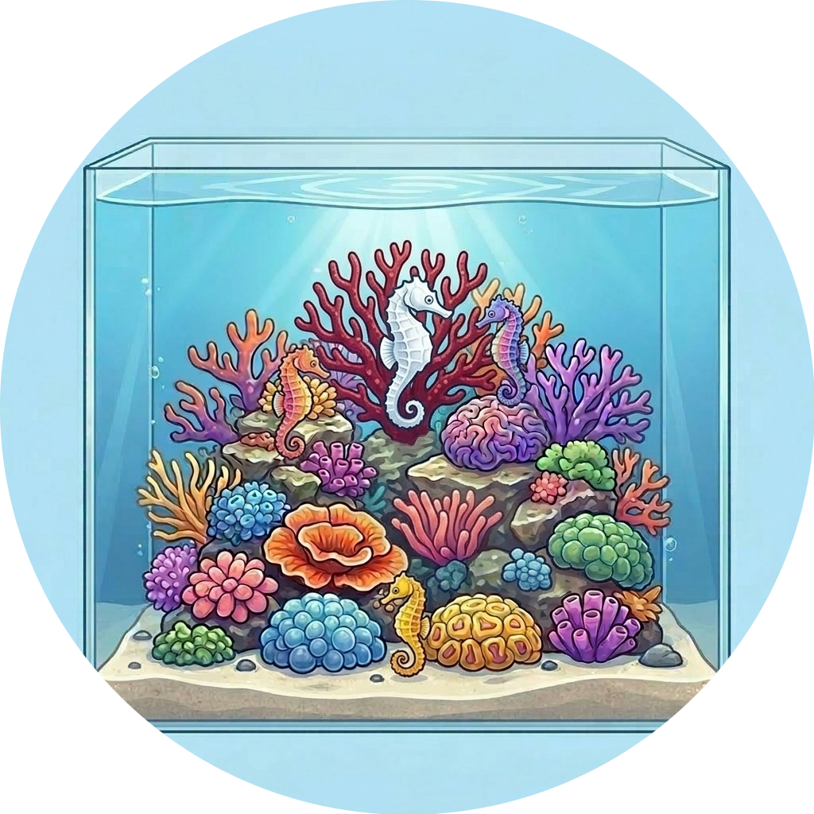

[![BuyMeCoffee][buymecoffeebadge]][buymecoffee]

# Supported Languages:       
To help us with translation, follow this [guide](https://github.com/Elwinmage/ha-reefbeat-component/blob/main/doc/TRANSLATION.md).

# Overview
***HomeAssistant RedSea Reefbeat devices Local Management (no cloud): ReefATO+, ReefControl, ReefControl-Power, ReefDose, ReefLed, ReefMat, ReefRun and ReefWave***

<!-- ecosystem:start -->

## Related projects

The ReefTech projects fit together: the integrations bring your equipment into Home Assistant, the card displays and drives it, and the backup keeps it running through an outage. Each one also works on its own.

<table>
  <tr>
    <th width="100px"></th>
    <th>Project</th>
    <th>What it does</th>
    <th>Works with</th>
  </tr>
  <tr>
    <td></td>
    <td>🐠 <b>ha-reefbeat-component</b> <i>(this repository)</i></td>
    <td>Red Sea ReefBeat devices, controlled locally with no cloud: ReefATO+, ReefControl, ReefControl-Power, ReefDose, ReefLed, ReefMat, ReefRun and ReefWave. alert blueprint for abnormal modes, calibrations and low battery. </td>
    <td>ha-reef-card</td>
  </tr>
  <tr>
    <td></td>
    <td>🌊 <a href="https://github.com/Elwinmage/ha-aquamedic-component"><b>ha-aquamedic-component</b></a></td>
    <td>Aqua Medic pumps through the Gizwits cloud API: EcoDrift and SmartDrift wavemakers, DC Runner return and skimmer pumps.</td>
    <td>ha-reef-card</td>
  </tr>
  <tr>
    <td></td>
    <td>🐙 <a href="https://github.com/Elwinmage/ha-reef-maintenance-component"><b>ha-reef-maintenance-component</b></a></td>
    <td>Cleaning and wear tracking for the equipment Home Assistant cannot talk to: flow pumps, return pumps, skimmers, media reactors, anything you service by hand.</td>
    <td>ha-reef-card</td>
  </tr>
  <tr>
    <td></td>
    <td>🪸 <a href="https://github.com/Elwinmage/ha-reef-card"><b>ha-reef-card</b></a></td>
    <td>Interactive graphical view of each device on your dashboard, and the only way to edit advanced schedules. Reads the three integrations above through the shared <code>reef_role</code> contract, with no card-side configuration.</td>
    <td>all three integrations</td>
  </tr>
  <tr>
    <td></td>
    <td>🐬 <a href="https://github.com/Elwinmage/ha-reef-blueprints"><b>ha-reef-blueprints</b></a></td>
    <td>Notification blueprints shared by the whole ecosystem: overdue maintenance found through the <code>reef_role</code> contract, and devices that went unreachable. Eight languages.</td>
    <td>all three integrations</td>
  </tr>
  <tr>
    <td></td>
    <td>⚡ <a href="https://github.com/Elwinmage/reefbeatEnergyBackup"><b>reefbeatEnergyBackup</b></a></td>
    <td>Battery backup for power outages. A 24V LiFePO₄ pack driven by a Raspberry Pi, with pump speed degraded progressively according to the state of charge.</td>
    <td>standalone, or alongside ha-reefbeat-component</td>
  </tr>
</table>

All of them are documented together on the [ReefTech project page](https://elwinmage.github.io/reeftank/).

<!-- ecosystem:end -->

> [!TIP]
> The list of future implementations can be found [here](https://github.com/Elwinmage/ha-reefbeat-component/issues?q=is%3Aissue%20state%3Aopen%20label%3Aenhancement) 
> The list of bugs can be found [here](https://github.com/Elwinmage/ha-reefbeat-component/issues?q=is%3Aissue%20state%3Aopen%20label%3Abug) 

***If you need other sensors or actuators, feel free to contact me [here](https://github.com/Elwinmage/ha-reefbeat-component/discussions).***

> [!IMPORTANT]
> If your devices are not on the same subnet as your Home Assistant, please [read this](https://github.com/Elwinmage/ha-reefbeat-component/#my-device-is-not-detected).

> [!CAUTION]
> ⚠️ This is not an official RedSea repository. Use at your own risk.⚠️

# Compatibility

> ✅ Supported &nbsp;|&nbsp; 🚧 In progress &nbsp;|&nbsp; 🧪 Untested (may work) &nbsp;|&nbsp; ❌ Not yet supported
>
> Own a device marked 🧪? Please confirm it works [here](https://github.com/Elwinmage/ha-reefbeat-component/discussions/8).
<table>
<th>
<td colspan="2"><b>Model</b></td>
<td colspan="2"><b>Status</b></td>
<td><b><a href="https://github.com/Elwinmage/reefbeatEnergyBackup">EnergyBackup</a></b></td>
<td><b>Issues</b>  📆(Planned)   🐛(Bugs)</td>
</th>
<tr>
<td><a href="https://github.com/Elwinmage/ha-reefbeat-component/blob/main/doc/en/reefato.md#reefato">ReefATO+</a></td>
<td colspan="2">RSATO+</td><td>✅ </td>
<td width="200px">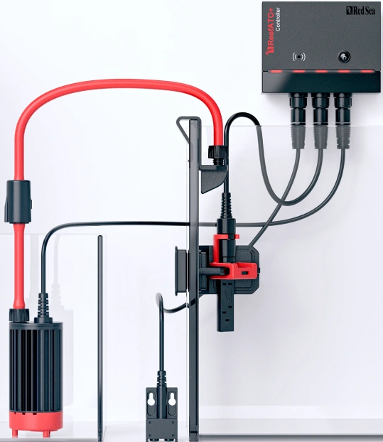</td>
<td align="center">–</td>
<td>
<a href="https://github.com/Elwinmage/ha-reefbeat-component/issues?q=is:issue state:open label:rsato,all label:enhancement" style="text-decoration:none">📆</a>
<a href="https://github.com/Elwinmage/ha-reefbeat-component/issues?q=is:issue state:open label:rsato,all label:bug" style="text-decoration:none">🐛</a>
</td>
</tr>
<tr>
<td rowspan="2"><a href="https://github.com/Elwinmage/ha-reefbeat-component/blob/main/doc/en/reefcontrol.md#reefcontrol">ReefControl</a></td>
<td colspan="2">RSCONTROLPRO</td><td>✅</td>
<td width="200px">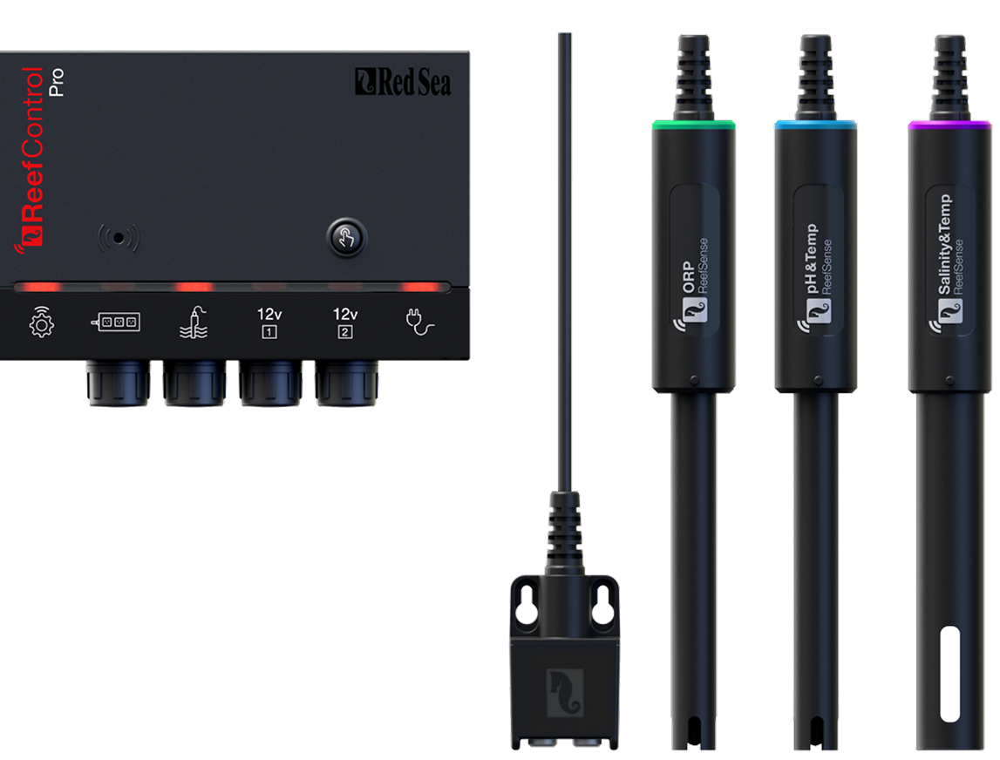</td>
<td align="center" rowspan="2">–</td>
<td rowspan="2">
  <a href="https://github.com/Elwinmage/ha-reefbeat-component/issues?q=is:issue state:open label:rscontrol,all label:enhancement" style="text-decoration:none">📆</a>
  <a href="https://github.com/Elwinmage/ha-reefbeat-component/issues?q=is:issue state:open label:rscontrol,all label:bug" style="text-decoration:none">🐛</a>
</td>
</tr>
<tr>
<td colspan="2">RSCONTROLLITE</td><td>🧪</td>
<td width="200px">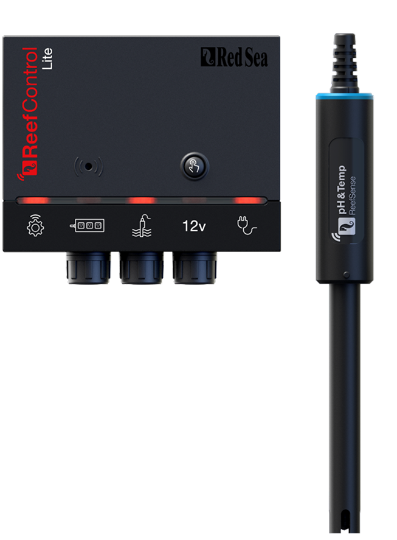</td>
</tr>
<tr>
<td rowspan="2"><a href="https://github.com/Elwinmage/ha-reefbeat-component/blob/main/doc/en/reefcontrol-power.md#reefcontrol-power">ReefControl-Power</a></td>
<td colspan="2">RSPOWER6</td><td>✅</td>
<td width="200px">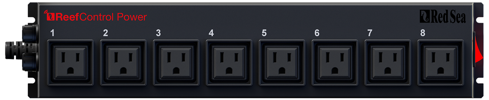</td>
<td align="center" rowspan="2">–</td>
<td rowspan="2">
  <a href="https://github.com/Elwinmage/ha-reefbeat-component/issues?q=is:issue state:open label:rspower,all label:enhancement" style="text-decoration:none">📆</a>
  <a href="https://github.com/Elwinmage/ha-reefbeat-component/issues?q=is:issue state:open label:rspower,all label:bug" style="text-decoration:none">🐛</a>
</td>
</tr>
<tr>
<td colspan="2">RSPOWER8</td><td>🧪</td>
<td width="200px"></td>
</tr>
<tr>
<td rowspan="2"><a href="https://github.com/Elwinmage/ha-reefbeat-component/blob/main/doc/en/reefdose.md#reefdose">ReefDose</a></td>
<td colspan="2">RSDOSE2</td>
<td>✅</td>
<td width="200px">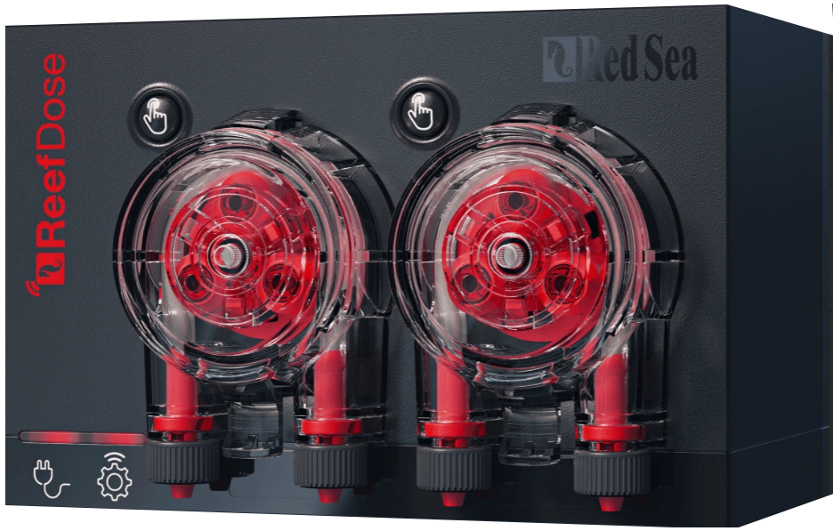</td>
<td align="center" rowspan="2">–</td>
<td rowspan="2">
<a href="https://github.com/Elwinmage/ha-reefbeat-component/issues?q=is:issue state:open label:rsdose,all label:enhancement" style="text-decoration:none">📆</a>
<a href="https://github.com/Elwinmage/ha-reefbeat-component/issues?q=is:issue state:open label:rsdose,all label:bug" style="text-decoration:none">🐛</a>
</td>
</tr>
<tr>
<td colspan="2">RSDOSE4</td><td>✅ </td>
<td width="200px">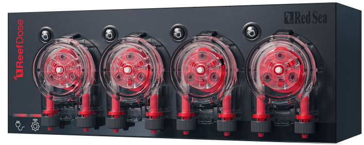</td>
</tr>
<tr>
<td rowspan="6"> <a href="https://github.com/Elwinmage/ha-reefbeat-component/blob/main/doc/en/reefled.md#reefled">ReefLed</a></td>
<td rowspan="3">G1</td>
<td>RSLED50</td>
<td>✅</td>
<td rowspan="3" width="200px">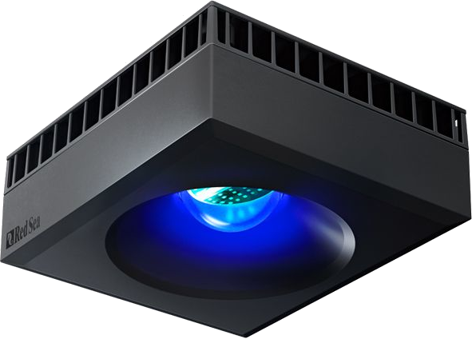</td>
<td align="center" rowspan="6">–</td>
<td rowspan="6">
<a href="https://github.com/Elwinmage/ha-reefbeat-component/issues?q=is:issue state:open label:rsled,all label:enhancement" style="text-decoration:none">📆</a>
<a href="https://github.com/Elwinmage/ha-reefbeat-component/issues?q=is:issue state:open label:rsled,RSLED90,all label:bug" style="text-decoration:none">🐛</a>
</td>
</tr>
<tr>
<td>RSLED90</td>
<td>✅</td>
</tr>
<tr>
<td>RSLED160</td><td>✅ </td>
</tr>
<tr>
<td rowspan="3">G2</td>
<td>RSLED60</td>
<td>✅</td>
<td rowspan="3" width="200px">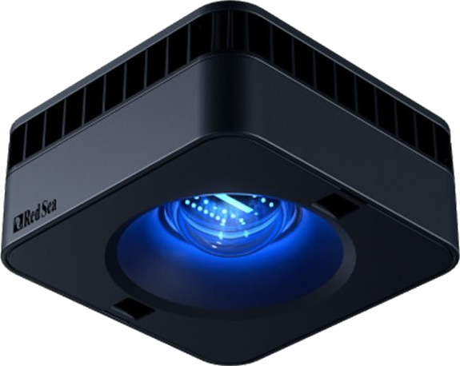</td>
</tr>
<tr>
<td>RSLED115</td><td>✅ </td>
</tr>
<tr>
<td>RSLED170</td><td>🧪</td>
</tr>
<tr>
<td rowspan="3"><a href="https://github.com/Elwinmage/ha-reefbeat-component/blob/main/doc/en/reefmat.md#reefmat">ReefMat</a></td>
<td colspan="2">RSMAT250</td>
<td>✅</td>
<td rowspan="3" width="200px">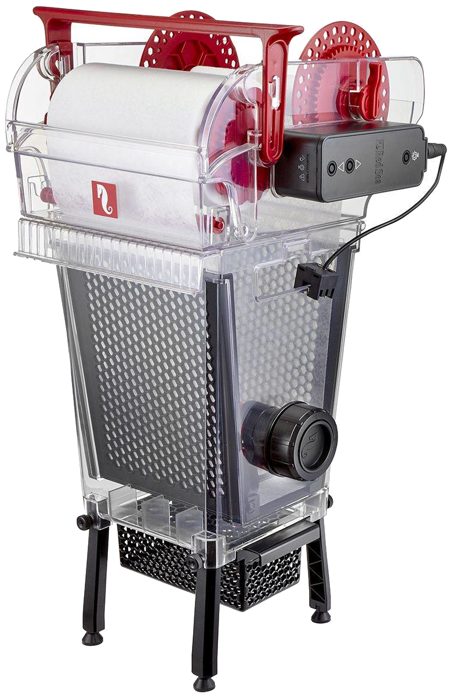</td>
<td align="center" rowspan="3">–</td>
<td rowspan="3">
<a href="https://github.com/Elwinmage/ha-reefbeat-component/issues?q=is:issue state:open label:rsmat,all label:enhancement" style="text-decoration:none">📆</a>
<a href="https://github.com/Elwinmage/ha-reefbeat-component/issues?q=is:issue state:open label:rsmat,all label:bug" style="text-decoration:none">🐛</a>
</td>
</tr>
<tr>
<td colspan="2">RSMAT500</td><td>✅</td>
</tr>
<tr>
<td colspan="2">RSMAT1200</td><td>✅ </td>
</tr>
<tr>
<td><a href="https://github.com/Elwinmage/ha-reefbeat-component/blob/main/doc/en/reefrun.md#reefrun">ReefRun & DC Skimmer</a></td>
<td colspan="2">RSRUN</td><td>✅</td>
<td width="200px">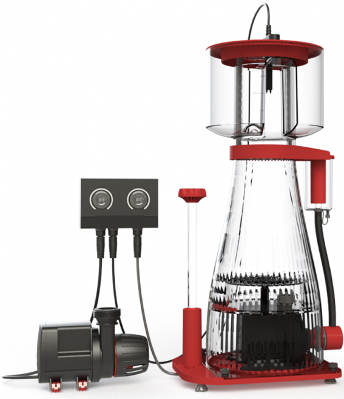</td>
<td align="center">✅</td>
<td>
<a href="https://github.com/Elwinmage/ha-reefbeat-component/issues?q=is:issue state:open label:rsrun,all label:enhancement" style="text-decoration:none">📆</a>
<a href="https://github.com/Elwinmage/ha-reefbeat-component/issues?q=is:issue state:open label:rsrun,all label:bug" style="text-decoration:none">🐛</a>
</td>
</tr>
<tr>
<td rowspan="2"><a href="https://github.com/Elwinmage/ha-reefbeat-component/blob/main/doc/en/reefwave.md#reefwave">ReefWave (*)</a></td>
<td colspan="2">RSWAVE25</td>
<td>✅</td>
<td width="200px" rowspan="2">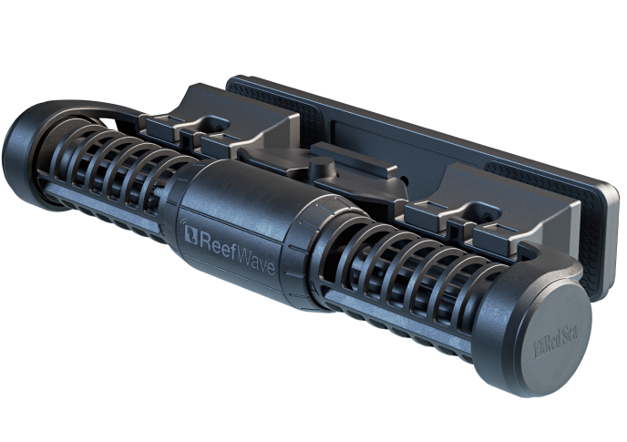</td>
<td align="center" rowspan="2">✅</td>
<td rowspan="2">
<a href="https://github.com/Elwinmage/ha-reefbeat-component/issues?q=is:issue state:open label:rswave,all label:enhancement" style="text-decoration:none">📆</a>
<a href="https://github.com/Elwinmage/ha-reefbeat-component/issues?q=is:issue state:open label:rwave,all label:bug" style="text-decoration:none">🐛</a>
</td>
</tr>
<tr>
<td colspan="2">RSWAVE45</td><td>✅</td>
</tr>
</table>

(*) ReefWave users, please read [this](https://github.com/Elwinmage/ha-reefbeat-component/blob/main/doc/en/reefwave.md#reefwave)

# Summary
- [Installation via HACS](https://github.com/Elwinmage/ha-reefbeat-component/#installation-via-hacs)
- [Common functions](https://github.com/Elwinmage/ha-reefbeat-component/#common-functions)
- [ReefATO+](https://github.com/Elwinmage/ha-reefbeat-component/blob/main/doc/en/reefato.md#reefato)
- [ReefControl](https://github.com/Elwinmage/ha-reefbeat-component/blob/main/doc/en/reefcontrol.md#reefcontrol)
- [ReefControl-Power](https://github.com/Elwinmage/ha-reefbeat-component/blob/main/doc/en/reefcontrol-power.md#reefcontrol-power)
- [ReefDose](https://github.com/Elwinmage/ha-reefbeat-component/blob/main/doc/en/reefdose.md#reefdose)
- [ReefLED](https://github.com/Elwinmage/ha-reefbeat-component/blob/main/doc/en/reefled.md#reefled)
- [Virtual LED](https://github.com/Elwinmage/ha-reefbeat-component/blob/main/doc/en/virtual-led.md#virtual-led)
- [ReefMat](https://github.com/Elwinmage/ha-reefbeat-component/blob/main/doc/en/reefmat.md#reefmat)
- [ReefRun](https://github.com/Elwinmage/ha-reefbeat-component/blob/main/doc/en/reefrun.md#reefrun)
- [ReefWave](https://github.com/Elwinmage/ha-reefbeat-component/blob/main/doc/en/reefwave.md#reefwave)
- [Maintenance](https://github.com/Elwinmage/ha-reefbeat-component/blob/main/doc/en/maintenance.md#maintenance)
- [Cloud API](https://github.com/Elwinmage/ha-reefbeat-component/blob/main/doc/en/cloud-api.md#cloud-api)
- [FAQ](https://github.com/Elwinmage/ha-reefbeat-component/#faq)

# Installation via HACS

## Direct installation

Just click here to directly go to the repository in HACS and click "Download": 

For the companion card ha-reef-card offering advanced and ergonomic features, click here to directly go to the repository in HACS and click "Download": 

## Find in HACS
Or search for "redsea" or "reefbeat" in HACS.

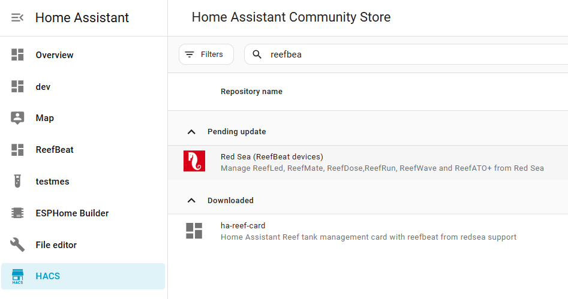

# Common functions

# Icons
This integration provides custom icons accessible via "redsea:icon-name":

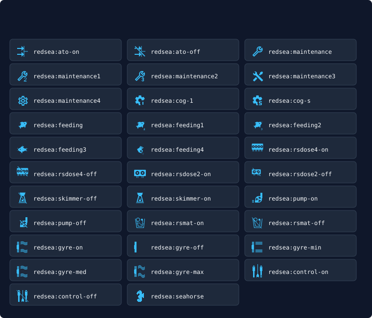

## Add device
When adding a new device you have 4 choices:

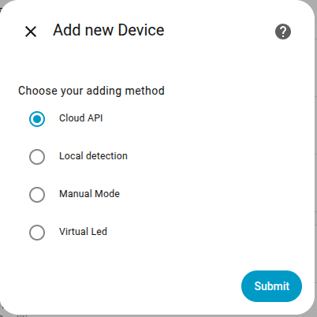

### Add Cloud API
***Mandatory for ReefWave if you want to keep it synchronized with the ReefBeat Mobile App*** (Read [this](https://github.com/Elwinmage/ha-reefbeat-component/blob/main/doc/en/reefwave.md#reefwave)).  
***Mandatory to be notified of a new firmware version*** (Read [this](https://github.com/Elwinmage/ha-reefbeat-component/#firmware-update)).
- Get user information
- Get aquariums
- Get Waves library
- Get LED library

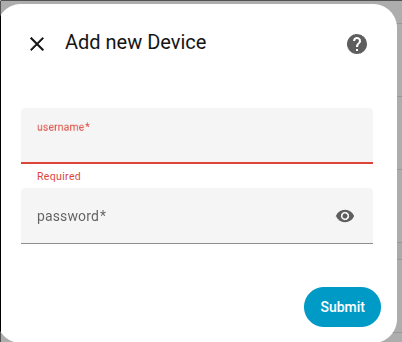

### Auto detect on private network
If not on the same network, read [this](#my-device-is-not-detected) and use ["Manual Mode"](https://github.com/Elwinmage/ha-reefbeat-component/#manual-mode).

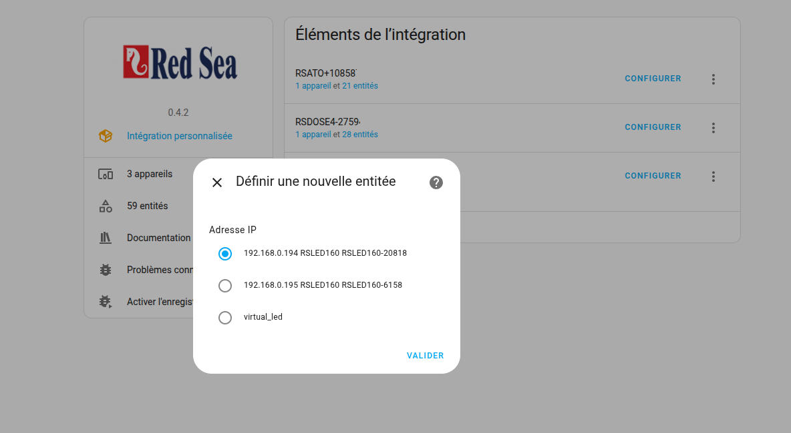

### Manual Mode
You can enter your device IP address or the network address for auto-detection.

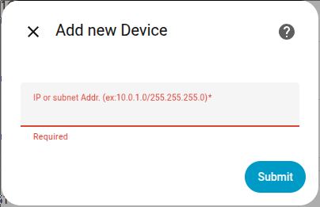

## Device Config

Right-click a device (or open its options from the integration page) to reach its configuration. The first screen lets you change how the integration talks to the device.

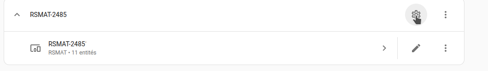

### Set scan interval for device

Set how often (in seconds) the integration polls the device for new data.

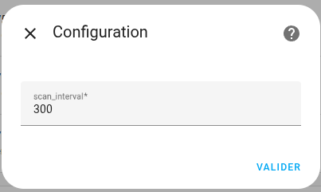

### Change WiFi network

You can move a device to another WiFi network directly from Home Assistant, without going back to the ReefBeat app.

From the device configuration menu, choose **Change WiFi network**. The integration asks the device to scan for nearby networks and shows them in a drop-down, sorted by signal strength. The network the device is currently connected to is pre-selected, so if you only need to update the password you can leave the selection as-is.

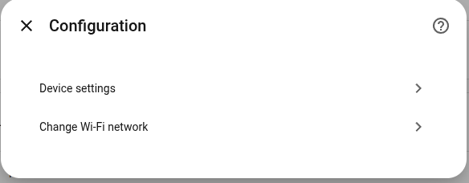

Pick the target network, enter its password, and submit. The integration sends the new credentials to the device, reboots it, and then automatically looks for it again on the network to update its IP address.

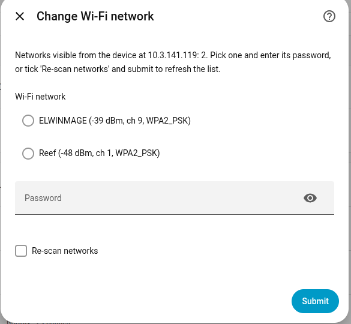

> [!NOTE]
> After a WiFi change the device may join a different subnet (for example moving from `192.168.0.x` to `10.0.0.x`). The integration scans every subnet Home Assistant is directly connected to. If the device lands on a subnet that Home Assistant can only reach through a router, rediscovery will fail and you will be asked to enter the target subnet manually (for example `10.0.0.0/24`).

## Live update

> [!NOTE]
> It is possible to choose whether to enable live_update_config or not. In this mode (old default), configuration data is continuously retrieved along with normal data. For RSDOSE or RSLED, these large HTTP requests can take a long time (7–9 seconds). Sometimes the device does not respond to the request, so a retry function has been implemented. When live_update_config is disabled, configuration data is only retrieved at startup and when requested via the "Fetch Configuration" button. This new mode is activated by default. You can change it in the device configuration. 

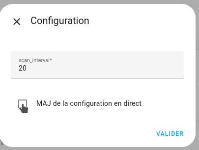
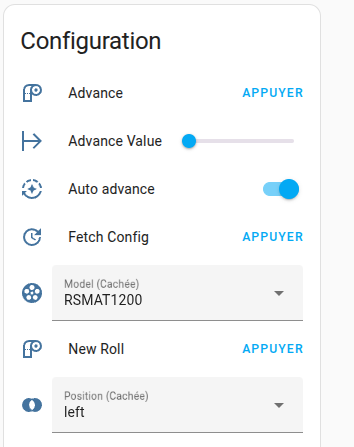

> [!NOTE]
> Every device also exposes a "Fetch data" button. It forces an immediate read of the polled sources instead of waiting for the next scan interval, and works whatever the Live update config setting is — unlike "Fetch config", which only refreshes the configuration sources.

## Firmware Update
You can be notified and update your device when a new firmware version is available. You must have an active ["Cloud API"](https://github.com/Elwinmage/ha-reefbeat-component/#add-cloud-api) device with your credentials and the "Use Cloud API" switch must be enabled.
> [!TIP]
> The "Cloud API" is only needed to get the version number of the new release and compare it to the installed version. To update your firmware, the Cloud API is not strictly required.
> If you do not use the "Cloud API" (switch disabled or no Cloud API device installed), you will not be alerted when a new version is available, but you can still use the hidden "Force Firmware Update" button. If a new version is available, it will be installed.

  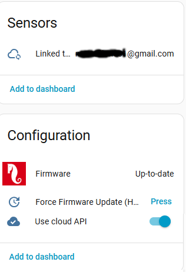
  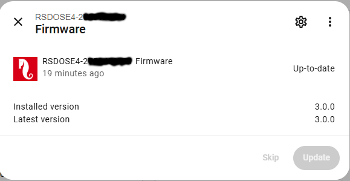

# FAQ

## My device is not detected
- Try relaunching the auto-detection with the "Add entry" button. Sometimes devices do not respond because they are busy.
- If your Red Sea devices are not on the same subnet as your Home Assistant, auto-detection will first fail and then offer you the option to enter the IP address of your device or the address of the subnet where your devices are located. For subnet detection, please use the format IP/MASK, for example: 192.168.14.0/255.255.255.0.
- You can also use [Manual Mode](https://github.com/Elwinmage/ha-reefbeat-component/#manual-mode).

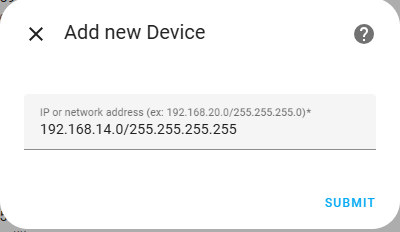

## Some data are updated correctly but others are not
Data is divided into three parts: data, configuration and device-info.
- Data is regularly updated.
- Configuration data is only updated at startup and when you press the "Fetch Config" button.
- Device-info data is only updated at boot.

To ensure that configuration data is updated regularly, please enable [Live Configuration Update](#live-update).

***

[buymecoffee]: https://paypal.me/Elwinmage
[buymecoffeebadge]: https://img.shields.io/badge/buy%20me%20a%20coffee-donate-yellow.svg?style=flat-square
[ruff-shield]: https://github.com/Elwinmage/ha-reefbeat-component/actions/workflows/ruff.yml/badge.svg
[ruff-link]: https://github.com/Elwinmage/ha-reefbeat-component/actions/workflows/ruff.yml
[pyright-shield]: https://github.com/Elwinmage/ha-reefbeat-component/actions/workflows/pyright.yml/badge.svg
[pyright-link]: https://github.com/Elwinmage/ha-reefbeat-component/actions/workflows/pyright.yml
[coverage-shield]: https://raw.githubusercontent.com/Elwinmage/ha-reefbeat-component/main/badges/coverage.svg
[coverage-link]: https://app.codecov.io/gh/Elwinmage/ha-reefbeat-component
