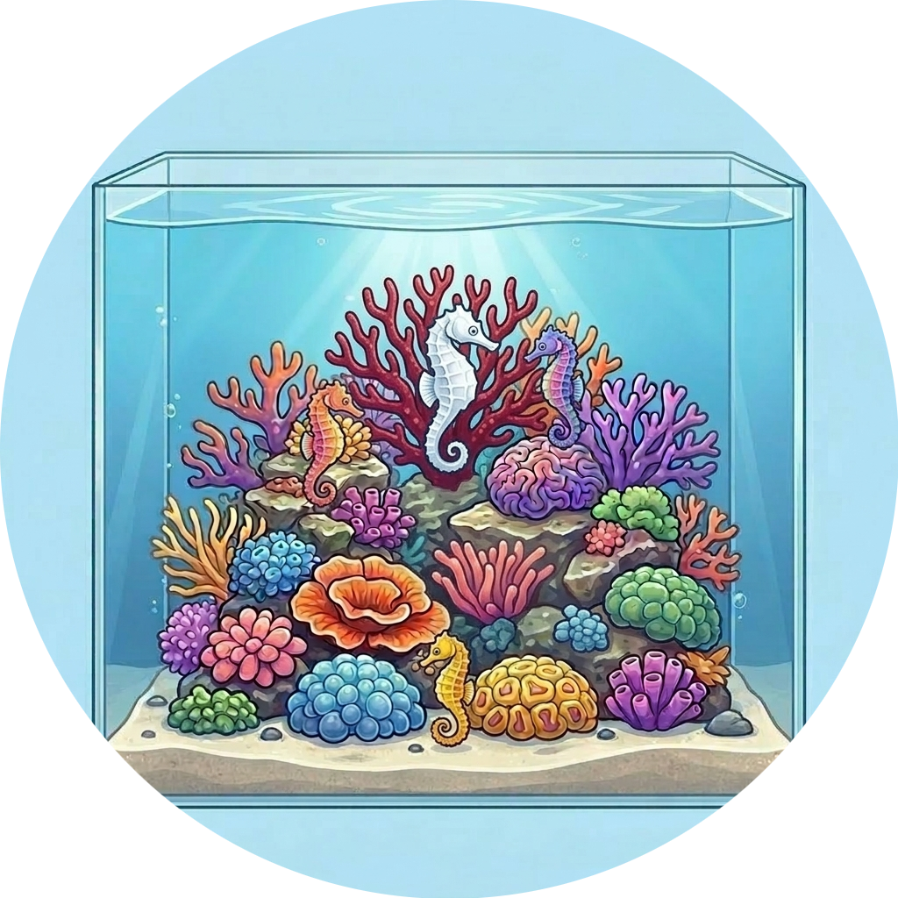

# Red Sea (ReefBeat-Geräte) 🐠
> Teil des **[ReefTech Project Ökosystems](https://elwinmage.github.io/reeftank/de.html)**

  

[![BuyMeCoffee][buymecoffeebadge]][buymecoffee]
# Supported Languages:       

Um bei der Übersetzung zu helfen, folgen Sie dieser [Anleitung](https://github.com/Elwinmage/ha-reefbeat-component/blob/main/doc/TRANSLATION.md).

# Übersicht
***Lokale Verwaltung von HomeAssistant RedSea Reefbeat-Geräten (ohne Cloud): ReefATO+, ReefControl, ReefControl-Power, ReefDose, ReefLed, ReefMat, ReefRun und ReefWave***

## Verwandte Projekte

Diese Integration ist eines von drei sich ergänzenden Projekten für ein Red-Sea-Riffaquarium:

| Projekt | Aufgabe |
| --- | --- |
| [**ha-reefbeat-component**](https://github.com/Elwinmage/ha-reefbeat-component) | Diese Integration. Lokale Steuerung der ReefBeat-Geräte aus Home Assistant, ohne Cloud: ReefATO+, ReefControl, ReefControl-Power, ReefDose, ReefLed, ReefMat, ReefRun und ReefWave. |
| [**ReefBeat watch**](https://github.com/Elwinmage/ha-reefbeat-component/tree/main/blueprints/automation) | Mit dieser Integration geliefertes Alarm-Blueprint. Benachrichtigt Sie über überfällige Wartungen und Kalibrierungen, abnormale Modi, schwache Batterien und nicht erreichbare Geräte, auf den von Ihnen gewählten Mobilgeräten.  |
| [**ha-reef-card**](https://github.com/Elwinmage/ha-reef-card) | Begleitende Lovelace-Karte. Erforderlich, um erweiterte Zeitpläne für ReefDose, ReefLed, ReefRun und ReefWave zu bearbeiten, und gibt jedem Gerät eine interaktive grafische Ansicht. |
| [**reefbeatEnergyBackup**](https://github.com/Elwinmage/reefbeatEnergyBackup) | Batteriepuffer bei Stromausfall. 24V-LiFePO₄-Pack, gesteuert von einem Raspberry Pi, mit stufenweiser Drosselung der Pumpen je nach Ladezustand. Läuft eigenständig oder ergänzend zu dieser Integration. |

Alle drei, sowie weitere Riff-Projekte, sind gemeinsam auf der [Projektseite](https://elwinmage.github.io/reeftank/) dokumentiert.

> [!TIP]
> Die Liste der zukünftigen Implementierungen ist [hier] verfügbar(https://github.com/Elwinmage/ha-reefbeat-component/issues?q=is%3Aissue%20state%3Aopen%20label%3Aenhancement) 
> Die Liste der Fehler ist [hier] verfügbar(https://github.com/Elwinmage/ha-reefbeat-component/issues?q=is%3Aissue%20state%3Aopen%20label%3Abug) 

***Wenn Sie andere Sensoren oder Aktoren benötigen, kontaktieren Sie mich [hier](https://github.com/Elwinmage/ha-reefbeat-component/discussions).***

> [!IMPORTANT]
> Wenn sich Ihre Geräte nicht im gleichen Subnetz wie Ihr Home Assistant befinden, [lesen Sie bitte dies](https://github.com/Elwinmage/ha-reefbeat-component/#my-device-is-not-detected).

> [!CAUTION]
> ⚠️ Dies ist kein offizielles RedSea-Repository. Verwendung auf eigene Gefahr.⚠️

# Kompatibilität

✅ Getestet ☑️ Sollte funktionieren (Wenn Sie eines haben, können Sie das Funktionieren [hier] bestätigen(https://github.com/Elwinmage/ha-reefbeat-component/discussions/8))
<table>
<th>
<td colspan="2"><b>Model</b></td>
<td colspan="2"><b>Status</b></td>
<td><b><a href="https://github.com/Elwinmage/reefbeatEnergyBackup">EnergyBackup</a></b></td>
<td><b>Issues</b>  📆(Planned)   🐛(Bugs)</td>
</th>
<tr>
<td><a href="#reefato">ReefATO+</a></td>
<td colspan="2">RSATO+</td><td>✅ </td>
<td width="200px"></td>
<td align="center">–</td>
<td>
<a href="https://github.com/Elwinmage/ha-reefbeat-component/issues?q=is:issue state:open label:rsato,all label:enhancement" style="text-decoration:none">📆</a>
<a href="https://github.com/Elwinmage/ha-reefbeat-component/issues?q=is:issue state:open label:rsato,all label:bug" style="text-decoration:none">🐛</a>
</td>
</tr>
<tr>
<td rowspan="2"><a href="#reefcontrol">ReefControl</a></td>
<td colspan="2">RSCONTROLPRO</td><td>✅</td>
<td width="200px"></td>
<td align="center" rowspan="2">–</td>
<td rowspan="2">
  <a href="https://github.com/Elwinmage/ha-reefbeat-component/issues?q=is:issue state:open label:rscontrol,all label:enhancement" style="text-decoration:none">📆</a>
  <a href="https://github.com/Elwinmage/ha-reefbeat-component/issues?q=is:issue state:open label:rscontrol,all label:bug" style="text-decoration:none">🐛</a>
</td>
</tr>
<tr>
<td colspan="2">RSCONTROLLITE</td><td>☑️</td>
<td width="200px"></td>
</tr>
<tr>
<td rowspan="2"><a href="#reefcontrol-power">ReefControl-Power</a></td>
<td colspan="2">RSPOWER6</td><td>✅</td>
<td width="200px"></td>
<td align="center" rowspan="2">–</td>
<td rowspan="2">
  <a href="https://github.com/Elwinmage/ha-reefbeat-component/issues?q=is:issue state:open label:rspower,all label:enhancement" style="text-decoration:none">📆</a>
  <a href="https://github.com/Elwinmage/ha-reefbeat-component/issues?q=is:issue state:open label:rspower,all label:bug" style="text-decoration:none">🐛</a>
</td>
</tr>
<tr>
<td colspan="2">RSPOWER8</td><td>☑️</td>
<td width="200px"></td>
</tr>
<tr>
<td rowspan="2"><a href="#reefdose">ReefDose</a></td>
<td colspan="2">RSDOSE2</td>
<td>✅</td>
<td width="200px"></td>
<td align="center" rowspan="2">–</td>
<td rowspan="2">
<a href="https://github.com/Elwinmage/ha-reefbeat-component/issues?q=is:issue state:open label:rsdose,all label:enhancement" style="text-decoration:none">📆</a>
<a href="https://github.com/Elwinmage/ha-reefbeat-component/issues?q=is:issue state:open label:rsdose,all label:bug" style="text-decoration:none">🐛</a>
</td>
</tr>
<tr>
<td colspan="2">RSDOSE4</td><td>✅ </td>
<td width="200px"></td>
</tr>
<tr>
<td rowspan="6"> <a href="#reefled">ReefLed</a></td>
<td rowspan="3">G1</td>
<td>RSLED50</td>
<td>✅</td>
<td rowspan="3" width="200px"></td>
<td align="center" rowspan="6">–</td>
<td rowspan="6">
<a href="https://github.com/Elwinmage/ha-reefbeat-component/issues?q=is:issue state:open label:rsled,all label:enhancement" style="text-decoration:none">📆</a>
<a href="https://github.com/Elwinmage/ha-reefbeat-component/issues?q=is:issue state:open label:rsled,RSLED90,all label:bug" style="text-decoration:none">🐛</a>
</td>
</tr>
<tr>
<td>RSLED90</td>
<td>✅</td>
</tr>
<tr>
<td>RSLED160</td><td>✅ </td>
</tr>
<tr>
<td rowspan="3">G2</td>
<td>RSLED60</td>
<td>✅</td>
<td rowspan="3" width="200px"></td>
</tr>
<tr>
<td>RSLED115</td><td>✅ </td>
</tr>
<tr>
<td>RSLED170</td><td>☑️</td>
</tr>
<tr>
<td rowspan="3"><a href="#reefmat">ReefMat</a></td>
<td colspan="2">RSMAT250</td>
<td>✅</td>
<td rowspan="3" width="200px"></td>
<td align="center" rowspan="3">–</td>
<td rowspan="3">
<a href="https://github.com/Elwinmage/ha-reefbeat-component/issues?q=is:issue state:open label:rsmat,all label:enhancement" style="text-decoration:none">📆</a>
<a href="https://github.com/Elwinmage/ha-reefbeat-component/issues?q=is:issue state:open label:rsmat,all label:bug" style="text-decoration:none">🐛</a>
</td>
</tr>
<tr>
<td colspan="2">RSMAT500</td><td>✅</td>
</tr>
<tr>
<td colspan="2">RSMAT1200</td><td>✅ </td>
</tr>
<tr>
<td><a href="#reefrun">ReefRun & DC Skimmer</a></td>
<td colspan="2">RSRUN</td><td>✅</td>
<td width="200px"></td>
<td align="center">✅</td>
<td>
<a href="https://github.com/Elwinmage/ha-reefbeat-component/issues?q=is:issue state:open label:rsrun,all label:enhancement" style="text-decoration:none">📆</a>
<a href="https://github.com/Elwinmage/ha-reefbeat-component/issues?q=is:issue state:open label:rsrun,all label:bug" style="text-decoration:none">🐛</a>
</td>
</tr>
<tr>
<td rowspan="2"><a href="#reefwave">ReefWave (*)</a></td>
<td colspan="2">RSWAVE25</td>
<td>✅</td>
<td width="200px" rowspan="2"></td>
<td align="center" rowspan="2">✅</td>
<td rowspan="2">
<a href="https://github.com/Elwinmage/ha-reefbeat-component/issues?q=is:issue state:open label:rswave,all label:enhancement" style="text-decoration:none">📆</a>
<a href="https://github.com/Elwinmage/ha-reefbeat-component/issues?q=is:issue state:open label:rwave,all label:bug" style="text-decoration:none">🐛</a>
</td>
</tr>
<tr>
<td colspan="2">RSWAVE45</td><td>✅</td>
</tr>
</table>

(*) ReefWave-Benutzer, bitte lesen Sie [dies](https://github.com/Elwinmage/ha-reefbeat-component/#reefwave)

# Zusammenfassung
- [Installation via HACS](https://github.com/Elwinmage/ha-reefbeat-component/#installation-via-hacs)
- [Gemeinsame Funktionen](https://github.com/Elwinmage/ha-reefbeat-component/#common-functions)
- [ReefATO+](https://github.com/Elwinmage/ha-reefbeat-component/#reefato)
- [ReefControl](https://github.com/Elwinmage/ha-reefbeat-component/#reefcontrol)
- [ReefControl-Power](https://github.com/Elwinmage/ha-reefbeat-component/#reefcontrol-power)
- [ReefDose](https://github.com/Elwinmage/ha-reefbeat-component/#reefdose)
- [ReefLED](https://github.com/Elwinmage/ha-reefbeat-component/#reefled)
- [Virtuelle LED](https://github.com/Elwinmage/ha-reefbeat-component/#virtual-led)
- [ReefMat](https://github.com/Elwinmage/ha-reefbeat-component/#reefmat)
- [ReefRun](https://github.com/Elwinmage/ha-reefbeat-component/#reefrun)
- [ReefWave](https://github.com/Elwinmage/ha-reefbeat-component/#reefwave)
- [Wartung](https://github.com/Elwinmage/ha-reefbeat-component/#maintenance)
- [Cloud API](https://github.com/Elwinmage/ha-reefbeat-component/#cloud-api)
- [FAQ](https://github.com/Elwinmage/ha-reefbeat-component/#faq)

# Installation via HACS

## Direkte Installation

Klicken Sie hier, um direkt zum Repository in HACS zu gelangen und auf „Herunterladen" zu klicken: 

Für die Begleit-Karte ha-reef-card mit erweiterten Funktionen klicken Sie hier, um zum Repository in HACS zu gelangen und auf „Herunterladen" zu klicken: 

## In HACS suchen
Oder suchen Sie in HACS nach „redsea" oder „reefbeat".

# Gemeinsame Funktionen

# Symbole
Diese Integration stellt benutzerdefinierte Symbole bereit, zugänglich über "redsea:icon-name":

## Gerät hinzufügen
Beim Hinzufügen eines neuen Geräts haben Sie 4 Optionen:

### Cloud-API hinzufügen
***Für ReefWave erforderlich, wenn Sie es mit der ReefBeat Mobile App synchronisiert halten möchten*** (Read [this](https://github.com/Elwinmage/ha-reefbeat-component/#reefwave)).  
***Erforderlich, um über neue Firmware-Versionen benachrichtigt zu werden*** (Read [this](https://github.com/Elwinmage/ha-reefbeat-component/#firmware-update)).
- Benutzerinformationen abrufen
- Aquarien abrufen
- Waves-Bibliothek abrufen
- LED-Bibliothek abrufen

### Automatische Erkennung im privaten Netzwerk
Wenn Sie sich nicht im gleichen Netzwerk befinden, lesen Sie [dies](#my-device-is-not-detected) und verwenden Sie den [„Manuellen Modus"](https://github.com/Elwinmage/ha-reefbeat-component/#manual-mode).

### Manueller Modus
Sie können die IP-Adresse Ihres Geräts oder die Netzwerkadresse für die automatische Erkennung eingeben.

## Gerätekonfiguration

Klicken Sie mit der rechten Maustaste auf ein Gerät (oder öffnen Sie seine Optionen über die Integrationsseite), um zu seiner Konfiguration zu gelangen. Der erste Bildschirm legt fest, wie die Integration mit dem Gerät kommuniziert.

### Scan-Intervall für das Gerät festlegen

Legen Sie fest, wie oft (in Sekunden) die Integration das Gerät nach neuen Daten abfragt.

### WLAN-Netzwerk ändern

Sie können ein Gerät direkt aus Home Assistant in ein anderes WLAN-Netzwerk verschieben, ohne zur ReefBeat-App zurückzukehren.

Wählen Sie im Gerätekonfigurationsmenü **WLAN-Netzwerk ändern**. Die Integration fordert das Gerät auf, nach Netzwerken in der Nähe zu suchen, und zeigt sie in einer Dropdown-Liste an, sortiert nach Signalstärke. Das Netzwerk, mit dem das Gerät aktuell verbunden ist, ist vorausgewählt. Wenn Sie also nur das Passwort aktualisieren möchten, können Sie die Auswahl unverändert lassen.

Wählen Sie das Zielnetzwerk, geben Sie dessen Passwort ein und bestätigen Sie. Die Integration sendet die neuen Zugangsdaten an das Gerät, startet es neu und sucht es anschließend automatisch im Netzwerk, um seine IP-Adresse zu aktualisieren.

> [!NOTE]
> Nach einem WLAN-Wechsel kann das Gerät einem anderen Subnetz beitreten (zum Beispiel von `192.168.0.x` zu `10.0.0.x`). Die Integration durchsucht jedes Subnetz, mit dem Home Assistant direkt verbunden ist. Wenn das Gerät in einem Subnetz landet, das Home Assistant nur über einen Router erreichen kann, schlägt die Wiedererkennung fehl und Sie werden aufgefordert, das Zielsubnetz manuell einzugeben (zum Beispiel `10.0.0.0/24`).

## Live-Aktualisierung

> [!NOTE]
> It is possible to choose whether to enable live_update_config or not. In this mode (old default), configuration data is continuously retrieved along with normal data. For RSDOSE or RSLED, these large HTTP requests can take a long time (7–9 seconds). Sometimes the device does not respond to the request, so a retry function has been implemented. When live_update_config is disabled, configuration data is only retrieved at startup and when requested via the "Fetch Configuration" button. This new mode is activated by default. You can change it in the device configuration. 

> [!NOTE]
> Jedes Gerät bietet außerdem eine Schaltfläche „Daten abrufen". Sie erzwingt ein sofortiges Lesen der regelmäßig abgefragten Quellen, ohne auf das nächste Scan-Intervall zu warten, und funktioniert unabhängig von der Einstellung Live_update_config — anders als „Konfiguration abrufen", das nur die Konfigurationsquellen aktualisiert.

## Firmware-Aktualisierung
Sie können benachrichtigt werden und Ihr Gerät aktualisieren, wenn eine neue Firmware-Version verfügbar ist. You must have an active ["Cloud API"](https://github.com/Elwinmage/ha-reefbeat-component/#add-cloud-api) device with your credentials and the "Use Cloud API" switch must be enabled.
> [!TIP]
> The "Cloud API" is only needed to get the version number of the new release and compare it to the installed version. To update your firmware, the Cloud API is not strictly required.
> If you do not use the "Cloud API" (switch disabled or no Cloud API device installed), you will not be alerted when a new version is available, but you can still use the hidden "Force Firmware Update" button. If a new version is available, it will be installed.

  
  

# ReefATO:
- Automatisches Befüllen aktivieren/deaktivieren
- Manuelles Befüllen
- Leckalarm-Summer aktivieren/deaktivieren

### Wartungsaufgaben
| Aufgabe | Standard | Spanne |
| ------- | -------- | ------ |
| EC-Sonde reinigen | 6 Wochen | 3 – 9 Wochen |
| Rückförderpumpe reinigen | 4,5 Monate | 2 – 7 Monate |

Siehe den Abschnitt [Wartung](README.de.md#wartung).

# ReefControl:

- Auslesen aller angeschlossenen ReefSense-Sonden (pH, ORP, Salinität, Temperatur, ATO, Leck) mit Wert und Qualitätsstufe
- Zustand des Summers und des Lecksensors
- Ein/Aus-Umschaltung der 12V-DC-Anschlüsse (RSCONTROL)

## ReefControl-Power

Das RSPOWER (Power Center) ist ein eigenständiges Gerät mit eigener IP-Adresse und wird in Home Assistant separat angezeigt.

- Zustand, Modus, Verbrauch und Ein/Aus-Umschaltung pro Steckdose
- 6 oder 8 steuerbare Steckdosen je nach Modell (RSPOWER6 / RSPOWER8)

# ReefDose:
- Tagesdosis bearbeiten
- Manuelle Dosierung
- Supplemente hinzufügen und entfernen
- Behältervolumen bearbeiten und steuern. Container volume settings are automatically enabled or disabled according to the volume control switch.
- Zeitplan pro Pumpe aktivieren/deaktivieren
- Konfiguration von Bestandsalarmen
- Dosierungsverzögerung zwischen Supplementen
- Befüllen (Bitte lesen Sie [this](https://github.com/Elwinmage/ha-reefbeat-component/#calibration-and-priming))
- Kalibrierung (Bitte lesen Sie [this](https://github.com/Elwinmage/ha-reefbeat-component/#calibration-and-priming))

### Hauptgerät

### Köpfe

#### Calibration and Priming

> [!CAUTION]
> Sie müssen die folgende Reihenfolge genau einhalten (Using the [ha-reef-card](https://github.com/Elwinmage/ha-reef-card) is safer).  
> <ins>Calibration</ins>:
>  1. Place the graduated container and press "Start Calibration"
>  2. Enter the measured value using the "Dose of Calibration" field
>  3. Press "Set Calibration Value"
>  4. Empty the graduated container and press "Test new Calibration". If the value obtained is not 4 mL, go back to step 1.
>  5. Press "Stop and Save Graduation"
>
> <ins>For priming</ins>:
>  1. (a) Press "Start Priming"
>  2. (b) When the liquid flows out, press "Stop Priming"
>  3. (1) Place the graduated container and press "Start Calibration"
>  4. (2) Enter the measured value using the "Dose of Calibration" field
>  5. (3) Press "Set Calibration Value"
>  6. (4) Empty the graduated container and press "Test new Calibration". If the value obtained is not 4 mL, go back to step 1.
>  7. (5) Press "Stop and Save Graduation"
>
> ⚠️ Priming must always be followed by a calibration (steps 1 to 5)!⚠️

  

### Wartungsaufgaben
| Aufgabe | Ebene | Standard | Spanne |
| ------- | ----- | -------- | ------ |
| Dosierköpfe kalibrieren | Gerät | 90 Tage | 80 – 120 Tage |
| Köpfe und Schläuche tauschen | Je Kopf | 15 Monate | 11 – 19 Monate |

Der Tausch wird **je Kopf** verfolgt: Kopf 2 zu wechseln setzt den Countdown der
anderen drei nicht zurück. Siehe den Abschnitt [Wartung](README.de.md#wartung).

# ReefLED:

- Weiß- und Blaukanal abrufen und einstellen (only for G1: RSLED50, RSLED90, RSLED160)
- Farbtemperatur, Intensität und Mond abrufen und einstellen (all LEDs)
- Akklimatisierung verwalten. Acclimation settings are automatically enabled or disabled according to the acclimation switch.
- Mondphasen verwalten. Moon phase settings are automatically enabled or disabled according to the moon phase switch.
- Manuellen Farbmodus mit oder ohne Dauer einstellen.
- Lüfter- und Temperaturwerte abrufen.
- Name und Wert für Programme abrufen (with cloud support). Only for G1 LEDs.

***

Color Temperature support for G1 LEDs takes into account the specificities of each of the three models.

***
## WICHTIG für G1- und G2-Leuchten

### G2-LEUCHTEN

#### Intensität
Because G2 LEDs ensure constant intensity across the entire color range, your LEDs do not utilize their full capacity in the middle of the spectrum. At 8,000K, the white channel is at 100% and the blue channel at 0% (the opposite at 23,000K). At 14,000K with 100% intensity for G2 lights, the power of the white and blue channels is approximately 85%.
Here is the loss curve for the G2s.

#### Farbtemperatur
The G2 interface does not support the entire temperature range. From 8,000K to 10,000K, values are incremented in 200K steps, and from 10,000K to 23,000K in 500K steps. This behavior is handled automatically: if you choose an invalid value (e.g. 8,300K), a valid value will be automatically selected (8,200K in this example). This is why you may sometimes observe a slight cursor adjustment when selecting the color on a G2 light — the cursor repositions itself to an allowed value.

### G1-LEUCHTEN

G1 LEDs use white and blue channel control, which allows full power across the entire range, but not constant intensity without compensation.
That is why intensity compensation has been implemented.
This compensation ensures you get the same [PAR](https://en.wikipedia.org/wiki/Photosynthetically_active_radiation) (light intensity) regardless of your color temperature choice (in the range 12,000 to 23,000K).
> [!NOTE]
> Because Red Sea does not publish PAR values below 12,000K, compensation is only available in the 12,000 to 23,000K range. If you have a G1 LED and a PAR meter, you can [contact me](https://github.com/Elwinmage/ha-reefbeat-component/discussions/) to add compensation for the full range (9,000 to 23,000K).

In other words, without compensation, an intensity of x% at 9,000K does not provide the same PAR as at 23,000K or 15,000K.

Here are the power curves:

If you want to use the full power of your LED, disable intensity compensation (default).

If you enable intensity compensation, the light intensity will be constant across all color temperature values, but in the middle of the range you will not use the full capacity of your LEDs (as with G2 models).

Also note that if compensation is enabled, the intensity factor can exceed 100% for G1 lights if you manually adjust the White/Blue channels. This allows you to harness the full power of your LEDs!

***

### Wartungsaufgaben
| Aufgabe | Standard | Spanne |
| ------- | -------- | ------ |
| Linsen reinigen | 3 Wochen | 1 – 5 Wochen |
| Lüfter und Gitter entstauben | 6 Monate | 5 – 7 Monate |

Diese beiden Aufgaben entstehen für alle ReefLED-Generationen, auch für die
virtuelle LED. Siehe den Abschnitt [Wartung](README.de.md#wartung).

# Virtuelle LED
- LEDs mit einem virtuellen Gerät gruppieren und verwalten (create a virtual device from the integration panel, then use the configure button to link the LEDs).
- Sie können Kelvin und Intensität zur Steuerung nur verwenden, wenn Sie G2 oder eine Mischung aus G1 und G2 haben.
- Sie können sowohl Kelvin/Intensität als auch Weiß & Blau verwenden, wenn Sie nur G1-Leuchten haben.

# ReefMat:
- Automatischer Vorschubschalter (aktivieren/deaktivieren)
- Geplanter Vorschub
- Benutzerdefinierter Vorschubwert: Vorschubwert der Rolle wählbar
- Manueller Vorschub
- Rolle wechseln.
>[!TIP]
> For a new full roll, please set "roll diameter" to the minimum (4.0 cm). The size will be adjusted according to your RSMAT version. For a partially used roll, enter the value in cm.
- Zwei versteckte Parameter: Modell und Position, falls Sie Ihr RSMAT neu konfigurieren müssen

### Wartungsaufgaben
| Aufgabe | Standard | Spanne |
| ------- | -------- | ------ |
| Aktivkohle tauschen | 25 Tage | 2 – 5 Wochen |

Siehe den Abschnitt [Wartung](README.de.md#wartung).

# ReefRun:
- Pumpengeschwindigkeit einstellen
- Überschäumen verwalten
- Erkennung eines vollen Auffangbehälters verwalten
- Skimmer-Modell änderbar

### Hauptgerät

### Pumpen

### Wartungsaufgaben
Die Aufgaben hängen am Untergerät Pumpe und richten sich nach deren Typ.

| Aufgabe | Pumpe | Standard | Spanne |
| ------- | ----- | -------- | ------ |
| Motor und Rotor reinigen | Rückförderung | 4,5 Monate | 2 – 7 Monate |
| Ansaugsieb reinigen | Rückförderung | 6 Wochen | 3 – 9 Wochen |
| Venturi und Luftschlauch reinigen | Abschäumer | 5 Wochen | 3 – 7 Wochen |
| Rotor des Abschäumers reinigen | Abschäumer | 4,5 Monate | 2 – 7 Monate |
| Sonde für vollen Becher kalibrieren | Abschäumer | 4 Wochen | 2 – 6 Wochen |
| Sonde für Überschäumen kalibrieren | Abschäumer | 4 Wochen | 2 – 6 Wochen |

Die beiden Kalibrieraufgaben überwacht auch das Alarm-Blueprint, das das vom
Gerät gemeldete Datum der letzten Kalibrierung mit dem hier gesetzten Intervall
vergleicht. Siehe den Abschnitt [Wartung](README.de.md#wartung).

### Werkzeug zum Ausbau des Rotors

Die obige Aufgabe *Rotor des Abschäumers reinigen* erfordert das Aufschrauben
des Pumpenkörpers, der nass so gut wie keinen Griff bietet. Ein 3D-druckbares
Werkzeug dafür, mit Video zur Anwendung, gibt es hier:
[Red Sea DC Skimmer Rotorwerkzeug](https://elwinmage.github.io/reeftank/#-red-sea-dc-skimmer-impeller-tool).

# ReefWave:
> [!IMPORTANT]
> ReefWave devices are different from other ReefBeat devices. They are the only devices that are slaves to the ReefBeat cloud. 
> When you launch the ReefBeat mobile app, the status of all devices is queried and data from the ReefBeat app is retrieved from device state. 
> For ReefWave, it is the opposite: there is no local control point (as you can see in the ReefBeat app, you cannot add a ReefWave to a disconnected aquarium). 
> 

 
> Waves are stored in the cloud user library. When you change a wave's value, it is changed in the cloud library and applied to the new schedule. 
> So there is no local mode? Not so simple. There is a hidden local API to control ReefWave, but the ReefBeat app will not detect the changes. As a result, the device and Home Assistant on one side, and the ReefBeat mobile app on the other, will be out of sync. The device and Home Assistant will always be synchronized. 
> Now that you know, make your choice!

> [!NOTE]
> ReefWave waves have many linked parameters, and the range of some parameters depends on other parameters. I was not able to test all possible combinations. If you find a bug, you can create an issue [here](https://github.com/Elwinmage/ha-reefbeat-component/issues).

## ReefWave-Modi
As explained above, ReefWave devices are the only devices that can become unsynchronized with the ReefBeat app if you use the local API.
Es stehen drei Modi zur Verfügung: Cloud, Lokal und Hybrid.
Sie können den Modus durch Einstellen der Schalter „Mit Cloud verbinden" und „Cloud-API verwenden" ändern, wie in der folgenden Tabelle beschrieben.

<table>
<tr>
<td>Modusname</td>
<td>Schalter Mit Cloud verbinden</td>
<td>Schalter Cloud-API verwenden</td>
<td>Verhalten</td>
<td>ReefBeat und HA sind synchronisiert</td>
</tr>
<tr>
<td>Cloud (Standard)</td>
<td>✅</td>
<td>✅</td>
<td>Data is fetched via the local API.  On/off commands are also sent via the local API.  Wave commands are sent via the cloud API.</td>
<td>✅</td>
</tr>
<tr>
<td>Local</td>
<td>❌</td>
<td>❌</td>
<td>Data is fetched via the local API.  Commands are sent via the local API.  Device is shown as "off" in the ReefBeat app.</td>
<td>❌</td>
</tr>
<tr>
<td>Hybrid</td>
<td>✅</td>
<td>❌</td>
<td>Data is fetched via the local API.  Commands are sent via the local API. The ReefBeat mobile app does not display the correct wave values if they have been changed via HA. Home Assistant always displays the correct values. You can change values from both the ReefBeat app and Home Assistant.</td>
<td>❌</td>
</tr>
</table>

For Cloud and Hybrid modes you must link your ReefBeat cloud account.
First create a ["Cloud API"](https://github.com/Elwinmage/ha-reefbeat-component/#add-cloud-api) device with your credentials, and that's it!
The "Linked to account" sensor will be updated with the name of your ReefBeat account once the connection is established.

## Aktuelle Werte ändern
To load current wave values into the preview fields, use the "Set Preview From Current Wave" button.

To change the current wave values, set the preview values and use the "Save Preview" button.

The behavior is the same as the ReefBeat mobile app. All waves with the same ID in the current schedule will be updated.

### Wartungsaufgaben
| Aufgabe | Standard | Spanne |
| ------- | -------- | ------ |
| Rotorkäfige reinigen | 2 Monate | 1 – 3 Monate |

Siehe den Abschnitt [Wartung](README.de.md#wartung).

# Wartung

Über die Steuerung der Hardware hinaus verfolgt die Integration die
**wiederkehrenden Wartungsaufgaben** deiner Ausrüstung: das Venturi eines
Abschäumers reinigen, die Schläuche einer Dosierpumpe wechseln, die Aktivkohle
des ReefMat tauschen … Home Assistant erinnert sich daran, nicht mehr du.

Aufgaben hängen am betreffenden Gerät und am **Untergerät**, wenn das genauer
ist: einem ReefDose-Kopf, einer ReefRun-Pumpe. Ein ReefRun zeigt die Aufgaben
der Rückförderpumpe an Pumpe 1 und die des Abschäumers an Pumpe 2, nie
umgekehrt: die Liste folgt dem vom Gerät gemeldeten Pumpentyp.

## Die drei Entitäten einer Aufgabe

Jede Aufgabe erzeugt drei Entitäten, alle in den Kategorien *Konfiguration* und
*Diagnose*, damit dein Haupt-Dashboard übersichtlich bleibt:

| Entität | Rolle |
| ------- | ----- |
| `button.<Gerät>_<Aufgabe>` | **Aufgabe erledigt.** Ein Druck speichert das heutige Datum als letzte Ausführung und startet den Countdown neu. |
| `number.<Gerät>_<Aufgabe>_interval_<Einheit>` | **Intervall.** Wie oft die Aufgabe zu wiederholen ist, je nach Aufgabe in Tagen, Wochen oder Monaten. |
| `switch.<Gerät>_<Aufgabe>_notify` | **Benachrichtigungen.** Schaltet die Überfälligkeitsmeldung genau dieser Aufgabe stumm, ohne ihre Frist zu ändern. |

Der Button ist die Entität, die den Zustand trägt. Alles Abgeleitete steht in
Attributen, sodass eine einzige Entität für ein Dashboard oder eine
Automatisierung genügt:

| Attribut | Bedeutung |
| -------- | --------- |
| `last_reset` | ISO-8601-Datum des letzten Drucks, oder `null`, wenn nie ausgeführt |
| `interval_days` | Aktuelles Intervall, immer in Tagen normalisiert |
| `days_left` | Verbleibende Tage, negativ nach Ablauf der Frist |
| `overdue` | `true`, sobald `days_left` negativ ist |
| `reef_role` | `maint_<Aufgabenschlüssel>`, die stabile Markierung zum Auffinden der Aufgaben |

> [!TIP]
> `reef_role` macht das Ganze erweiterbar: Karte und Alarm-Blueprint finden die
> Aufgaben, indem sie nach diesem Attribut suchen. Eine in einer künftigen
> Version der Integration ergänzte Aufgabe erscheint in beiden ohne jede
> Aktualisierung auf deren Seite.

## Intervalle

Die Standardintervalle folgen den Empfehlungen von Red Sea und nehmen den Median
der veröffentlichten Spanne. Jede Aufgabe definiert zusätzlich ein Minimum und
ein Maximum, die von der `number`-Entität erzwungen werden: du kannst ein
Intervall an die Belastung deines Beckens anpassen, aber keinen absurden Wert
setzen.

Intervalle werden in der für die Aufgabe sinnvollen Einheit angezeigt (Wochen
für ein Venturi, Monate für einen Rotor) und intern in Tagen gespeichert, sodass
ein Einheitenwechsel nie Genauigkeit verliert.

## Persistenz

Daten und Intervalle speichert Home Assistant in
`.storage/redsea_maintenance_<entry_id>`, eine Datei je Konfigurationseintrag.
Sie überstehen Neustarts, Neuladen der Integration und Geräte-Reboots und werden
**nie an die Red-Sea-Cloud gesendet**. Wird der Konfigurationseintrag entfernt,
verschwindet auch die Datei.

## Die Wartungsansicht von ha-reef-card

Die Begleitkarte [ha-reef-card](https://github.com/Elwinmage/ha-reef-card)
sammelt alle Aufgaben der Anlage in einer eigenen Ansicht, als wäre die Wartung
ein eigenes Gerät: ein Fortschrittsbalken je Aufgabe, nach Restzeit eingefärbt,
sortierbar nach Gerät oder Fälligkeit, mit einem Button zum Abhaken, einer
Glocke zum Stummschalten und einem eingebetteten Schieberegler zum Ändern des
Intervalls.

## Benachrichtigungen: das Alarm-Blueprint

Die Integration benachrichtigt bewusst nicht selbst: wen, wann und wie
informiert wird, entscheidest du. Diese Rolle übernimmt das mitgelieferte
Blueprint **ReefBeat watch**, das auch ungewöhnliche Modi, überfällige
Kalibrierungen, schwache Batterien und nicht erreichbare Geräte abdeckt.

### Installation

Klicke auf die Schaltfläche unten und bestätige den Import in Home Assistant:

Es gibt auch eine französische Fassung,
[`redsea_alerts.fr.yaml`](https://github.com/Elwinmage/ha-reefbeat-component/blob/main/blueprints/automation/redsea_alerts.fr.yaml).
Alternativ kopierst du die Datei nach
`config/blueprints/automation/redsea_alerts/` und lädst die Automatisierungen
neu.

Erstelle anschließend eine Automatisierung aus dem Blueprint:
*Einstellungen → Automatisierungen & Szenen → Automatisierung erstellen →
Blueprint verwenden → ReefBeat watch (redsea)*.

### Konfiguration

Nur das erste Feld ist Pflicht:

| Abschnitt | Rolle |
| --------- | ----- |
| **Benachrichtigungsziele** | Die zu benachrichtigenden Mobilgeräte, ausgewählt im Geräteauswahlfeld. Der Dienst `notify.mobile_app_*` wird automatisch ermittelt. Ein Android-Benachrichtigungskanal lässt sich angeben (Standard `ReefBeat`). |
| **Wartung überfällig** | Meldet, wenn eine Aufgabe ihre Frist überschreitet. Die Option *Benachrichtigungsschalter je Aufgabe beachten* (standardmäßig aktiv) lässt die Automatisierung den `switch.*_notify`-Entitäten folgen: eine in der Karte stummgeschaltete Aufgabe schweigt damit auch in der Automatisierung. |
| **Ungewöhnlicher Modus** | Meldet, wenn ein Gerät seinen erwarteten Modus verlässt. `off_grace_minutes` (Standard 5) verhindert Fehlalarme während eines Fütterungszyklus oder eines kurzen manuellen Eingriffs. |
| **Kalibrierung überfällig** | ReefDose-Köpfe und Kalibrierungen der ReefRun-Abschäumer. |
| **Verzögerung der Sondenkalibrierung (RSRUN)** | Sonden für vollen Becher und Überschäumen der ReefRun-Abschäumer. |
| **Alarmmeldung des Geräts** | Leitet die von den Geräten selbst gesendeten Alarmmeldungen weiter. |
| **Schwache Batterie** / **Gerät nicht erreichbar** | Ohne Überraschungen. |

Jeder Abschnitt lässt sich einzeln abschalten und hat eine eigene
**Ausschlussliste**: ein Gerät im Test überflutet dich nicht mit Meldungen,
während die übrigen weiter überwacht werden. Die Automatisierung läuft im
5-Minuten-Takt und berücksichtigt im nächsten Zyklus Geräte, die der Integration
hinzugefügt oder aus ihr entfernt wurden — ohne dass du etwas ändern musst.

> [!NOTE]
> Das Blueprint überwacht **alle** Geräte der Integration und deren Untergeräte.
> Beim Hinzufügen eines neuen ReefBeat-Geräts ist nichts zu deklarieren.

# Cloud-API
Die Cloud-API ermöglicht Ihnen:
- Verknüpfungen starten oder stoppen: Notfall, Wartung und Fütterung,
- Benutzerinformationen abrufen,
- Waves-Bibliothek abrufen,
- Supplement-Bibliothek abrufen,
- LED-Programmbibliothek abrufen,
- Über eine [neue Firmware-Version] benachrichtigt werden(https://github.com/Elwinmage/ha-reefbeat-component/#firmware-update),
- Befehle an ReefWave senden, wenn der Modus „[Cloud oder Hybrid](https://github.com/Elwinmage/ha-reefbeat-component/#reefwave)" mode is selected.

Verknüpfungen, Wellenparameter und LED-Parameter sind nach Aquarium sortiert.

>[!TIP]
> Sie können das Abrufen der Supplements-Liste in der Cloud-API-Gerätekonfiguration deaktivieren.
>    
***
# FAQ

## Mein Gerät wird nicht erkannt
- Versuchen Sie, die automatische Erkennung mit der Schaltfläche „Eintrag hinzufügen" neu zu starten. Sometimes devices do not respond because they are busy.
- If your Red Sea devices are not on the same subnet as your Home Assistant, auto-detection will first fail and then offer you the option to enter the IP address of your device or the address of the subnet where your devices are located. For subnet detection, please use the format IP/MASK, for example: 192.168.14.0/255.255.255.0.
- You can also use [Manual Mode](https://github.com/Elwinmage/ha-reefbeat-component/#manual-mode).

## Einige Daten werden korrekt aktualisiert, andere nicht.
Die Daten sind in drei Teile unterteilt: Daten, Konfiguration und Geräteinformationen.
- Daten werden regelmäßig aktualisiert.
- Konfigurationsdaten werden nur beim Start und beim Drücken der Schaltfläche „Konfiguration abrufen" aktualisiert.
- Geräteinformationen werden nur beim Starten aktualisiert.

Um sicherzustellen, dass Konfigurationsdaten regelmäßig aktualisiert werden, aktivieren Sie bitte [Live-Konfigurationsaktualisierung](#live-update).

***

[buymecoffee]: https://paypal.me/Elwinmage
[buymecoffeebadge]: https://img.shields.io/badge/buy%20me%20a%20coffee-donate-yellow.svg?style=flat-square
