

[![BuyMeCoffee][buymecoffeebadge]][buymecoffee]

<!--  -->
Um bei der Übersetzung zu helfen, folgen Sie dieser [Anleitung](https://github.com/Elwinmage/ha-reefbeat-component/blob/main/doc/TRANSLATION.md).

# Übersicht
***Lokale Verwaltung von HomeAssistant RedSea Reefbeat-Geräten (ohne Cloud): ReefATO+, ReefDose, ReefLed, ReefMat, ReefRun und ReefWave***

> [!TIP]
> ***Um erweiterte Zeitpläne für ReefDose, ReefLed, ReefRun und ReefWave zu bearbeiten, verwenden Sie die [ha-reef-card](https://github.com/Elwinmage/ha-reef-card) (currently under development)***

> [!TIP]
> Die Liste der zukünftigen Implementierungen ist [hier] verfügbar(https://github.com/Elwinmage/ha-reefbeat-component/issues?q=is%3Aissue%20state%3Aopen%20label%3Aenhancement) 
> Die Liste der Fehler ist [hier] verfügbar(https://github.com/Elwinmage/ha-reefbeat-component/issues?q=is%3Aissue%20state%3Aopen%20label%3Abug) 

***Wenn Sie andere Sensoren oder Aktoren benötigen, kontaktieren Sie mich [hier](https://github.com/Elwinmage/ha-reefbeat-component/discussions).***

> [!IMPORTANT]
> Wenn sich Ihre Geräte nicht im gleichen Subnetz wie Ihr Home Assistant befinden, [lesen Sie bitte dies](https://github.com/Elwinmage/ha-reefbeat-component/#my-device-is-not-detected).

> [!CAUTION]
> ⚠️ Dies ist kein offizielles RedSea-Repository. Verwendung auf eigene Gefahr.⚠️

# Kompatibilität

✅ Getestet ☑️ Sollte funktionieren (Wenn Sie eines haben, können Sie das Funktionieren [hier] bestätigen(https://github.com/Elwinmage/ha-reefbeat-component/discussions/8)) ❌ Not Supported Yet
<table>
<th>
<td colspan="2"><b>Model</b></td>
<td colspan="2"><b>Status</b></td>
<td><b>Issues</b>  📆(Planned)   🐛(Bugs)</td>
</th>
<tr>
<td><a href="#reefato">ReefATO+</a></td>
<td colspan="2">RSATO+</td><td>✅ </td>
<td width="200px">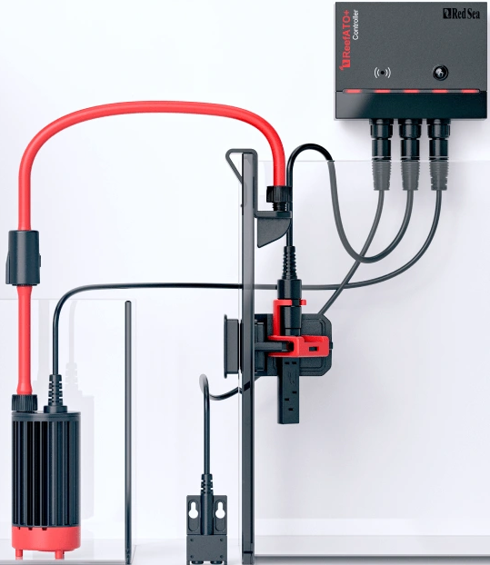</td>
<td>
<a href="https://github.com/Elwinmage/ha-reefbeat-component/issues?q=is:issue state:open label:rsato,all label:enhancement" style="text-decoration:none">📆</a>
<a href="https://github.com/Elwinmage/ha-reefbeat-component/issues?q=is:issue state:open label:rsato,all label:bug" style="text-decoration:none">🐛</a>
</td>
</tr>
<tr>
<td><a href="#reefcontrol">ReefControl</a></td>
<td colspan="2">RSSENSE Wenn Sie eines haben, kontaktieren Sie mich <a href="https://github.com/Elwinmage/ha-reefbeat-component/discussions/8">hier</a>, und ich werde den Support hinzufügen.</td><td>❌</td>
<td width="200px"></td>
<td>
  <a href="https://github.com/Elwinmage/ha-reefbeat-component/issues?q=is:issue state:open label:rscontrol,all label:enhancement" style="text-decoration:none">📆</a>
  <a href="https://github.com/Elwinmage/ha-reefbeat-component/issues?q=is:issue state:open label:rscontrol,all label:bug" style="text-decoration:none">🐛</a>
</td>
</tr>
<tr>
<td rowspan="2"><a href="#reefdose">ReefDose</a></td>
<td colspan="2">RSDOSE2</td>
<td>✅</td>
<td width="200px">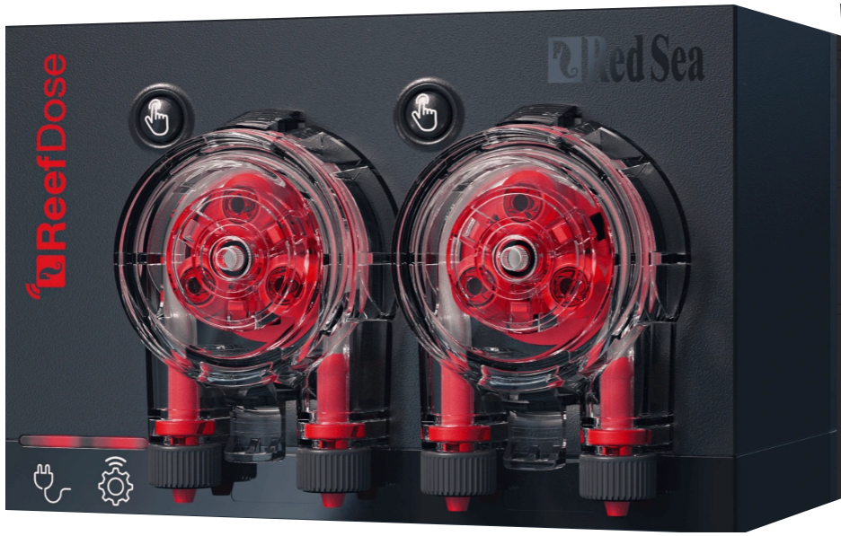</td>
<td rowspan="2">
<a href="https://github.com/Elwinmage/ha-reefbeat-component/issues?q=is:issue state:open label:rsdose,all label:enhancement" style="text-decoration:none">📆</a>
<a href="https://github.com/Elwinmage/ha-reefbeat-component/issues?q=is:issue state:open label:rsdose,all label:bug" style="text-decoration:none">🐛</a>
</td>
</tr>
<tr>
<td colspan="2">RSDOSE4</td><td>✅ </td>
<td width="200px"></td>
</tr>
<tr>
<td rowspan="6"> <a href="#reefled">ReefLed</a></td>
<td rowspan="3">G1</td>
<td>RSLED50</td>
<td>✅</td>
<td rowspan="3" width="200px"></td>
<td rowspan="6">
<a href="https://github.com/Elwinmage/ha-reefbeat-component/issues?q=is:issue state:open label:rsled,all label:enhancement" style="text-decoration:none">📆</a>
<a href="https://github.com/Elwinmage/ha-reefbeat-component/issues?q=is:issue state:open label:rsled,RSLED90,all label:bug" style="text-decoration:none">🐛</a>
</td>
</tr>
<tr>
<td>RSLED90</td>
<td>✅</td>
</tr>
<tr>
<td>RSLED160</td><td>✅ </td>
</tr>
<tr>
<td rowspan="3">G2</td>
<td>RSLED60</td>
<td>✅</td>
<td rowspan="3" width="200px">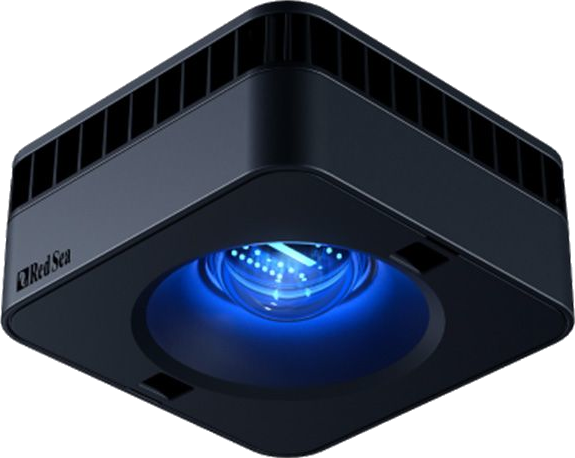</td>
</tr>
<tr>
<td>RSLED115</td><td>✅ </td>
</tr>
<tr>
<td>RSLED170</td><td>☑️</td>
</tr>
<tr>
<td rowspan="3"><a href="#reefmat">ReefMat</a></td>
<td colspan="2">RSMAT250</td>
<td>✅</td>
<td rowspan="3" width="200px"></td>
<td rowspan="3">
<a href="https://github.com/Elwinmage/ha-reefbeat-component/issues?q=is:issue state:open label:rsmat,all label:enhancement" style="text-decoration:none">📆</a>
<a href="https://github.com/Elwinmage/ha-reefbeat-component/issues?q=is:issue state:open label:rsmat,all label:bug" style="text-decoration:none">🐛</a>
</td>
</tr>
<tr>
<td colspan="2">RSMAT500</td><td>✅</td>
</tr>
<tr>
<td colspan="2">RSMAT1200</td><td>✅ </td>
</tr>
<tr>
<td><a href="#reefrun">ReefRun & DC Skimmer</a></td>
<td colspan="2">RSRUN</td><td>✅</td>
<td width="200px"></td>
<td>
<a href="https://github.com/Elwinmage/ha-reefbeat-component/issues?q=is:issue state:open label:rsrun,all label:enhancement" style="text-decoration:none">📆</a>
<a href="https://github.com/Elwinmage/ha-reefbeat-component/issues?q=is:issue state:open label:rsrun,all label:bug" style="text-decoration:none">🐛</a>
</td>
</tr>
<tr>
<td rowspan="2"><a href="#reefwave">ReefWave (*)</a></td>
<td colspan="2">RSWAVE25</td>
<td>☑️</td>
<td width="200px" rowspan="2"></td>
<td rowspan="2">
<a href="https://github.com/Elwinmage/ha-reefbeat-component/issues?q=is:issue state:open label:rswave,all label:enhancement" style="text-decoration:none">📆</a>
<a href="https://github.com/Elwinmage/ha-reefbeat-component/issues?q=is:issue state:open label:rwave,all label:bug" style="text-decoration:none">🐛</a>
</td>
</tr>
<tr>
<td colspan="2">RSWAVE45</td><td>✅</td>
</tr>
</table>

(*) ReefWave-Benutzer, bitte lesen Sie [dies](https://github.com/Elwinmage/ha-reefbeat-component/#reefwave)

# Zusammenfassung
- [Installation via HACS](https://github.com/Elwinmage/ha-reefbeat-component/#installation-via-hacs)
- [Gemeinsame Funktionen](https://github.com/Elwinmage/ha-reefbeat-component/#common-functions)
- [ReefATO+](https://github.com/Elwinmage/ha-reefbeat-component/#reefato)
- [ReefControl](https://github.com/Elwinmage/ha-reefbeat-component/#reefcontrol)
- [ReefDose](https://github.com/Elwinmage/ha-reefbeat-component/#reefdose)
- [ReefLED](https://github.com/Elwinmage/ha-reefbeat-component/#reefled)
- [Virtuelle LED](https://github.com/Elwinmage/ha-reefbeat-component/#virtual-led)
- [ReefMat](https://github.com/Elwinmage/ha-reefbeat-component/#reefmat)
- [ReefRun](https://github.com/Elwinmage/ha-reefbeat-component/#reefrun)
- [ReefWave](https://github.com/Elwinmage/ha-reefbeat-component/#reefwave)
- [Cloud API](https://github.com/Elwinmage/ha-reefbeat-component/#cloud-api)
- [FAQ](https://github.com/Elwinmage/ha-reefbeat-component/#faq)

# Installation via HACS

## Direkte Installation

Klicken Sie hier, um direkt zum Repository in HACS zu gelangen und auf „Herunterladen" zu klicken: 

Für die Begleit-Karte ha-reef-card mit erweiterten Funktionen klicken Sie hier, um zum Repository in HACS zu gelangen und auf „Herunterladen" zu klicken: 

## In HACS suchen
Oder suchen Sie in HACS nach „redsea" oder „reefbeat".

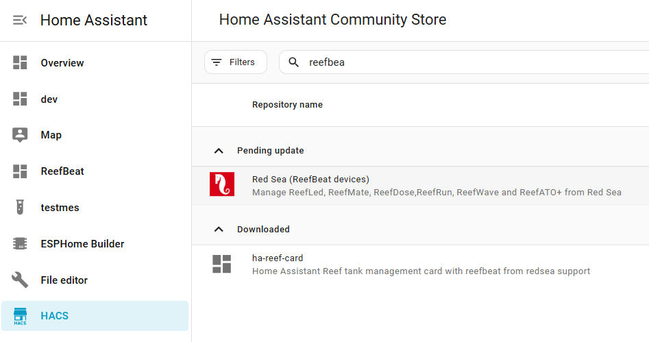

# Gemeinsame Funktionen

# Symbole
Diese Integration stellt benutzerdefinierte Symbole bereit, zugänglich über "redsea:icon-name":

## Gerät hinzufügen
Beim Hinzufügen eines neuen Geräts haben Sie 4 Optionen:

### Cloud-API hinzufügen
***Für ReefWave erforderlich, wenn Sie es mit der ReefBeat Mobile App synchronisiert halten möchten*** (Read [this](https://github.com/Elwinmage/ha-reefbeat-component/#reefwave)).  
***Erforderlich, um über neue Firmware-Versionen benachrichtigt zu werden*** (Read [this](https://github.com/Elwinmage/ha-reefbeat-component/#firmware-update)).
- Benutzerinformationen abrufen
- Aquarien abrufen
- Waves-Bibliothek abrufen
- LED-Bibliothek abrufen

### Automatische Erkennung im privaten Netzwerk
Wenn Sie sich nicht im gleichen Netzwerk befinden, lesen Sie [dies](#my-device-is-not-detected) und verwenden Sie den [„Manuellen Modus"](https://github.com/Elwinmage/ha-reefbeat-component/#manual-mode).

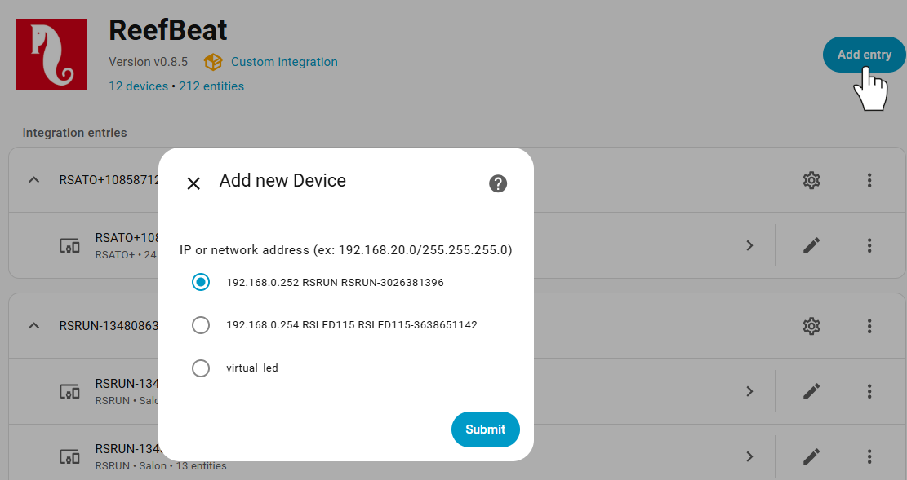

### Manueller Modus
Sie können die IP-Adresse Ihres Geräts oder die Netzwerkadresse für die automatische Erkennung eingeben.

### Scan-Intervall für das Gerät festlegen

## Live-Aktualisierung

> [!NOTE]
> It is possible to choose whether to enable live_update_config or not. In this mode (old default), configuration data is continuously retrieved along with normal data. For RSDOSE or RSLED, these large HTTP requests can take a long time (7–9 seconds). Sometimes the device does not respond to the request, so a retry function has been implemented. When live_update_config is disabled, configuration data is only retrieved at startup and when requested via the "Fetch Configuration" button. This new mode is activated by default. You can change it in the device configuration. 

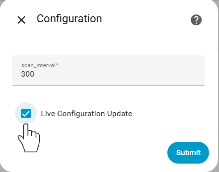

## Firmware-Aktualisierung
Sie können benachrichtigt werden und Ihr Gerät aktualisieren, wenn eine neue Firmware-Version verfügbar ist. You must have an active ["Cloud API"](https://github.com/Elwinmage/ha-reefbeat-component/#add-cloud-api) device with your credentials and the "Use Cloud API" switch must be enabled.
> [!TIP]
> The "Cloud API" is only needed to get the version number of the new release and compare it to the installed version. To update your firmware, the Cloud API is not strictly required.
> If you do not use the "Cloud API" (switch disabled or no Cloud API device installed), you will not be alerted when a new version is available, but you can still use the hidden "Force Firmware Update" button. If a new version is available, it will be installed.

  
  

# ReefATO:
- Automatisches Befüllen aktivieren/deaktivieren
- Manuelles Befüllen

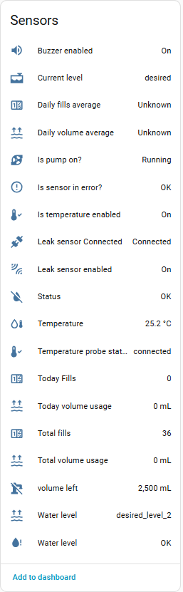
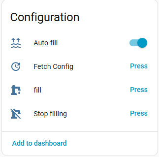

# ReefControl:
Noch nicht unterstützt. If you have one, contact me [here](https://github.com/Elwinmage/ha-reefbeat-component/discussions/8) and I will add its support.

# ReefDose:
- Tagesdosis bearbeiten
- Manuelle Dosierung
- Supplemente hinzufügen und entfernen
- Behältervolumen bearbeiten und steuern. Container volume settings are automatically enabled or disabled according to the volume control switch.
- Zeitplan pro Pumpe aktivieren/deaktivieren
- Konfiguration von Bestandsalarmen
- Dosierungsverzögerung zwischen Supplementen
- Befüllen (Bitte lesen Sie [this](https://github.com/Elwinmage/ha-reefbeat-component/#calibration-and-priming))
- Kalibrierung (Bitte lesen Sie [this](https://github.com/Elwinmage/ha-reefbeat-component/#calibration-and-priming))

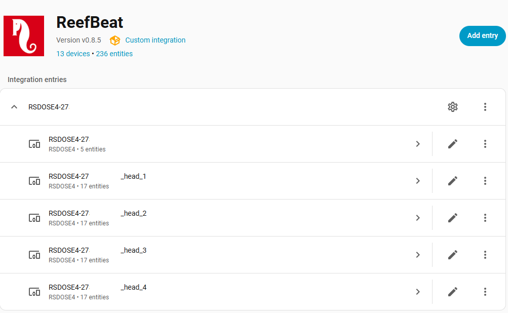

### Hauptgerät

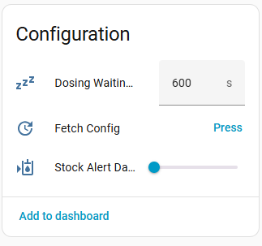

### Köpfe

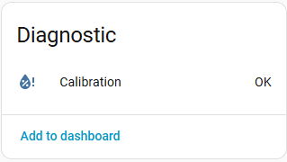

#### Calibration and Priming

> [!CAUTION]
> Sie müssen die folgende Reihenfolge genau einhalten (Using the [ha-reef-card](https://github.com/Elwinmage/ha-reef-card) is safer).  
> <ins>Calibration</ins>:
>  1. Place the graduated container and press "Start Calibration"
>  2. Enter the measured value using the "Dose of Calibration" field
>  3. Press "Set Calibration Value"
>  4. Empty the graduated container and press "Test new Calibration". If the value obtained is not 4 mL, go back to step 1.
>  5. Press "Stop and Save Graduation"
>
> <ins>For priming</ins>:
>  1. (a) Press "Start Priming"
>  2. (b) When the liquid flows out, press "Stop Priming"
>  3. (1) Place the graduated container and press "Start Calibration"
>  4. (2) Enter the measured value using the "Dose of Calibration" field
>  5. (3) Press "Set Calibration Value"
>  6. (4) Empty the graduated container and press "Test new Calibration". If the value obtained is not 4 mL, go back to step 1.
>  7. (5) Press "Stop and Save Graduation"
>
> ⚠️ Priming must always be followed by a calibration (steps 1 to 5)!⚠️

  

# ReefLED:

- Weiß- und Blaukanal abrufen und einstellen (only for G1: RSLED50, RSLED90, RSLED160)
- Farbtemperatur, Intensität und Mond abrufen und einstellen (all LEDs)
- Akklimatisierung verwalten. Acclimation settings are automatically enabled or disabled according to the acclimation switch.
- Mondphasen verwalten. Moon phase settings are automatically enabled or disabled according to the moon phase switch.
- Manuellen Farbmodus mit oder ohne Dauer einstellen.
- Lüfter- und Temperaturwerte abrufen.
- Name und Wert für Programme abrufen (with cloud support). Only for G1 LEDs.

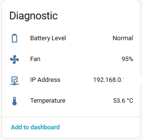

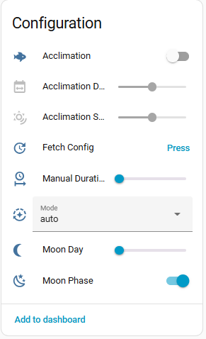

***

Color Temperature support for G1 LEDs takes into account the specificities of each of the three models.

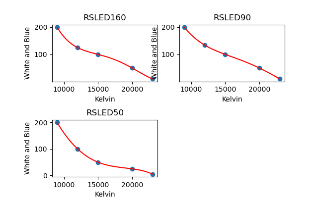

***
## WICHTIG für G1- und G2-Leuchten

### G2-LEUCHTEN

#### Intensität
Because G2 LEDs ensure constant intensity across the entire color range, your LEDs do not utilize their full capacity in the middle of the spectrum. At 8,000K, the white channel is at 100% and the blue channel at 0% (the opposite at 23,000K). At 14,000K with 100% intensity for G2 lights, the power of the white and blue channels is approximately 85%.
Here is the loss curve for the G2s.

#### Farbtemperatur
The G2 interface does not support the entire temperature range. From 8,000K to 10,000K, values are incremented in 200K steps, and from 10,000K to 23,000K in 500K steps. This behavior is handled automatically: if you choose an invalid value (e.g. 8,300K), a valid value will be automatically selected (8,200K in this example). This is why you may sometimes observe a slight cursor adjustment when selecting the color on a G2 light — the cursor repositions itself to an allowed value.

### G1-LEUCHTEN

G1 LEDs use white and blue channel control, which allows full power across the entire range, but not constant intensity without compensation.
That is why intensity compensation has been implemented.
This compensation ensures you get the same [PAR](https://en.wikipedia.org/wiki/Photosynthetically_active_radiation) (light intensity) regardless of your color temperature choice (in the range 12,000 to 23,000K).
> [!NOTE]
> Because Red Sea does not publish PAR values below 12,000K, compensation is only available in the 12,000 to 23,000K range. If you have a G1 LED and a PAR meter, you can [contact me](https://github.com/Elwinmage/ha-reefbeat-component/discussions/) to add compensation for the full range (9,000 to 23,000K).

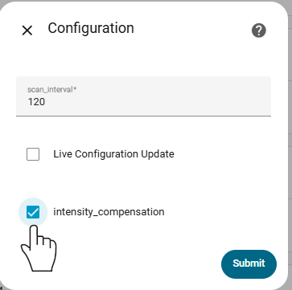

In other words, without compensation, an intensity of x% at 9,000K does not provide the same PAR as at 23,000K or 15,000K.

Here are the power curves:

If you want to use the full power of your LED, disable intensity compensation (default).

If you enable intensity compensation, the light intensity will be constant across all color temperature values, but in the middle of the range you will not use the full capacity of your LEDs (as with G2 models).

Also note that if compensation is enabled, the intensity factor can exceed 100% for G1 lights if you manually adjust the White/Blue channels. This allows you to harness the full power of your LEDs!

***

# Virtuelle LED
- LEDs mit einem virtuellen Gerät gruppieren und verwalten (create a virtual device from the integration panel, then use the configure button to link the LEDs).
- Sie können Kelvin und Intensität zur Steuerung nur verwenden, wenn Sie G2 oder eine Mischung aus G1 und G2 haben.
- Sie können sowohl Kelvin/Intensität als auch Weiß & Blau verwenden, wenn Sie nur G1-Leuchten haben.

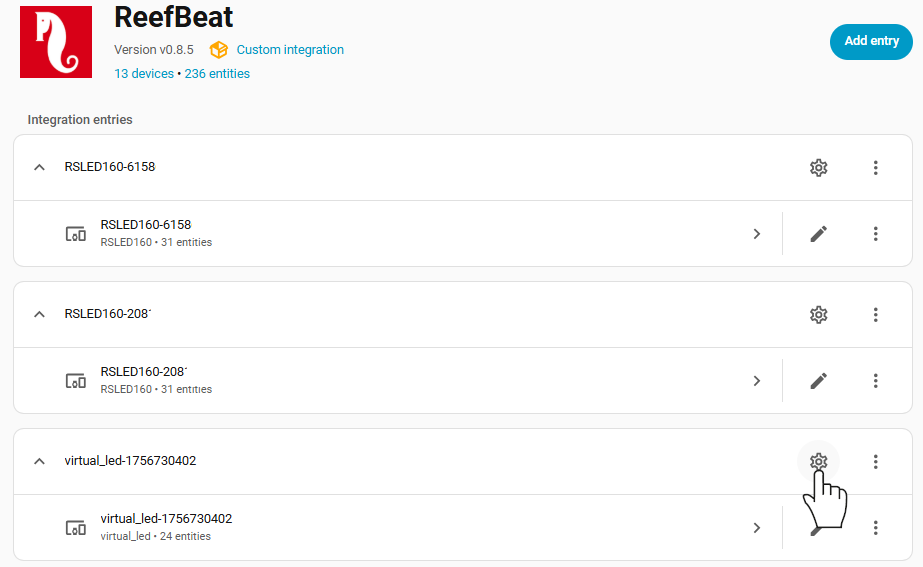

# ReefMat:
- Automatischer Vorschubschalter (aktivieren/deaktivieren)
- Geplanter Vorschub
- Benutzerdefinierter Vorschubwert: Vorschubwert der Rolle wählbar
- Manueller Vorschub
- Rolle wechseln.
>[!TIP]
> For a new full roll, please set "roll diameter" to the minimum (4.0 cm). The size will be adjusted according to your RSMAT version. For a partially used roll, enter the value in cm.
- Zwei versteckte Parameter: Modell und Position, falls Sie Ihr RSMAT neu konfigurieren müssen

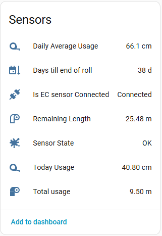

# ReefRun:
- Pumpengeschwindigkeit einstellen
- Überschäumen verwalten
- Erkennung eines vollen Auffangbehälters verwalten
- Skimmer-Modell änderbar

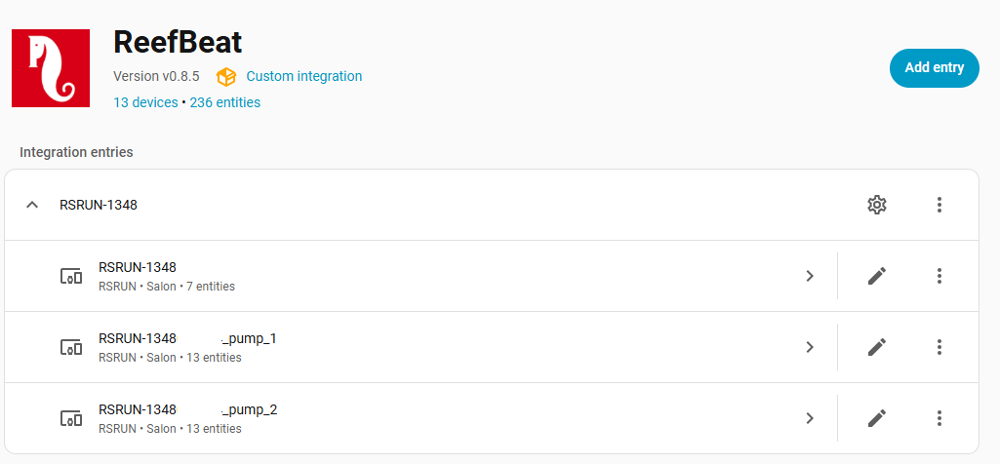

### Hauptgerät

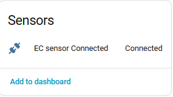

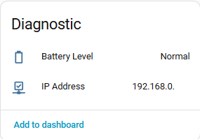

### Pumpen

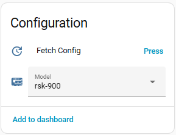

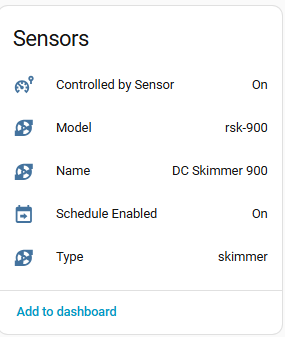
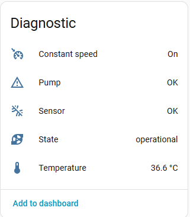

# ReefWave:
> [!IMPORTANT]
> ReefWave devices are different from other ReefBeat devices. They are the only devices that are slaves to the ReefBeat cloud. 
> When you launch the ReefBeat mobile app, the status of all devices is queried and data from the ReefBeat app is retrieved from device state. 
> For ReefWave, it is the opposite: there is no local control point (as you can see in the ReefBeat app, you cannot add a ReefWave to a disconnected aquarium). 
> 

 
> Waves are stored in the cloud user library. When you change a wave's value, it is changed in the cloud library and applied to the new schedule. 
> So there is no local mode? Not so simple. There is a hidden local API to control ReefWave, but the ReefBeat app will not detect the changes. As a result, the device and Home Assistant on one side, and the ReefBeat mobile app on the other, will be out of sync. The device and Home Assistant will always be synchronized. 
> Now that you know, make your choice!

> [!NOTE]
> ReefWave waves have many linked parameters, and the range of some parameters depends on other parameters. I was not able to test all possible combinations. If you find a bug, you can create an issue [here](https://github.com/Elwinmage/ha-reefbeat-component/issues).

## ReefWave-Modi
As explained above, ReefWave devices are the only devices that can become unsynchronized with the ReefBeat app if you use the local API.
Es stehen drei Modi zur Verfügung: Cloud, Lokal und Hybrid.
Sie können den Modus durch Einstellen der Schalter „Mit Cloud verbinden" und „Cloud-API verwenden" ändern, wie in der folgenden Tabelle beschrieben.

<table>
<tr>
<td>Modusname</td>
<td>Schalter Mit Cloud verbinden</td>
<td>Schalter Cloud-API verwenden</td>
<td>Verhalten</td>
<td>ReefBeat und HA sind synchronisiert</td>
</tr>
<tr>
<td>Cloud (Standard)</td>
<td>✅</td>
<td>✅</td>
<td>Data is fetched via the local API.  On/off commands are also sent via the local API.  Wave commands are sent via the cloud API.</td>
<td>✅</td>
</tr>
<tr>
<td>Local</td>
<td>❌</td>
<td>❌</td>
<td>Data is fetched via the local API.  Commands are sent via the local API.  Device is shown as "off" in the ReefBeat app.</td>
<td>❌</td>
</tr>
<tr>
<td>Hybrid</td>
<td>✅</td>
<td>❌</td>
<td>Data is fetched via the local API.  Commands are sent via the local API. The ReefBeat mobile app does not display the correct wave values if they have been changed via HA. Home Assistant always displays the correct values. You can change values from both the ReefBeat app and Home Assistant.</td>
<td>❌</td>
</tr>
</table>

For Cloud and Hybrid modes you must link your ReefBeat cloud account.
First create a ["Cloud API"](https://github.com/Elwinmage/ha-reefbeat-component/#add-cloud-api) device with your credentials, and that's it!
The "Linked to account" sensor will be updated with the name of your ReefBeat account once the connection is established.

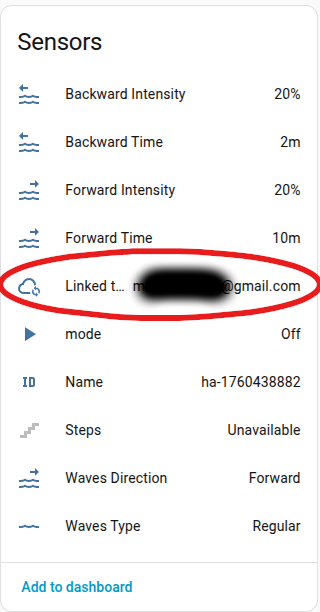

## Aktuelle Werte ändern
To load current wave values into the preview fields, use the "Set Preview From Current Wave" button.

To change the current wave values, set the preview values and use the "Save Preview" button.

The behavior is the same as the ReefBeat mobile app. All waves with the same ID in the current schedule will be updated.

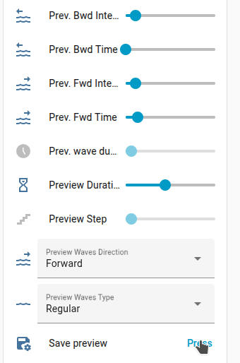

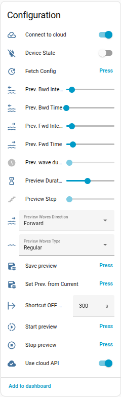
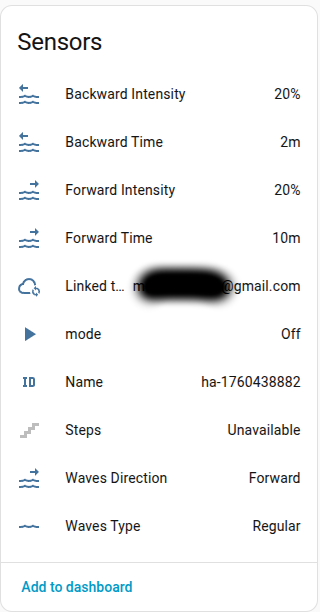

# Cloud-API
Die Cloud-API ermöglicht Ihnen:
- Verknüpfungen starten oder stoppen: Notfall, Wartung und Fütterung,
- Benutzerinformationen abrufen,
- Waves-Bibliothek abrufen,
- Supplement-Bibliothek abrufen,
- LED-Programmbibliothek abrufen,
- Über eine [neue Firmware-Version] benachrichtigt werden(https://github.com/Elwinmage/ha-reefbeat-component/#firmware-update),
- Befehle an ReefWave senden, wenn der Modus „[Cloud oder Hybrid](https://github.com/Elwinmage/ha-reefbeat-component/#reefwave)" mode is selected.

Verknüpfungen, Wellenparameter und LED-Parameter sind nach Aquarium sortiert.

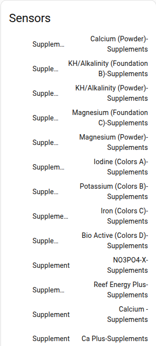

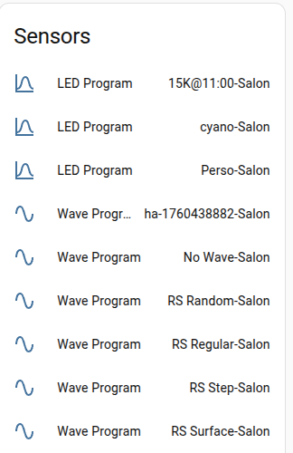
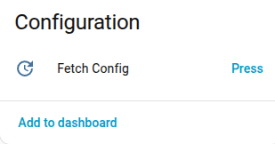

>[!TIP]
> Sie können das Abrufen der Supplements-Liste in der Cloud-API-Gerätekonfiguration deaktivieren.
>    
***
# FAQ

## Mein Gerät wird nicht erkannt
- Versuchen Sie, die automatische Erkennung mit der Schaltfläche „Eintrag hinzufügen" neu zu starten. Sometimes devices do not respond because they are busy.
- If your Red Sea devices are not on the same subnet as your Home Assistant, auto-detection will first fail and then offer you the option to enter the IP address of your device or the address of the subnet where your devices are located. For subnet detection, please use the format IP/MASK, for example: 192.168.14.0/255.255.255.0.
- You can also use [Manual Mode](https://github.com/Elwinmage/ha-reefbeat-component/#manual-mode).

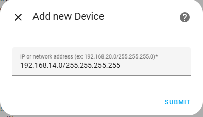

## Einige Daten werden korrekt aktualisiert, andere nicht.
Die Daten sind in drei Teile unterteilt: Daten, Konfiguration und Geräteinformationen.
- Daten werden regelmäßig aktualisiert.
- Konfigurationsdaten werden nur beim Start und beim Drücken der Schaltfläche „Konfiguration abrufen" aktualisiert.
- Geräteinformationen werden nur beim Starten aktualisiert.

Um sicherzustellen, dass Konfigurationsdaten regelmäßig aktualisiert werden, aktivieren Sie bitte [Live-Konfigurationsaktualisierung](#live-update).

***

[buymecoffee]: https://paypal.me/Elwinmage
[buymecoffeebadge]: https://img.shields.io/badge/buy%20me%20a%20coffee-donate-yellow.svg?style=flat-square
