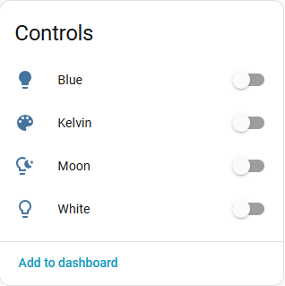
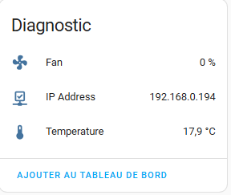
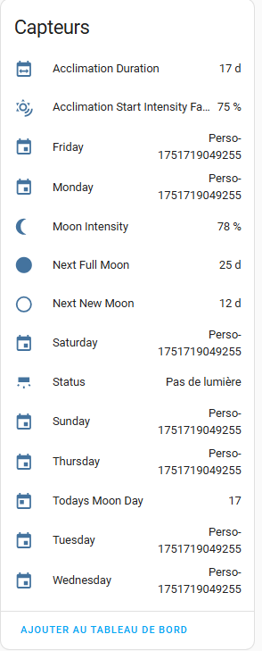
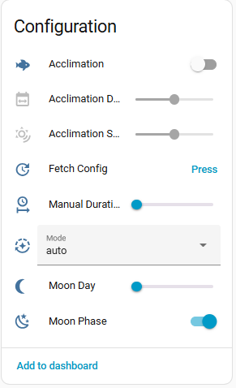
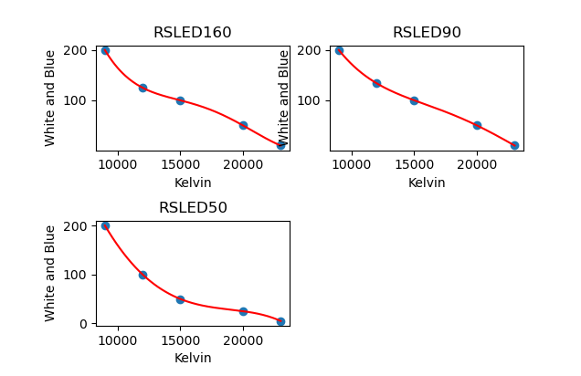
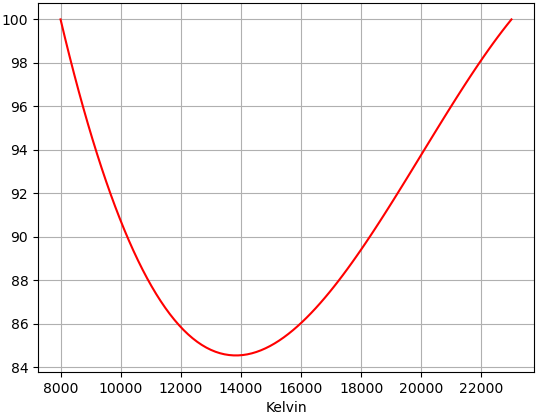
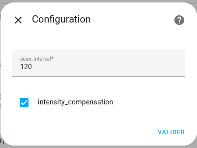
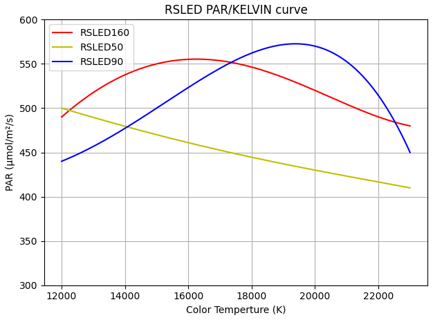

[← Zurück zur Hauptseite](README.de.md)

# ReefLED:

- Weiß- und Blaukanal abrufen und einstellen (only for G1: RSLED50, RSLED90, RSLED160)
- Farbtemperatur, Intensität und Mond abrufen und einstellen (all LEDs)
- Akklimatisierung verwalten. Acclimation settings are automatically enabled or disabled according to the acclimation switch.
- Mondphasen verwalten. Moon phase settings are automatically enabled or disabled according to the moon phase switch.
- Manuellen Farbmodus mit oder ohne Dauer einstellen.
- Lüfter- und Temperaturwerte abrufen.
- Name und Wert für Programme abrufen (with cloud support). Only for G1 LEDs.

***

Die Unterstützung der Farbtemperatur für G1-LEDs berücksichtigt die Besonderheiten jedes der drei Modelle.

***
## WICHTIG für G1- und G2-Leuchten

### G2-LEUCHTEN

#### Intensität
Da G2-LEDs über den gesamten Farbbereich eine konstante Intensität gewährleisten, nutzen Ihre LEDs in der Mitte des Spektrums nicht ihre volle Leistung. Bei 8.000K steht der Weißkanal auf 100 % und der Blaukanal auf 0 % (umgekehrt bei 23.000K). Bei 14.000K und 100 % Intensität liegt die Leistung des Weiß- und des Blaukanals bei G2-Leuchten bei etwa 85 %.
Hier ist die Verlustkurve der G2.

#### Farbtemperatur
Die G2-Oberfläche unterstützt nicht den gesamten Temperaturbereich. Von 8.000K bis 10.000K werden die Werte in 200K-Schritten erhöht, von 10.000K bis 23.000K in 500K-Schritten. Dies wird automatisch gehandhabt: Wählen Sie einen ungültigen Wert (z. B. 8.300K), wird automatisch ein gültiger Wert gewählt (in diesem Beispiel 8.200K). Deshalb springt der Regler bei der Farbwahl an einer G2-Leuchte manchmal leicht: Er stellt sich auf einen zulässigen Wert.

### G1-LEUCHTEN

G1-LEDs werden über den Weiß- und den Blaukanal gesteuert, was die volle Leistung über den gesamten Bereich erlaubt, ohne Kompensation aber keine konstante Intensität.
Deshalb wurde die Intensitätskompensation eingeführt.
Diese Kompensation sorgt dafür, dass Sie unabhängig von der gewählten Farbtemperatur (im Bereich 12.000 bis 23.000K) dasselbe [PAR](https://en.wikipedia.org/wiki/Photosynthetically_active_radiation) (Lichtintensität) erhalten.
> [!NOTE]
> Da Red Sea keine PAR-Werte unter 12.000K veröffentlicht, ist die Kompensation nur im Bereich 12.000 bis 23.000K verfügbar. Wenn Sie eine G1-LED und ein PAR-Messgerät besitzen, können Sie [mich kontaktieren](https://github.com/Elwinmage/ha-reefbeat-component/discussions/), um die Kompensation auf den gesamten Bereich (9.000 bis 23.000K) zu erweitern.

Anders gesagt: Ohne Kompensation liefert eine Intensität von x % bei 9.000K nicht dasselbe PAR wie bei 23.000K oder 15.000K.

Hier sind die Leistungskurven:

Wenn Sie die volle Leistung Ihrer LED nutzen möchten, deaktivieren Sie die Intensitätskompensation (Standard).

Wenn Sie die Intensitätskompensation aktivieren, ist die Lichtintensität über alle Farbtemperaturen konstant, in der Mitte des Bereichs nutzen Sie jedoch nicht die volle Leistung Ihrer LEDs (wie bei den G2-Modellen).

Beachten Sie auch, dass bei aktivierter Kompensation der Intensitätsfaktor bei G1-Leuchten 100 % überschreiten kann, wenn Sie die Weiß-/Blaukanäle manuell einstellen. So können Sie die volle Leistung Ihrer LEDs ausschöpfen!

***

### Wetterprogramm
Die Leuchte kann dem Wetter eines Ortes folgen: Im **GPS-Wettermodus** wird
ihre Woche aus dem Wetter der nächsten sieben Tage (Vorhersage) oder der
vergangenen sieben Tage (gemessenes Wetter) aufgebaut, geliefert von
[Open-Meteo](https://open-meteo.com) (kostenlos, ohne Schlüssel). Es gibt
nichts zu bestätigen: Beim Einschalten werden die eigenen Programme der
Leuchte beiseitegelegt und die Wetterwoche sofort gesendet; das Wetter wird
danach alle paar Tage erneut abgerufen (3 bis 15, nach Wahl; einmal täglich
um 00:10 geprüft) sowie bei jeder geänderten Einstellung (30 s nach der
letzten Änderung). Beim Ausschalten werden die eigenen Programme der Leuchte
zurückgeschrieben.

| Entität | Rolle |
| ------- | ----- |
| `switch` GPS-Wettermodus | GPS-Wetter oder die Standardprogramme der Leuchte |
| `select` Wetterzeitraum | Nächste Woche (Vorhersage) oder letzte Woche (gemessen) |
| `number` Wetteraktualisierung (Tage) | Tage zwischen zwei Wetterabrufen, 3 bis 15 |
| `text` Wetterort | `lat, lon`, eine `geo:`-URI oder ein Link von Google Maps / OpenStreetMap / Apple Karten; leer für das Zuhause von Home Assistant |
| `select` Wettertag im Aquarium | Uhrzeit des Ortes, am Sonnenaufgang oder am Sonnenuntergang verankert, oder zwischen beiden gestreckt |
| `time` Wetter Sonnenaufgang / Wetter Sonnenuntergang | Beckenzeiten, die diese Verankerungen verwenden |
| `number` Wetter Mindestintensität / Wetter Höchstintensität | Leitplanken der Intensität |
| `switch` Wetterwolken | Setzt die Wolken der Leuchte auf die bewölkten Stunden |
| `sensor` Wetterprogramm | Ergebnis des letzten Abrufs (Status, Ort und je Tag Sonne, Sonnenschein, Bewölkung und höchste Intensität); `writing` (`{done, total}` Tage), während eine Woche an die Leuchte gesendet wird |

So entsteht ein Tag:
- **Zeiten** — vom Sonnenaufgang bis zum Sonnenuntergang des Ortes, nach der
  Uhr des Ortes (ein Riff auf Fidschi geht auch auf der Leuchte um 06:00
  auf), oder am Becken verankert: *Sonnenaufgang* (der Tag des Ortes beginnt
  zur gewählten Zeit), *Sonnenuntergang* (er endet zur gewählten Zeit) oder
  *beide* (der Tag des Ortes wird zwischen beiden Zeiten gestreckt).
- **Intensität** — folgt der tatsächlich empfangenen Sonne (stündliche
  Globalstrahlung, 1000 W/m² entsprechen voller Sonne), zwischen Minimum und
  Maximum; bis zu 8 Punkte pro Tag.
- **Farbe** — die des Standardprogramms der Leuchte zum selben Zeitpunkt
  seines Tages: das Weiß/Blau-Verhältnis bei einer G1, die Farbtemperatur
  bei einer G2. Stattdessen können Sie eigene Farben wählen, je Wochentag
  (Einstellung `colors`: `{Wochentag: [{at, k}]}`, `at` vom Aufgang, 0, bis
  zum Untergang, 1, `k` die Farbtemperatur von 8.000 bis 23.000 K); eine G1
  rechnet sie mit der Tabelle ihres Modells um. Diese Einstellung hat keine
  Entität: Sie wird im Programmeditor von ha-reef-card oder mit
  `redsea.led_weather_save` gesetzt.
- **Wolken** — in den Stunden mit mindestens 40 % Bewölkung: Low, Medium
  oder High je nach mittlerer Bewölkung; an einem klaren Tag entfernt.
- **Mond** — behält seinen Platz nach dem Sonnenuntergang.

Das Programm heißt auf der Leuchte *Weather*. Die an eine Leuchte
geschriebenen Anfragen werden getaktet (2 s Abstand): Eine ReefLED antwortet
spät oder gar nicht auf einen zu früh gesendeten Befehl; das Schreiben einer
Woche dauert daher etwas.

Die Leuchten einer Gruppe ([Virtuelle LED](virtual-led.de.md#virtuelle-led)) teilen sich ein
Wetterprogramm: Auf einer Leuchte der Gruppe eingeschaltet oder eingestellt,
gilt es für alle. Jede Leuchte erhält ihre eigene Wetterwoche in ihrem
eigenen Format, und die tägliche Prüfung erfolgt einmal, durch die Gruppe.

| Dienst | Rolle |
| ------ | ----- |
| `redsea.led_weather_apply` | Ruft das Wetter erneut ab und sendet die Woche sofort (nur im Wettermodus), zum Beispiel aus einer Automatisierung |
| `redsea.led_weather_preview` | Die Woche, die bestimmte Einstellungen ergäben, und die eigene der Leuchte: Es wird nichts geschrieben |
| `redsea.led_weather_save` | Speichert Einstellungen und den Modus (`enabled`) auf einmal und schreibt dann die Woche (im Hintergrund, oder mit `wait` vor der Antwort) |

***

### Sonnenaufgang-Versatz
Jede ReefLED, die auf `/offset` antwortet (beim Start geprüft), erhält ein
`number` Sonnenaufgang-Versatz (Minuten): Die Leuchte spielt ihr
gesamtes Programm um diese Zeit später. In einer Gruppe setzt ihn der
[versetzte Sonnenaufgang](virtual-led.de.md#virtuelle-led) der virtuellen LED für jede Leuchte.

***

### Cloud-Bibliothek
Mit einem ReefBeat-Cloud-Konto ([Cloud-API](README.de.md#cloud-api-hinzufügen)) können die
Lichtprogramme der Bibliothek der ReefBeat-App gelesen und geschrieben
werden, wie es der Programmeditor von ha-reef-card tut. G1-Programme werden
je Aquarium gespeichert, G2-Programme je Konto; die Red-Sea-Programme können
weder geändert noch gelöscht werden.

| Dienst | Rolle |
| ------ | ----- |
| `redsea.led_library` | Listet die Programme, die die Leuchte verwenden kann (`linked: false` ohne Cloud-Konto) |
| `redsea.led_library_save` | Fügt ein Programm hinzu (`name`, `program`, `clouds`) oder aktualisiert eines Ihrer eigenen (`uid`) |
| `redsea.led_library_delete` | Löscht eines Ihrer Programme (`uid`) |
| `redsea.led_convert` | Rechnet G1-Punkte zwischen Weiß/Blau und Kelvin/Intensität um, mit der Tabelle des Modells und der Intensitätskompensation |

***

### Wartungsaufgaben
| Aufgabe | Standard | Spanne |
| ------- | -------- | ------ |
| Linsen reinigen | 3 Wochen | 1 – 5 Wochen |
| Lüfter und Gitter entstauben | 6 Monate | 5 – 7 Monate |

Diese beiden Aufgaben entstehen für alle ReefLED-Generationen, auch für die
virtuelle LED. Siehe den Abschnitt [Wartung](maintenance.de.md#wartung).

---

[← Zurück zur Hauptseite](README.de.md)
