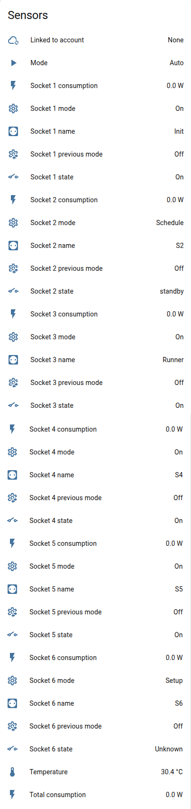
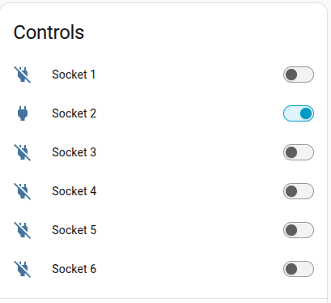
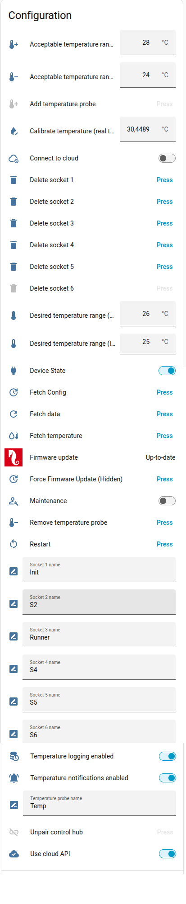
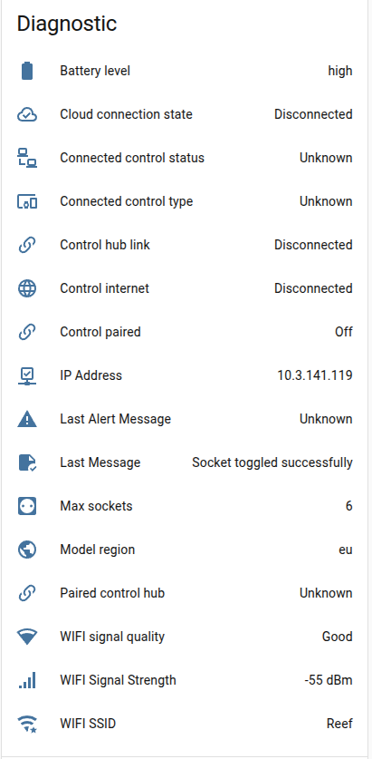

[← Volver a la página principal](README.es.md)

# ReefControl-Power

El RSPOWER (Power Center) es un dispositivo independiente con su propia dirección IP, expuesto por separado en Home Assistant.

- 6 u 8 tomas controlables según el modelo (RSPOWER6 / RSPOWER8)
- **Por toma**: nombre editable, interruptor de encendido/apagado, estado, modo, modo anterior, consumo y un botón «Eliminar enchufe» que devuelve la toma a su estado de fábrica (modo `setup`, nombre de fábrica)
- **Dispositivo**: consumo total, nivel de batería, modo, región del modelo y número de tomas
- **Sonda de temperatura local** (opcional): botones para añadirla / eliminarla, botón «Obtener temperatura», calibración con la temperatura real, rangos de temperatura deseado y aceptable, nombre, interruptores de notificaciones y registro — todo disponible una vez instalada la sonda. El sensor de temperatura lleva los atributos `ranges` y `level`, como las sondas del hub.
- **Emparejamiento ReefControl**: hub emparejado, su tipo y estado, estado del enlace y de internet, y un botón «Desemparejar hub de control»
- Las escrituras se muestran al instante (actualización optimista) y después se confirman leyendo de nuevo el dispositivo

> [!NOTE]
> La sonda de temperatura local y el hub ReefControl se excluyen: «Añadir sonda de temperatura» solo está disponible sin ninguno de los dos, «Eliminar sonda de temperatura» con una sonda local y «Desemparejar hub de control» con un hub emparejado. Los botones siguen visibles pero no disponibles cuando no se aplican.

## Emparejamiento con un ReefControl
El emparejamiento siempre se inicia desde el hub, con su botón **Emparejar Power Center**: el hub se empareja con el Power Center que encuentra en la red. El desemparejamiento funciona desde ambos lados. Cuando los dos dispositivos están configurados en Home Assistant, el cambio aparece en ambos a la vez — para un emparejamiento, solo cuando un único Power Center libre deja claro cuál es.

Una vez emparejado, las sondas del hub pueden controlar las tomas. El Power Center solo guarda qué tipo de sonda sigue una toma; la sonda en sí y los umbrales se guardan en el hub. Dos servicios permiten a una tarjeta o a una automatización leer ese lado:

- `redsea.get_control_probes` — las sondas de un hub (identidad y valores actuales), por su identificador de hardware
- `redsea.get_control_subscriptions` — las reglas que el hub aplica a las tomas de su Power Center, por su identificador de hardware

Eliminar una toma en el Power Center solo borra su mitad de una regla de sonda: el botón **Desuscribir enchufe N** del hub borra la otra mitad.

## Modo de las tomas y tomas pilotadas por sensor
El modo de una toma (off / on / schedule / sensor) y sus ajustes de programa o de umbral de sensor (p. ej. «encender esta toma cuando la temperatura local baje de 24 °C») se configuran desde la [ha-reef-card](https://github.com/Elwinmage/ha-reef-card), como los [puertos del hub](reefcontrol.es.md#modos-de-los-puertos-y-las-tomas).

Cada toma expone una entidad `sensor.socket_N_mode` para las automatizaciones: su estado es el modo actual de la toma, y sus atributos llevan el `schedule` actual y (en modo sensor) el `sensor_config`, marcado por `sensor_source`: `local` para la sonda propia del Power Center, `control` para una regla del hub emparejado.

Una toma controlada por un programa o una sonda puede apagarse a mano: su modo indica entonces `off`, mientras el sensor **modo anterior** conserva el modo automático al que volverá.

El dispositivo sale automáticamente de su estado inicial «setup» en cuanto se configura la primera toma, igual que la aplicación ReefBeat — no hace falta ninguna acción manual.

---

[← Volver a la página principal](README.es.md)
