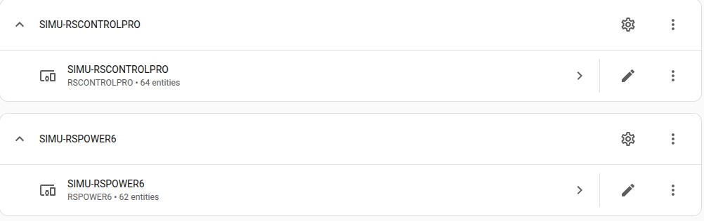
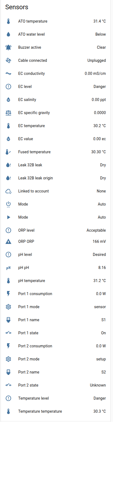
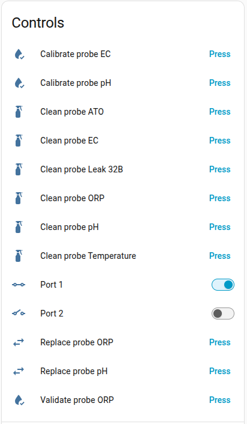
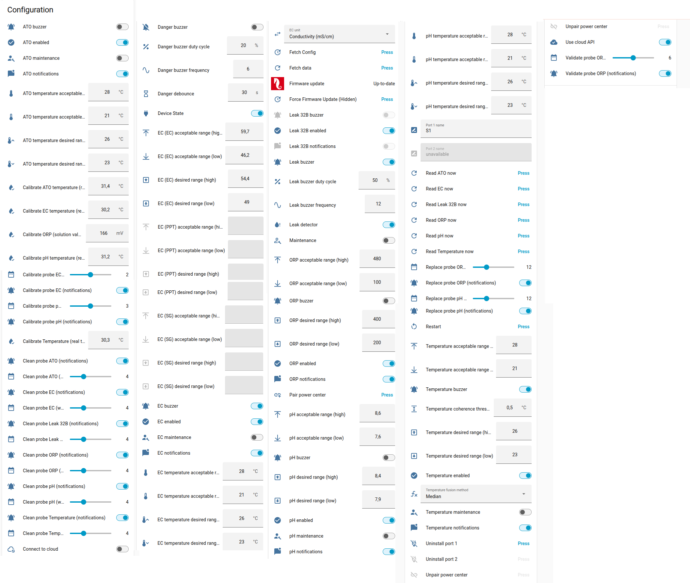
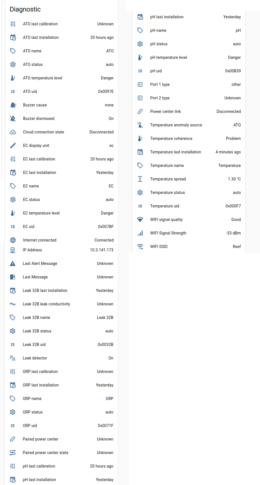
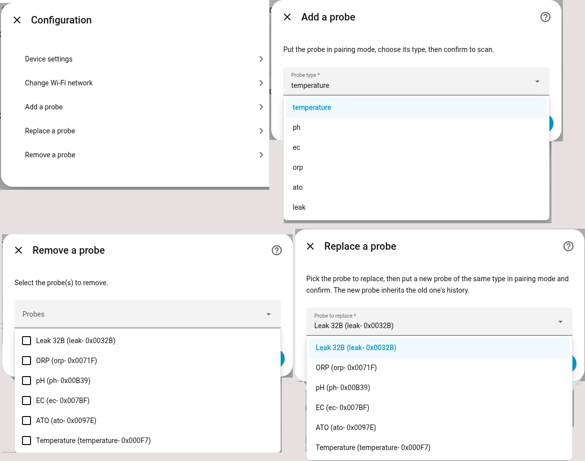

[← Volver a la página principal](README.es.md)

# ReefControl:
<p align="center">

</p>

El hub ReefControl (RSCONTROLPRO / RSCONTROLLITE) lee las sondas ReefSense conectadas a sus cajas de extensión, controla sus puertos de 12V DC (2 en el Pro, 1 en el Lite) y, una vez emparejado, las tomas de un [ReefControl-Power](reefcontrol-power.es.md#reefcontrol-power).

- **Sondas ReefSense** — pH, ORP, salinidad (EC), temperatura, ATO (nivel de agua) y fuga: valor y nivel (deseado / aceptable / peligro), estado, nombre, uid, fechas de última instalación y última calibración, y la temperatura integrada de las sondas de pH, EC y ATO. Cada entidad de sonda lleva los atributos `probe_uid`, `probe_type` y `probe_index`, y los sensores de medida un atributo `ranges` (`[acceptable_low, desired_low, desired_high, acceptable_high]`).
- **Sondas de salinidad** — sensores de conductividad, salinidad (ppt) y densidad, más un select de unidad de visualización.
- **Sondas de fuga** — estado seco/mojado, **origen del agua** (seco / agua del acuario / agua osmotizada) y la conductividad medida, leídos en cuanto la sonda se moja.
- **Ajustes por sonda** — rangos deseado y aceptable (lectura principal y temperatura integrada), interruptores de activada / zumbador / notificaciones / mantenimiento, y un botón «Leer ahora» que obtiene una lectura nueva sin esperar al siguiente sondeo.
- **Calibración de las sondas** — ver [más abajo](#calibración-de-las-sondas).
- **Zumbador** — zumbador de peligro y zumbador de fuga (activación, frecuencia, ciclo de trabajo), antirrebote del peligro, interruptor del detector de fugas; estado activo / silenciado del zumbador y su causa.
- **Puertos 12V** — nombre editable, interruptor de encendido/apagado, estado, modo, tipo, consumo y un botón «Desinstalar puerto». El sensor `port_N_mode` lleva como atributos toda la configuración del puerto, su programa y su regla de sonda, para que una tarjeta pueda editar el puerto (ver [Modos de los puertos y las tomas](#modos-de-los-puertos-y-las-tomas)).
- **Emparejamiento con ReefControl-Power** — Power Center emparejado, su estado y su enlace, botones «Emparejar Power Center» / «Desemparejar Power Center», y un botón «Desuscribir enchufe» por cada toma del Power Center que el hub controla desde una sonda.
- **Añadir, reemplazar o eliminar sondas** desde el menú de opciones de la integración (ver [más abajo](#gestión-de-sondas-añadir--reemplazar--eliminar)).
- Las escrituras se muestran al instante (actualización optimista) y después se confirman leyendo de nuevo el dispositivo.

<p align="center">




</p>

> [!TIP]
> La [ha-reef-card](https://github.com/Elwinmage/ha-reef-card) dibuja el hub, sus sondas, sus puertos y el Power Center emparejado, y maneja las calibraciones y los modos de los puertos en pocos clics.

## Gestión de sondas (añadir / reemplazar / eliminar)
Las sondas BLE (pH, ORP, EC, ATO, fuga, temperatura) se gestionan desde el menú **Opciones** de la integración, igual que en la aplicación de Red Sea:

<p align="center">

</p>

- **Añadir una sonda**: ponga la sonda en modo de emparejamiento, elija su tipo y confirme para buscarla. La sonda se configura como lo hace la aplicación: una sonda de fuga, por ejemplo, se llama `Leak <uid>` con su zumbador, su detector de fugas y sus notificaciones activados.
- **Reemplazar una sonda**: elija la sonda que se va a reemplazar, ponga una sonda nueva del mismo tipo en modo de emparejamiento y confirme. La nueva sonda hereda el historial y las estadísticas de la anterior.
- **Eliminar una sonda**: seleccione una o varias sondas y confirme — esto borra definitivamente las entidades de la sonda y su historial.

> [!NOTE]
> Reinstalar una sonda restablece sus ajustes en el hub (una sonda ORP vuelve a sus rangos de fábrica). La integración vuelve a leer la configuración de las sondas cuando una sonda aparece o se reinstala, ya sea desde Home Assistant o desde la aplicación ReefBeat.

## Calibración de las sondas
Cada tipo de sonda se calibra como en la aplicación ReefBeat.

| Sonda | Cómo | Entidad / servicio |
| ----- | ---- | ------------------ |
| ORP | Sumerja la sonda en la solución de calibración y ajuste el número al valor de la solución | `Calibrar {probe} (valor de la solución)` |
| Temperatura | Ajuste el número a la temperatura real del agua en la que está la sonda | `Calibrar {probe} (temperatura real)` |
| Temperatura integrada (pH, EC, ATO) | Igual, para el sensor de temperatura integrado en la sonda | `Calibrar la temperatura de {probe} (temperatura real)` |
| pH | Dos puntos: pH 7, luego pH 10 (agua salada) o pH 4 (agua dulce) | `redsea.probe_calibration` |
| Salinidad (EC) | Un punto, con el valor de la solución en mS/cm | `redsea.probe_calibration` |

Los **números de valor de referencia** (ORP y temperaturas) muestran la lectura actual. Ajustar uno a la referencia vuelve a leer la sonda y desplaza su offset en `referencia - lectura`, de modo que la sonda pasa a leer la referencia.

Las **calibraciones de pH y EC** tienen varios pasos y usan el servicio `redsea.probe_calibration`, un paso por llamada: `enter`, luego `point` para cada punto de calibración, `status` consultado hasta que el hub indica éxito o fallo (mientras tanto devuelve `calibration_status`, `time_left` y `stability_progress`) y finalmente `exit`. La [ha-reef-card](https://github.com/Elwinmage/ha-reef-card) ejecuta toda la secuencia por usted.

```yaml
action: redsea.probe_calibration
data:
  device_id: <config entry of the hub>
  probe_type: ph
  probe_uid: "0x00B39"
  action: point
  point: MID
  solution_value: 7.0
  solution_rated_temp: 25
```

La fecha de la última calibración la da el hub: una sonda de pH o EC calibrada desde la aplicación ReefBeat, o una sonda ORP verificada, marca su tarea de mantenimiento como hecha en esa fecha.

## Fusión de temperatura multi-sonda
En cuanto hay dos o más fuentes de temperatura (la sonda de temperatura dedicada más la temperatura embebida en las sondas EC/pH/ATO), ReefControl calcula una **temperatura fusionada** robusta a partir de las lecturas individuales:

- **Temperatura fusionada** (`sensor`): un único valor agregado con el método elegido — Mediana (por defecto), Media, Mínimo o Máximo. Configurable mediante la entidad select **Método de fusión de temperatura**.
- **Coherencia de temperatura** (`binary_sensor`) y **Dispersión de temperatura** (`sensor`, diagnóstico): indican si las fuentes concuerdan dentro del **Umbral de coherencia de temperatura** (configurable, 0,5 °C por defecto), y en qué medida difieren.
- **Origen de anomalía de temperatura** (`sensor`, diagnóstico): `OK` cuando todas las fuentes concuerdan, el nombre de la(s) sonda(s) sospechosa(s) de desviarse o de leer incorrectamente, o `Desconocido` cuando la discrepancia no puede atribuirse a una sonda concreta. Los atributos del sensor detallan cada fuente (valor, cambio en 1 hora, estado).
- Un **interruptor de mantenimiento por sonda con capacidad de temperatura**: activarlo excluye temporalmente esa sonda del cálculo de fusión/coherencia/anomalía, para que su limpieza o calibración nunca provoque una falsa alarma.
- Una **calibración con la temperatura real** (`number`) por sonda con capacidad de temperatura (ver [Calibración de las sondas](#calibración-de-las-sondas)).

Estas entidades solo aparecen cuando se detectan al menos dos fuentes de temperatura.

## Modos de los puertos y las tomas
Un puerto de 12V del hub, como una toma del Power Center, funciona en uno de cuatro modos: **off**, **on**, **schedule** (programa) o **sensor** (controlado por una sonda). Un puerto aún no instalado está en modo `setup` y rechaza cualquier escritura hasta que se instala.

Estos ajustes no se exponen como entidades individuales — con varios puertos y tomas y un juego de umbrales por tipo de sonda, serían decenas de entidades poco usadas. Configúrelos desde la [ha-reef-card](https://github.com/Elwinmage/ha-reef-card), que realiza las mismas llamadas que la aplicación ReefBeat en una sola acción mediante el servicio `redsea.request` (ver los Servicios de la integración en las Herramientas para desarrolladores de Home Assistant).

El sensor `port_N_mode` lleva igualmente lo que una automatización necesita para leer la configuración activa: `config` (la entrada completa del puerto, incluido `power_on_percent`), `schedule` (leído del hub mientras el puerto está en modo programa) y `sensor_config` (la regla de sonda), con `sensor_source: control`.

> [!NOTE]
> Un puerto que controla una bomba ATO desde una sonda ATO sigue siendo de tipo `other`: es el asistente del kit ATO de la aplicación ReefBeat el que los enlaza. El hub no expone los controles ATO del RSATO+ (llenado manual, llenado automático, volumen restante…).

## Tareas de mantenimiento
| Tarea | Sondas | Por defecto | Rango |
| ----- | ------ | ----------- | ----- |
| Limpiar la sonda | Todas | 30 días | 2 – 8 semanas |
| Calibrar la sonda | pH | 3 meses | 2 – 4 meses |
| Calibrar la sonda | Salinidad (EC) | 2 meses | 1 – 3 meses |
| Verificar la sonda | ORP | 6 meses | 5 – 7 meses |
| Sustituir la sonda | pH, ORP | 12 meses | 9 – 18 meses |

Las tareas se siguen **por sonda**, según las recomendaciones oficiales de Red Sea. Las sondas de temperatura y de fuga no tienen recordatorio de calibración, y la celda EC de 4 polos nunca se sustituye según un calendario. Ver la sección [Mantenimiento](maintenance.es.md#mantenimiento).

---

[← Volver a la página principal](README.es.md)
