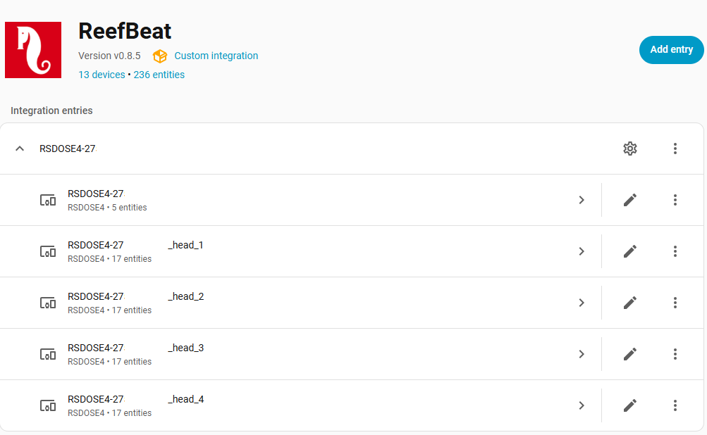
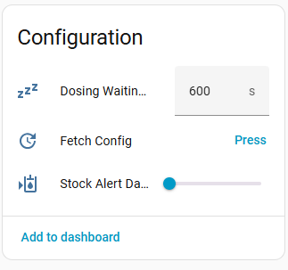
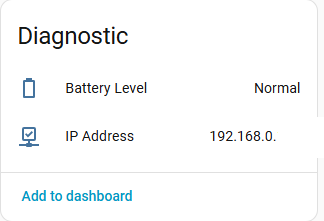
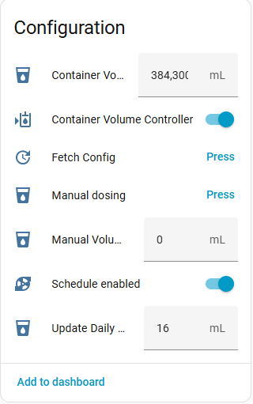
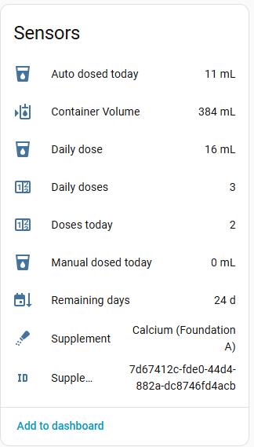
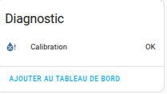
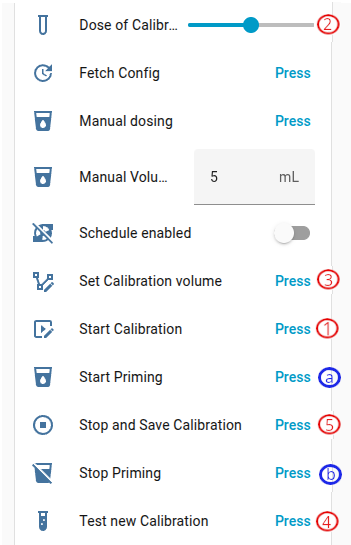

[← Volver a la página principal](README.es.md)

# ReefDose:
- Modificar la dosis diaria
- Dosis manual
- Añadir y eliminar suplementos
- Modificar y controlar el volumen del recipiente. Los ajustes del volumen del recipiente se activan o desactivan automáticamente según el interruptor de control de volumen.
- Activar/desactivar la programación por bomba
- Configuración de alertas de stock
- Retraso de dosificación entre suplementos
- Cebado (Por favor lea [esto](#calibración-y-cebado))
- Calibración (Por favor lea [esto](#calibración-y-cebado))

### Principal

### Cabezas

#### Calibración y cebado

> [!CAUTION]
> Debe seguir estrictamente el siguiente orden (Using the [ha-reef-card](https://github.com/Elwinmage/ha-reef-card) is safer).  
> <ins>Calibration</ins>:
>  1. Coloque el recipiente graduado y pulse "Iniciar calibración"
>  2. Introduzca el valor medido en el campo "Dosis de calibración"
>  3. Press "Set Calibration Value"
>  4. Vacíe el recipiente graduado y pulse "Probar nueva calibración". Si el valor obtenido no es 4 mL, vuelva al paso 1.
>  5. Press "Stop and Save Graduation"
>
> <ins>For priming</ins>:
>  1. (a) Press "Start Priming"
>  2. (b) Cuando el líquido salga, pulse "Detener cebado"
>  3. (1) Coloque el recipiente graduado y pulse "Iniciar calibración"
>  4. (2) Introduzca el valor medido en el campo "Dosis de calibración"
>  5. (3) Press "Set Calibration Value"
>  6. (4) Vacíe el recipiente graduado y pulse "Probar nueva calibración". Si el valor obtenido no es 4 mL, vuelva al paso 1.
>  7. (5) Press "Stop and Save Graduation"
>
> ⚠️ ¡El cebado siempre debe ir seguido de una calibración (pasos 1 a 5)!⚠️

  

### Tareas de mantenimiento
| Tarea | Nivel | Por defecto | Rango |
| ----- | ----- | ----------- | ----- |
| Calibrar los cabezales | Dispositivo | 90 días | 80 – 120 días |
| Sustituir cabezales y tubos | Por cabezal | 15 meses | 11 – 19 meses |

La sustitución se sigue **por cabezal**: cambiar el cabezal 2 no reinicia
la cuenta atrás de los otros tres. Consulta la sección [Mantenimiento](maintenance.es.md#mantenimiento).

---

[← Volver a la página principal](README.es.md)
