

[![BuyMeCoffee][buymecoffeebadge]][buymecoffee]

<!--  -->
Per aiutarci a tradurre, seguite questa [guida](https://github.com/Elwinmage/ha-reefbeat-component/blob/main/doc/TRANSLATION.md).

# Panoramica
***Gestione locale dei dispositivi HomeAssistant RedSea Reefbeat (senza cloud): ReefATO+, ReefDose, ReefLed, ReefMat, ReefRun e ReefWave***

> [!TIP]
> ***Per modificare le programmazioni avanzate di ReefDose, ReefLed, ReefRun e ReefWave, utilizzate la [ha-reef-card](https://github.com/Elwinmage/ha-reef-card) (currently under development)***

> [!TIP]
> La lista delle implementazioni future è disponibile [qui](https://github.com/Elwinmage/ha-reefbeat-component/issues?q=is%3Aissue%20state%3Aopen%20label%3Aenhancement) 
> La lista dei bug è disponibile [qui](https://github.com/Elwinmage/ha-reefbeat-component/issues?q=is%3Aissue%20state%3Aopen%20label%3Abug) 

***Se avete bisogno di altri sensori o attuatori, non esitate a contattarmi [qui](https://github.com/Elwinmage/ha-reefbeat-component/discussions).***

> [!IMPORTANT]
> Se i vostri dispositivi non sono sulla stessa sottorete del vostro Home Assistant, [leggete questo](https://github.com/Elwinmage/ha-reefbeat-component/#my-device-is-not-detected).

> [!CAUTION]
> ⚠️ Questo non è un repository ufficiale RedSea. Utilizzate a vostro rischio.⚠️

# Compatibilità

✅ Testato ☑️ Dovrebbe funzionare (Se ne avete uno, potete confermare che funziona [qui](https://github.com/Elwinmage/ha-reefbeat-component/discussions/8)) ❌ Not Supported Yet
<table>
<th>
<td colspan="2"><b>Model</b></td>
<td colspan="2"><b>Status</b></td>
<td><b>Issues</b>  📆(Planned)   🐛(Bugs)</td>
</th>
<tr>
<td><a href="#reefato">ReefATO+</a></td>
<td colspan="2">RSATO+</td><td>✅ </td>
<td width="200px">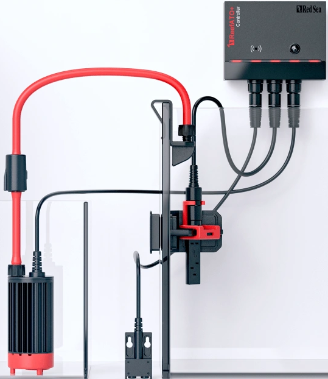</td>
<td>
<a href="https://github.com/Elwinmage/ha-reefbeat-component/issues?q=is:issue state:open label:rsato,all label:enhancement" style="text-decoration:none">📆</a>
<a href="https://github.com/Elwinmage/ha-reefbeat-component/issues?q=is:issue state:open label:rsato,all label:bug" style="text-decoration:none">🐛</a>
</td>
</tr>
<tr>
<td><a href="#reefcontrol">ReefControl</a></td>
<td colspan="2">RSSENSE Se ne avete uno, contattatemi <a href="https://github.com/Elwinmage/ha-reefbeat-component/discussions/8">qui</a> e aggiungerò il supporto.</td><td>❌</td>
<td width="200px">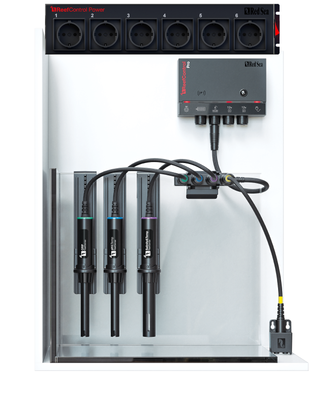</td>
<td>
  <a href="https://github.com/Elwinmage/ha-reefbeat-component/issues?q=is:issue state:open label:rscontrol,all label:enhancement" style="text-decoration:none">📆</a>
  <a href="https://github.com/Elwinmage/ha-reefbeat-component/issues?q=is:issue state:open label:rscontrol,all label:bug" style="text-decoration:none">🐛</a>
</td>
</tr>
<tr>
<td rowspan="2"><a href="#reefdose">ReefDose</a></td>
<td colspan="2">RSDOSE2</td>
<td>✅</td>
<td width="200px">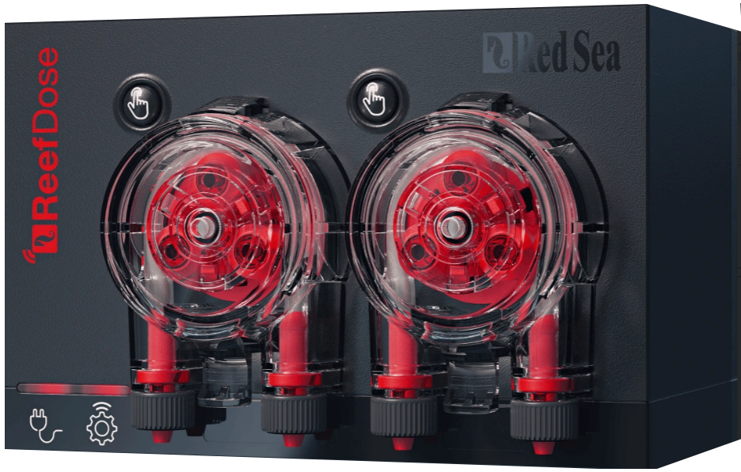</td>
<td rowspan="2">
<a href="https://github.com/Elwinmage/ha-reefbeat-component/issues?q=is:issue state:open label:rsdose,all label:enhancement" style="text-decoration:none">📆</a>
<a href="https://github.com/Elwinmage/ha-reefbeat-component/issues?q=is:issue state:open label:rsdose,all label:bug" style="text-decoration:none">🐛</a>
</td>
</tr>
<tr>
<td colspan="2">RSDOSE4</td><td>✅ </td>
<td width="200px">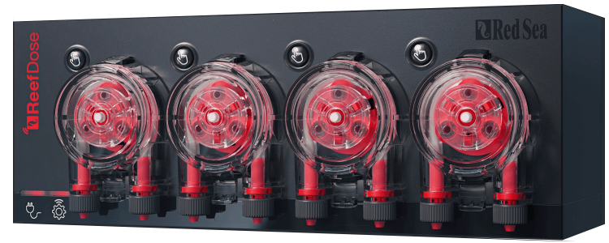</td>
</tr>
<tr>
<td rowspan="6"> <a href="#reefled">ReefLed</a></td>
<td rowspan="3">G1</td>
<td>RSLED50</td>
<td>✅</td>
<td rowspan="3" width="200px">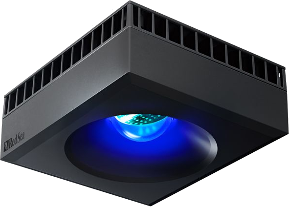</td>
<td rowspan="6">
<a href="https://github.com/Elwinmage/ha-reefbeat-component/issues?q=is:issue state:open label:rsled,all label:enhancement" style="text-decoration:none">📆</a>
<a href="https://github.com/Elwinmage/ha-reefbeat-component/issues?q=is:issue state:open label:rsled,RSLED90,all label:bug" style="text-decoration:none">🐛</a>
</td>
</tr>
<tr>
<td>RSLED90</td>
<td>✅</td>
</tr>
<tr>
<td>RSLED160</td><td>✅ </td>
</tr>
<tr>
<td rowspan="3">G2</td>
<td>RSLED60</td>
<td>✅</td>
<td rowspan="3" width="200px">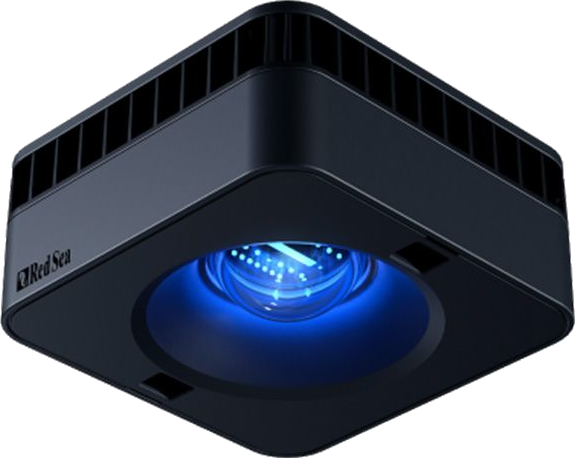</td>
</tr>
<tr>
<td>RSLED115</td><td>✅ </td>
</tr>
<tr>
<td>RSLED170</td><td>☑️</td>
</tr>
<tr>
<td rowspan="3"><a href="#reefmat">ReefMat</a></td>
<td colspan="2">RSMAT250</td>
<td>✅</td>
<td rowspan="3" width="200px">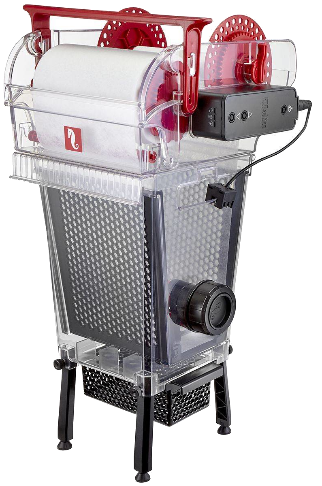</td>
<td rowspan="3">
<a href="https://github.com/Elwinmage/ha-reefbeat-component/issues?q=is:issue state:open label:rsmat,all label:enhancement" style="text-decoration:none">📆</a>
<a href="https://github.com/Elwinmage/ha-reefbeat-component/issues?q=is:issue state:open label:rsmat,all label:bug" style="text-decoration:none">🐛</a>
</td>
</tr>
<tr>
<td colspan="2">RSMAT500</td><td>✅</td>
</tr>
<tr>
<td colspan="2">RSMAT1200</td><td>✅ </td>
</tr>
<tr>
<td><a href="#reefrun">ReefRun & DC Skimmer</a></td>
<td colspan="2">RSRUN</td><td>✅</td>
<td width="200px">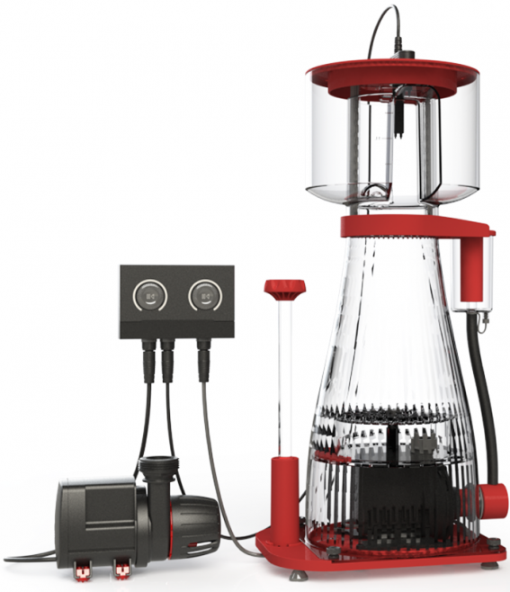</td>
<td>
<a href="https://github.com/Elwinmage/ha-reefbeat-component/issues?q=is:issue state:open label:rsrun,all label:enhancement" style="text-decoration:none">📆</a>
<a href="https://github.com/Elwinmage/ha-reefbeat-component/issues?q=is:issue state:open label:rsrun,all label:bug" style="text-decoration:none">🐛</a>
</td>
</tr>
<tr>
<td rowspan="2"><a href="#reefwave">ReefWave (*)</a></td>
<td colspan="2">RSWAVE25</td>
<td>☑️</td>
<td width="200px" rowspan="2">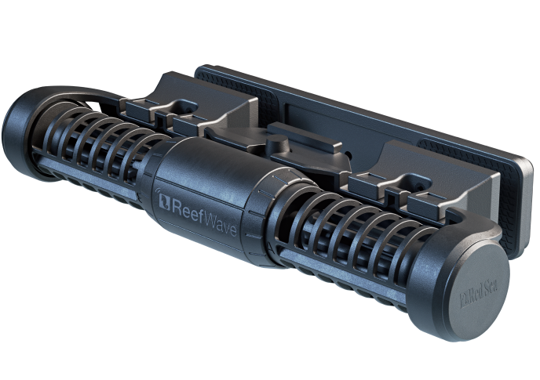</td>
<td rowspan="2">
<a href="https://github.com/Elwinmage/ha-reefbeat-component/issues?q=is:issue state:open label:rswave,all label:enhancement" style="text-decoration:none">📆</a>
<a href="https://github.com/Elwinmage/ha-reefbeat-component/issues?q=is:issue state:open label:rwave,all label:bug" style="text-decoration:none">🐛</a>
</td>
</tr>
<tr>
<td colspan="2">RSWAVE45</td><td>✅</td>
</tr>
</table>

(*) Utenti ReefWave, per favore leggete [questo](https://github.com/Elwinmage/ha-reefbeat-component/#reefwave)

# Sommario
- [Installazione via HACS](https://github.com/Elwinmage/ha-reefbeat-component/#installation-via-hacs)
- [Funzioni comuni](https://github.com/Elwinmage/ha-reefbeat-component/#common-functions)
- [ReefATO+](https://github.com/Elwinmage/ha-reefbeat-component/#reefato)
- [ReefControl](https://github.com/Elwinmage/ha-reefbeat-component/#reefcontrol)
- [ReefDose](https://github.com/Elwinmage/ha-reefbeat-component/#reefdose)
- [ReefLED](https://github.com/Elwinmage/ha-reefbeat-component/#reefled)
- [LED virtuale](https://github.com/Elwinmage/ha-reefbeat-component/#virtual-led)
- [ReefMat](https://github.com/Elwinmage/ha-reefbeat-component/#reefmat)
- [ReefRun](https://github.com/Elwinmage/ha-reefbeat-component/#reefrun)
- [ReefWave](https://github.com/Elwinmage/ha-reefbeat-component/#reefwave)
- [Cloud API](https://github.com/Elwinmage/ha-reefbeat-component/#cloud-api)
- [FAQ](https://github.com/Elwinmage/ha-reefbeat-component/#faq)

# Installazione via HACS

## Installazione diretta

Clicca qui per andare direttamente al repository in HACS e clicca su "Scarica": 

Per la card complementare ha-reef-card con funzionalità avanzate, clicca qui per andare al repository in HACS e clicca su "Scarica": 

## Cerca in HACS
Oppure cercate «redsea» o «reefbeat» in HACS.

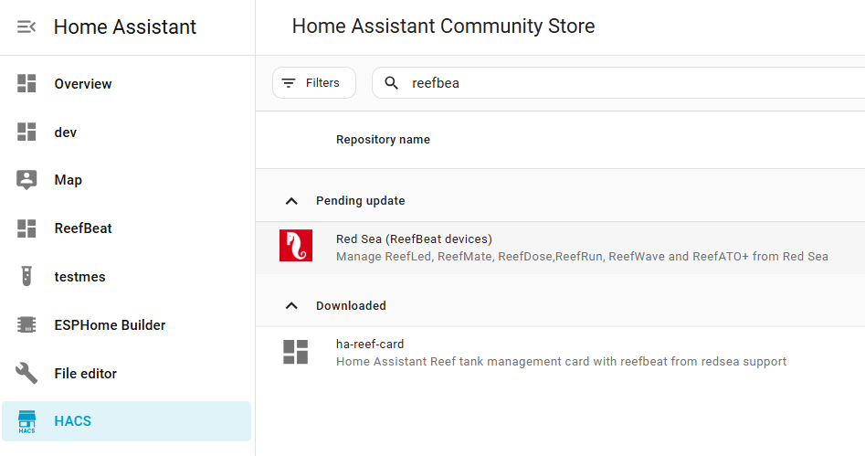

# Funzioni comuni

# Icone
Questa integrazione fornisce icone personalizzate accessibili tramite "redsea:icon-name":

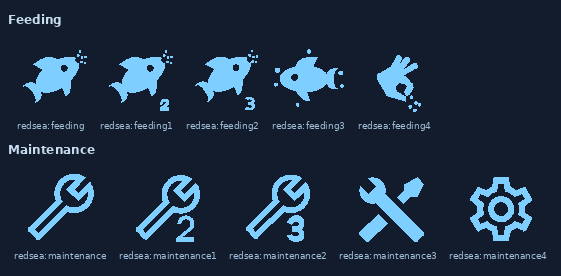
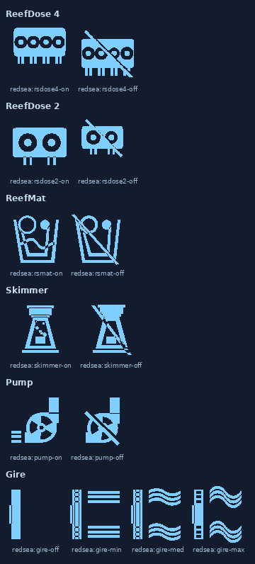

## Aggiungere un dispositivo
Quando si aggiunge un nuovo dispositivo, si hanno 4 opzioni:

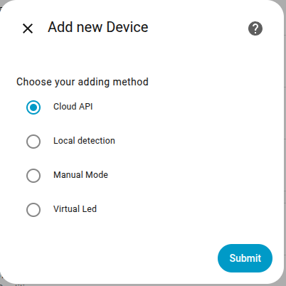

### Aggiungere API Cloud
***Obbligatorio per ReefWave se volete mantenerlo sincronizzato con l'app mobile ReefBeat*** (Read [this](https://github.com/Elwinmage/ha-reefbeat-component/#reefwave)).  
***Obbligatorio per ricevere notifiche di nuove versioni di firmware*** (Read [this](https://github.com/Elwinmage/ha-reefbeat-component/#firmware-update)).
- Ottenere informazioni utente
- Ottenere acquari
- Ottenere libreria Waves
- Ottenere libreria LED

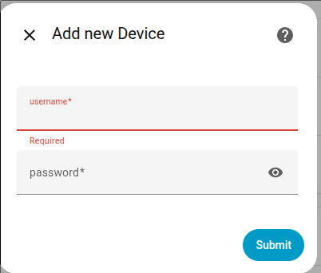

### Rilevamento automatico su rete privata
Se non siete sulla stessa rete, leggete [questo](#my-device-is-not-detected) e usate la ["Modalità Manuale"](https://github.com/Elwinmage/ha-reefbeat-component/#manual-mode).

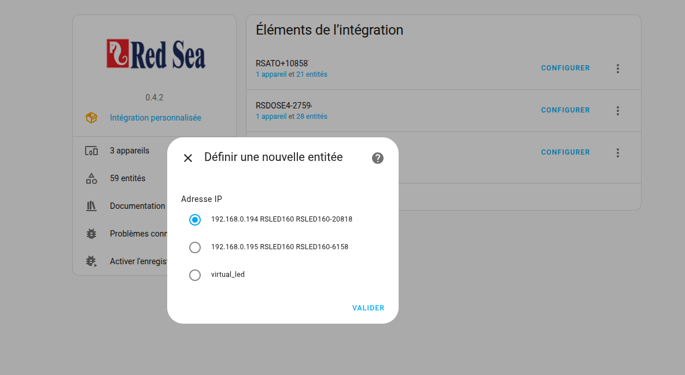

### Modalità manuale
Potete inserire l'indirizzo IP del dispositivo o l'indirizzo di rete per il rilevamento automatico.

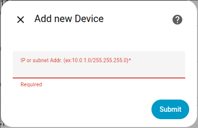

### Impostare l'intervallo di scansione del dispositivo

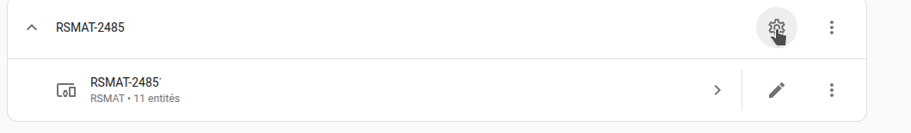

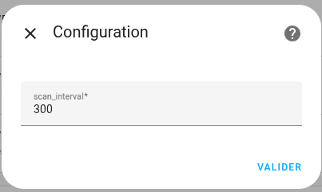

## Aggiornamento in tempo reale

> [!NOTE]
> It is possible to choose whether to enable live_update_config or not. In this mode (old default), configuration data is continuously retrieved along with normal data. For RSDOSE or RSLED, these large HTTP requests can take a long time (7–9 seconds). Sometimes the device does not respond to the request, so a retry function has been implemented. When live_update_config is disabled, configuration data is only retrieved at startup and when requested via the "Fetch Configuration" button. This new mode is activated by default. You can change it in the device configuration. 

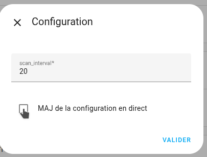
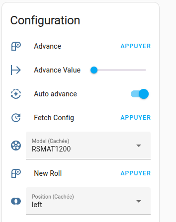

## Aggiornamento Firmware
Potete essere notificati e aggiornare il vostro dispositivo quando è disponibile una nuova versione del firmware. You must have an active ["Cloud API"](https://github.com/Elwinmage/ha-reefbeat-component/#add-cloud-api) device with your credentials and the "Use Cloud API" switch must be enabled.
> [!TIP]
> The "Cloud API" is only needed to get the version number of the new release and compare it to the installed version. To update your firmware, the Cloud API is not strictly required.
> If you do not use the "Cloud API" (switch disabled or no Cloud API device installed), you will not be alerted when a new version is available, but you can still use the hidden "Force Firmware Update" button. If a new version is available, it will be installed.

  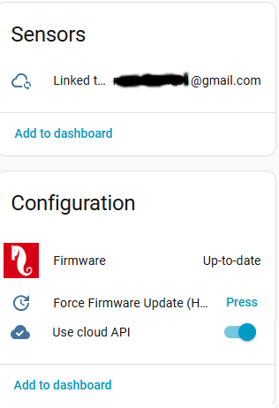
  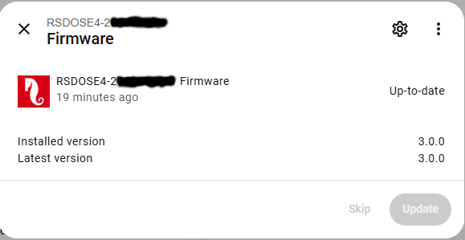

# ReefATO:
- Attivare/disattivare il riempimento automatico
- Riempimento manuale

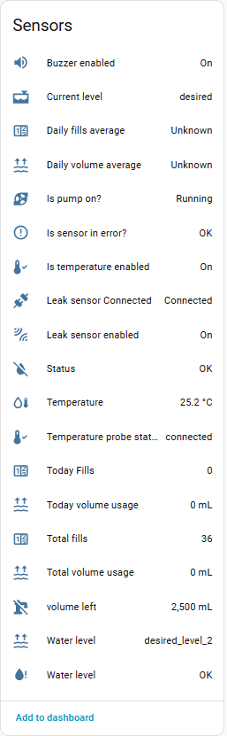
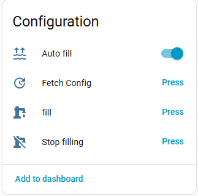
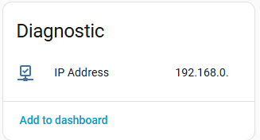

# ReefControl:
Non ancora supportato. If you have one, contact me [here](https://github.com/Elwinmage/ha-reefbeat-component/discussions/8) and I will add its support.

# ReefDose:
- Modificare la dose giornaliera
- Dose manuale
- Aggiungere e rimuovere integratori
- Modificare e controllare il volume del contenitore. Container volume settings are automatically enabled or disabled according to the volume control switch.
- Attivare/disattivare la programmazione per pompa
- Configurazione degli avvisi di scorta
- Ritardo di dosaggio tra integratori
- Innesco (Si prega di leggere [this](https://github.com/Elwinmage/ha-reefbeat-component/#calibration-and-priming))
- Calibrazione (Si prega di leggere [this](https://github.com/Elwinmage/ha-reefbeat-component/#calibration-and-priming))

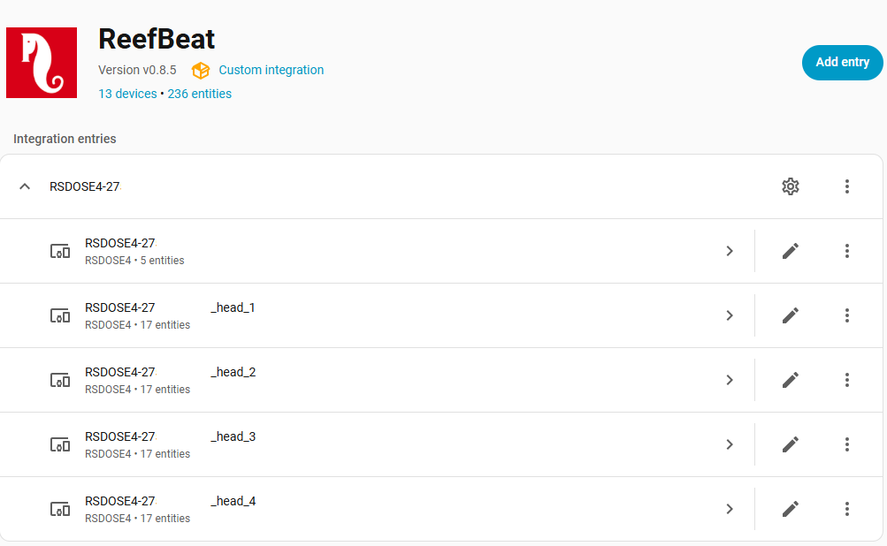

### Principale

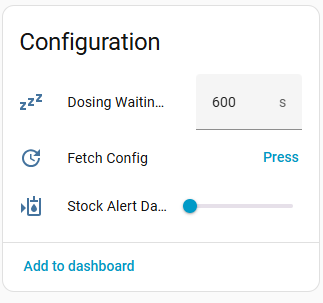
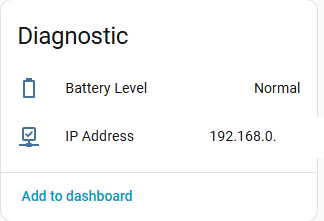

### Teste

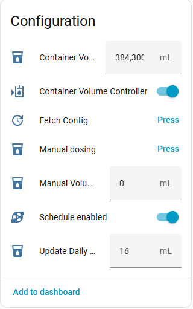
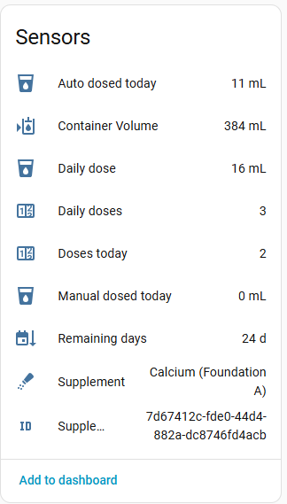
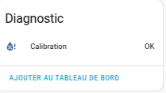

#### Calibration and Priming

> [!CAUTION]
> È necessario seguire rigorosamente l'ordine seguente (Using the [ha-reef-card](https://github.com/Elwinmage/ha-reef-card) is safer).  
> <ins>Calibration</ins>:
>  1. Place the graduated container and press "Start Calibration"
>  2. Enter the measured value using the "Dose of Calibration" field
>  3. Press "Set Calibration Value"
>  4. Empty the graduated container and press "Test new Calibration". If the value obtained is not 4 mL, go back to step 1.
>  5. Press "Stop and Save Graduation"
>
> <ins>For priming</ins>:
>  1. (a) Press "Start Priming"
>  2. (b) When the liquid flows out, press "Stop Priming"
>  3. (1) Place the graduated container and press "Start Calibration"
>  4. (2) Enter the measured value using the "Dose of Calibration" field
>  5. (3) Press "Set Calibration Value"
>  6. (4) Empty the graduated container and press "Test new Calibration". If the value obtained is not 4 mL, go back to step 1.
>  7. (5) Press "Stop and Save Graduation"
>
> ⚠️ Priming must always be followed by a calibration (steps 1 to 5)!⚠️

  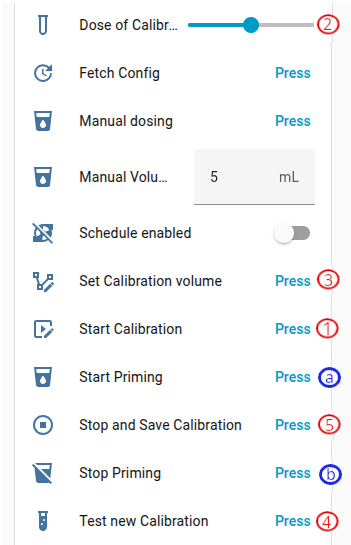

# ReefLED:

- Ottenere e impostare i canali Bianco e Blu (only for G1: RSLED50, RSLED90, RSLED160)
- Ottenere e impostare Temperatura colore, Intensità e Luna (all LEDs)
- Gestire l'acclimatazione. Acclimation settings are automatically enabled or disabled according to the acclimation switch.
- Gestire le fasi lunari. Moon phase settings are automatically enabled or disabled according to the moon phase switch.
- Impostare la modalità colore manuale con o senza durata.
- Ottenere i valori di ventilatore e temperatura.
- Ottenere nome e valore dei programmi (with cloud support). Only for G1 LEDs.

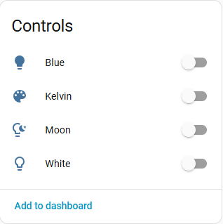
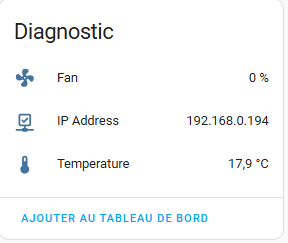

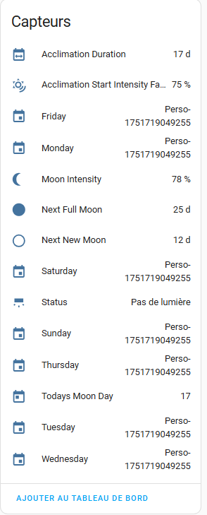

***

Color Temperature support for G1 LEDs takes into account the specificities of each of the three models.

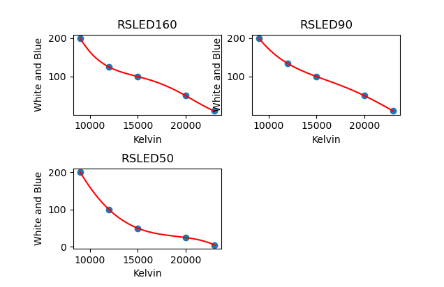

***
## IMPORTANTE per le lampade G1 e G2

### LAMPADE G2

#### Intensità
Because G2 LEDs ensure constant intensity across the entire color range, your LEDs do not utilize their full capacity in the middle of the spectrum. At 8,000K, the white channel is at 100% and the blue channel at 0% (the opposite at 23,000K). At 14,000K with 100% intensity for G2 lights, the power of the white and blue channels is approximately 85%.
Here is the loss curve for the G2s.

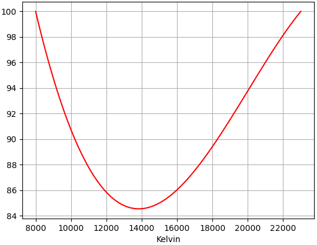

#### Temperatura colore
The G2 interface does not support the entire temperature range. From 8,000K to 10,000K, values are incremented in 200K steps, and from 10,000K to 23,000K in 500K steps. This behavior is handled automatically: if you choose an invalid value (e.g. 8,300K), a valid value will be automatically selected (8,200K in this example). This is why you may sometimes observe a slight cursor adjustment when selecting the color on a G2 light — the cursor repositions itself to an allowed value.

### LAMPADE G1

G1 LEDs use white and blue channel control, which allows full power across the entire range, but not constant intensity without compensation.
That is why intensity compensation has been implemented.
This compensation ensures you get the same [PAR](https://en.wikipedia.org/wiki/Photosynthetically_active_radiation) (light intensity) regardless of your color temperature choice (in the range 12,000 to 23,000K).
> [!NOTE]
> Because Red Sea does not publish PAR values below 12,000K, compensation is only available in the 12,000 to 23,000K range. If you have a G1 LED and a PAR meter, you can [contact me](https://github.com/Elwinmage/ha-reefbeat-component/discussions/) to add compensation for the full range (9,000 to 23,000K).

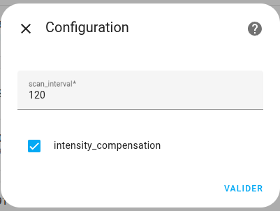

In other words, without compensation, an intensity of x% at 9,000K does not provide the same PAR as at 23,000K or 15,000K.

Here are the power curves:

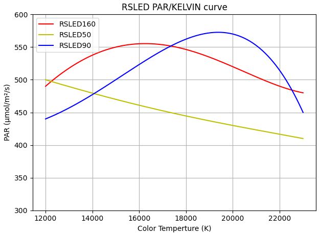

If you want to use the full power of your LED, disable intensity compensation (default).

If you enable intensity compensation, the light intensity will be constant across all color temperature values, but in the middle of the range you will not use the full capacity of your LEDs (as with G2 models).

Also note that if compensation is enabled, the intensity factor can exceed 100% for G1 lights if you manually adjust the White/Blue channels. This allows you to harness the full power of your LEDs!

***

# LED virtuale
- Raggruppare e gestire i LED con un dispositivo virtuale (create a virtual device from the integration panel, then use the configure button to link the LEDs).
- Potete usare solo Kelvin e intensità per controllare i vostri LED se avete G2 o un mix di G1 e G2.
- Potete usare sia Kelvin/Intensità che Bianco e Blu se avete solo lampade G1.

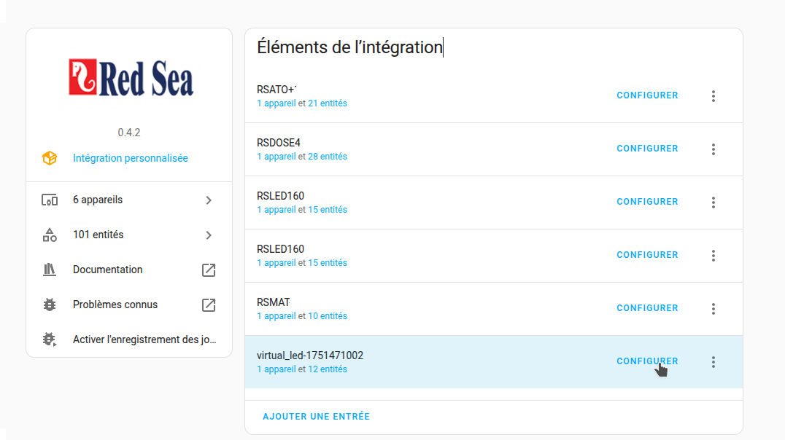
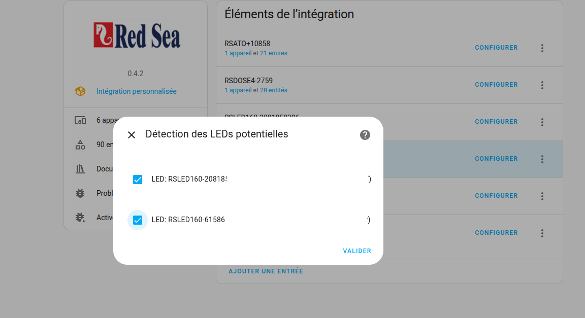

# ReefMat:
- Interruttore avanzamento automatico (attivare/disattivare)
- Avanzamento programmato
- Valore di avanzamento personalizzato: consente di selezionare il valore di avanzamento del rotolo
- Avanzamento manuale
- Cambiare il rotolo.
>[!TIP]
> For a new full roll, please set "roll diameter" to the minimum (4.0 cm). The size will be adjusted according to your RSMAT version. For a partially used roll, enter the value in cm.
- Due parametri nascosti: modello e posizione, se è necessario riconfigurare il proprio RSMAT

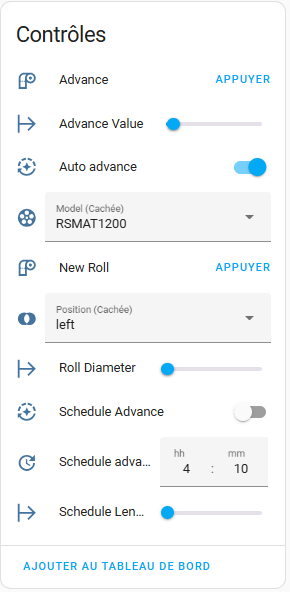
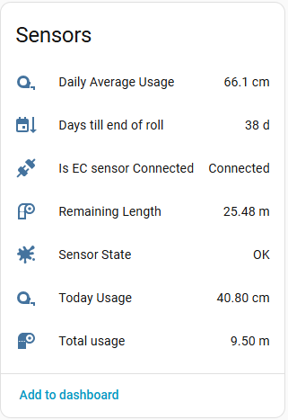
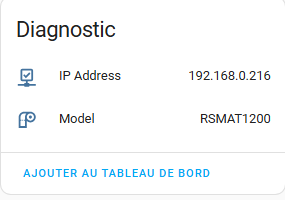

# ReefRun:
- Impostare la velocità della pompa
- Gestire la schiumatura eccessiva
- Gestire il rilevamento della coppa piena
- Possibilità di cambiare il modello dello schiumatoio

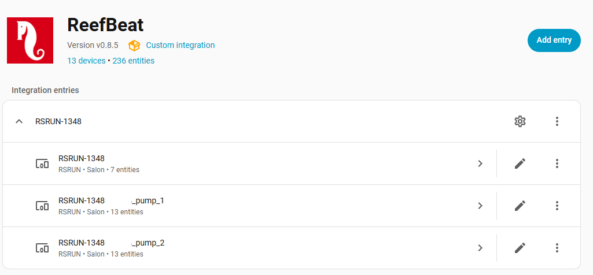

### Principale

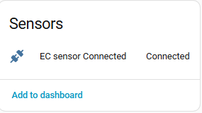
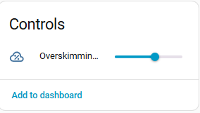

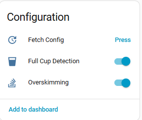
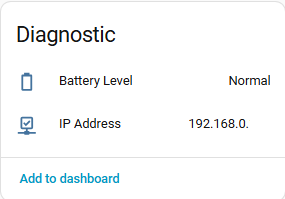

### Pompe

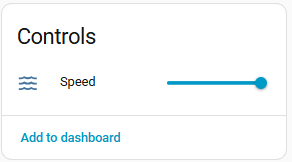
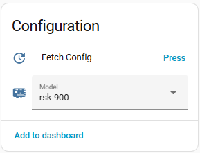

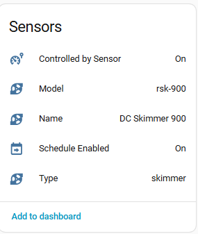
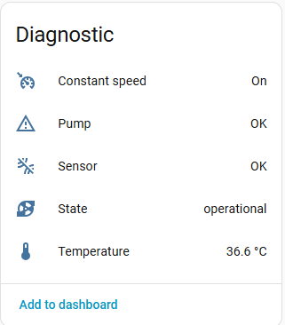

# ReefWave:
> [!IMPORTANT]
> ReefWave devices are different from other ReefBeat devices. They are the only devices that are slaves to the ReefBeat cloud. 
> When you launch the ReefBeat mobile app, the status of all devices is queried and data from the ReefBeat app is retrieved from device state. 
> For ReefWave, it is the opposite: there is no local control point (as you can see in the ReefBeat app, you cannot add a ReefWave to a disconnected aquarium). 
> 
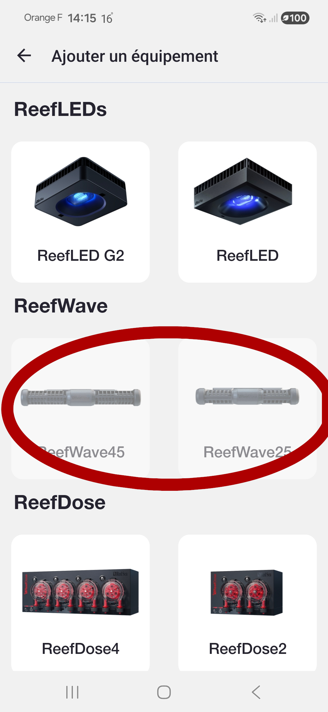
 
> Waves are stored in the cloud user library. When you change a wave's value, it is changed in the cloud library and applied to the new schedule. 
> So there is no local mode? Not so simple. There is a hidden local API to control ReefWave, but the ReefBeat app will not detect the changes. As a result, the device and Home Assistant on one side, and the ReefBeat mobile app on the other, will be out of sync. The device and Home Assistant will always be synchronized. 
> Now that you know, make your choice!

> [!NOTE]
> ReefWave waves have many linked parameters, and the range of some parameters depends on other parameters. I was not able to test all possible combinations. If you find a bug, you can create an issue [here](https://github.com/Elwinmage/ha-reefbeat-component/issues).

## Modalità ReefWave
As explained above, ReefWave devices are the only devices that can become unsynchronized with the ReefBeat app if you use the local API.
Sono disponibili tre modalità: Cloud, Locale e Ibrido.
Potete cambiare la modalità impostando gli interruttori "Connetti al Cloud" e "Usa API Cloud" come descritto nella tabella sottostante.

<table>
<tr>
<td>Nome modalità</td>
<td>Interruttore Connetti al Cloud</td>
<td>Interruttore Usa API Cloud</td>
<td>Comportamento</td>
<td>ReefBeat e HA sono sincronizzati</td>
</tr>
<tr>
<td>Cloud (predefinito)</td>
<td>✅</td>
<td>✅</td>
<td>Data is fetched via the local API.  On/off commands are also sent via the local API.  Wave commands are sent via the cloud API.</td>
<td>✅</td>
</tr>
<tr>
<td>Local</td>
<td>❌</td>
<td>❌</td>
<td>Data is fetched via the local API.  Commands are sent via the local API.  Device is shown as "off" in the ReefBeat app.</td>
<td>❌</td>
</tr>
<tr>
<td>Hybrid</td>
<td>✅</td>
<td>❌</td>
<td>Data is fetched via the local API.  Commands are sent via the local API. The ReefBeat mobile app does not display the correct wave values if they have been changed via HA. Home Assistant always displays the correct values. You can change values from both the ReefBeat app and Home Assistant.</td>
<td>❌</td>
</tr>
</table>

For Cloud and Hybrid modes you must link your ReefBeat cloud account.
First create a ["Cloud API"](https://github.com/Elwinmage/ha-reefbeat-component/#add-cloud-api) device with your credentials, and that's it!
The "Linked to account" sensor will be updated with the name of your ReefBeat account once the connection is established.

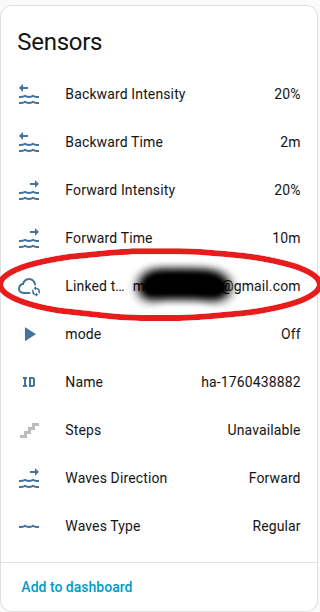

## Modificare i valori attuali
To load current wave values into the preview fields, use the "Set Preview From Current Wave" button.

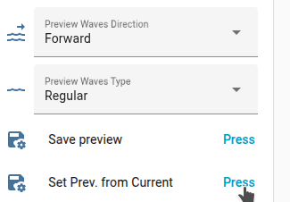

To change the current wave values, set the preview values and use the "Save Preview" button.

The behavior is the same as the ReefBeat mobile app. All waves with the same ID in the current schedule will be updated.

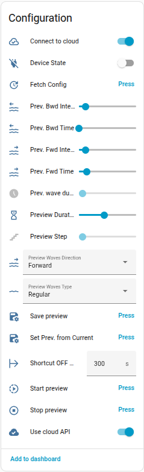
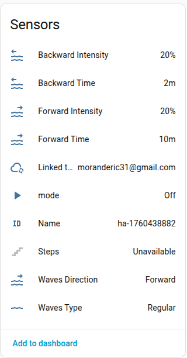
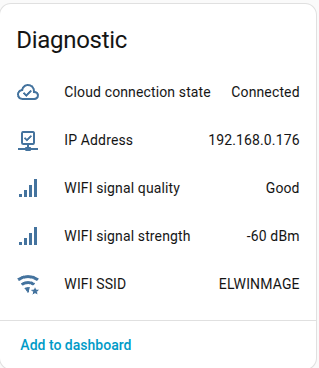

# API Cloud
L'API Cloud consente di:
- Avviare o fermare scorciatoie: emergenza, manutenzione e alimentazione,
- Ottenere informazioni utente,
- Recuperare la libreria waves,
- Recuperare la libreria integratori,
- Recuperare la libreria programmi LED,
- Essere notificati di una [nuova versione firmware](https://github.com/Elwinmage/ha-reefbeat-component/#firmware-update),
- Inviare comandi a ReefWave quando la modalità "[Cloud o Ibrido](https://github.com/Elwinmage/ha-reefbeat-component/#reefwave)" mode is selected.

Le scorciatoie, i parametri wave e LED sono ordinati per acquario.

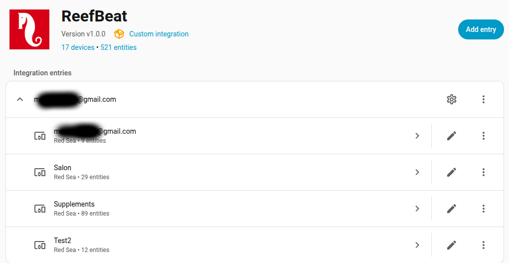
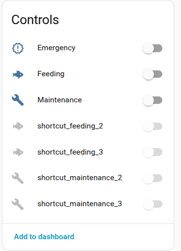
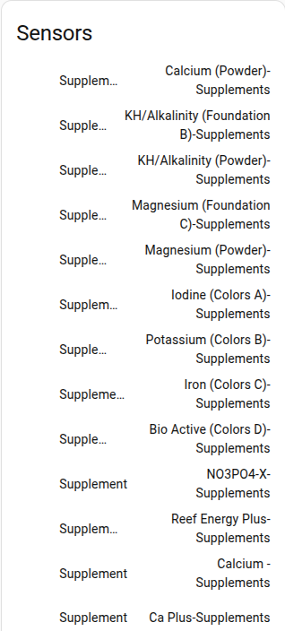
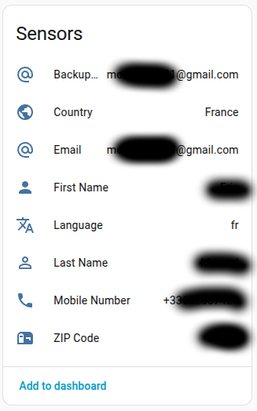
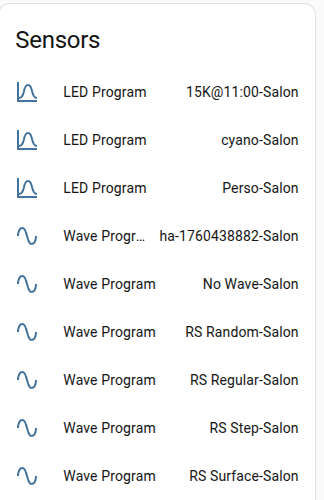
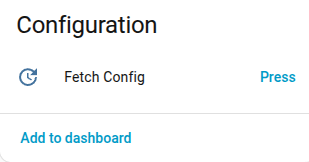

>[!TIP]
> Potete disattivare il recupero della lista degli integratori nella configurazione del dispositivo API Cloud.
>    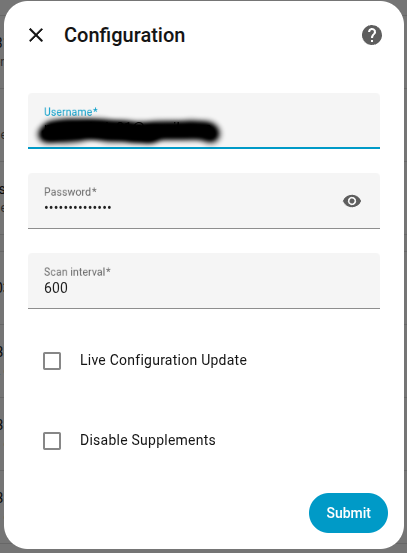
***
# FAQ

## Il mio dispositivo non viene rilevato
- Provate a rilanciare il rilevamento automatico con il pulsante "Aggiungi voce". Sometimes devices do not respond because they are busy.
- If your Red Sea devices are not on the same subnet as your Home Assistant, auto-detection will first fail and then offer you the option to enter the IP address of your device or the address of the subnet where your devices are located. For subnet detection, please use the format IP/MASK, for example: 192.168.14.0/255.255.255.0.
- You can also use [Manual Mode](https://github.com/Elwinmage/ha-reefbeat-component/#manual-mode).

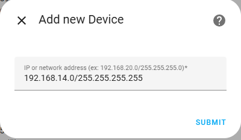

## Alcuni dati vengono aggiornati correttamente, altri no.
I dati sono divisi in tre parti: dati, configurazione e informazioni dispositivo.
- I dati vengono aggiornati regolarmente.
- I dati di configurazione vengono aggiornati solo all'avvio e quando si preme il pulsante "Recupera configurazione".
- I dati delle informazioni dispositivo vengono aggiornati solo all'avvio.

Per garantire che i dati di configurazione vengano aggiornati regolarmente, abilitate [Aggiornamento configurazione in tempo reale](#live-update).

***

[buymecoffee]: https://paypal.me/Elwinmage
[buymecoffeebadge]: https://img.shields.io/badge/buy%20me%20a%20coffee-donate-yellow.svg?style=flat-square
