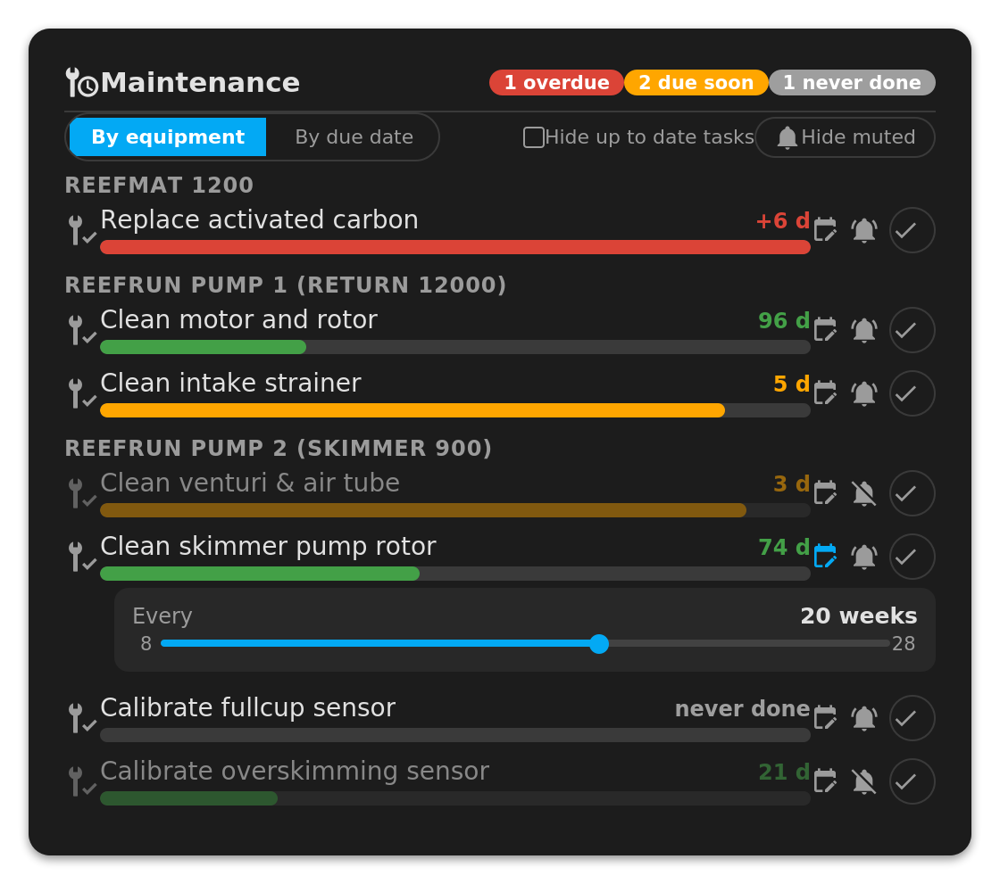

[← Torna alla pagina principale](README.it.md)

# Manutenzione

Oltre a pilotare l'hardware, l'integrazione tiene traccia delle **attività di
manutenzione ricorrenti** della tua attrezzatura: pulire il venturi di uno
schiumatoio, sostituire i tubi di una pompa dosatrice, cambiare il carbone
attivo del ReefMat… A ricordarsene è Home Assistant, non più tu.

Le attività sono associate al dispositivo interessato e al **sottodispositivo**
quando è più preciso: una testa di ReefDose, una pompa di ReefRun. Un ReefRun
espone le attività della pompa di risalita sulla pompa 1 e quelle dello
schiumatoio sulla pompa 2, mai il contrario: l'elenco segue il tipo di pompa
comunicato dall'apparecchio.

## Le tre entità di un'attività

Ogni attività crea tre entità, tutte nelle categorie *Configurazione* e
*Diagnostica* per non affollare la dashboard principale:

| Entità | Ruolo |
| ------ | ----- |
| `button.<dispositivo>_<attività>` | **Attività eseguita.** La pressione registra la data odierna come ultima esecuzione e fa ripartire il conto alla rovescia. |
| `number.<dispositivo>_<attività>_interval_<unità>` | **Intervallo.** Ogni quanto ripetere l'attività, in giorni, settimane o mesi a seconda del caso. |
| `switch.<dispositivo>_<attività>_notify` | **Notifiche.** Silenzia l'avviso di ritardo di quella sola attività, senza toccarne la scadenza. |

Il pulsante è l'entità che porta lo stato. Tutto ciò che ne deriva è esposto
come attributi, così una sola entità basta per costruire una dashboard o
un'automazione:

| Attributo | Significato |
| --------- | ----------- |
| `last_reset` | Data ISO-8601 dell'ultima pressione, o `null` se mai eseguita |
| `interval_days` | Intervallo corrente, sempre normalizzato in giorni |
| `days_left` | Giorni rimanenti, negativo una volta scaduta |
| `overdue` | `true` non appena `days_left` diventa negativo |
| `reef_role` | `maint_<chiave_attività>`, il marcatore stabile usato per scoprire le attività |

> [!TIP]
> È `reef_role` a rendere il tutto estensibile: la card e il blueprint degli
> avvisi scoprono le attività cercando questo attributo. Un'attività aggiunta in
> una versione futura dell'integrazione compare in entrambi senza alcun
> aggiornamento da parte loro.

## Intervalli

Gli intervalli predefiniti seguono le indicazioni di Red Sea, prendendo la
mediana dell'intervallo pubblicato. Ogni attività definisce anche un minimo e un
massimo, imposti dall'entità `number`: puoi adattare un intervallo al carico
della tua vasca, ma non impostare un valore assurdo.

Gli intervalli sono mostrati nell'unità che ha senso per l'attività (settimane
per un venturi, mesi per un rotore) e memorizzati internamente in giorni, quindi
cambiare unità non perde mai precisione.

## Persistenza

Date e intervalli sono salvati da Home Assistant in
`.storage/redsea_maintenance_<entry_id>`, un file per voce di configurazione.
Sopravvivono a riavvii, ricaricamenti dell'integrazione e riavvii degli
apparecchi, e **non vengono mai inviati al cloud Red Sea**. Rimuovendo la voce di
configurazione si rimuove anche il file.

## La vista manutenzione di ha-reef-card

La card companion [ha-reef-card](https://github.com/Elwinmage/ha-reef-card)
raccoglie tutte le attività dell'impianto in una vista dedicata, come se la
manutenzione fosse un dispositivo a sé: una barra di avanzamento per attività,
colorata in base al tempo rimanente, ordinabile per apparecchio o per scadenza,
con un pulsante per segnare l'attività come eseguita, una campanella per
silenziarla e un cursore in linea per cambiarne l'intervallo.

## Notifiche: il blueprint degli avvisi

L'integrazione non notifica da sola, ed è voluto: chi avvisare, quando e come
spetta a te. Se ne occupa il blueprint **ReefBeat watch** fornito con il
repository, che copre anche le modalità anomale, le calibrazioni scadute, le
batterie scariche e gli apparecchi irraggiungibili.

### Installazione

Clicca il pulsante qui sotto e conferma l'importazione in Home Assistant:

È disponibile anche una versione francese,
[`redsea_alerts.fr.yaml`](https://github.com/Elwinmage/ha-reefbeat-component/blob/main/blueprints/automation/redsea_alerts.fr.yaml).
In alternativa copia il file in
`config/blueprints/automation/redsea_alerts/` e ricarica le automazioni.

Crea poi un'automazione a partire dal blueprint:
*Impostazioni → Automazioni e scene → Crea automazione → Usa un blueprint →
ReefBeat watch (redsea)*.

### Configurazione

Solo il primo campo è obbligatorio:

| Sezione | Ruolo |
| ------- | ----- |
| **Destinatari delle notifiche** | I telefoni da avvisare, scelti nel selettore di dispositivi. Il servizio `notify.mobile_app_*` viene risolto automaticamente. Si può indicare un canale di notifica Android (`ReefBeat` di default). |
| **Manutenzione scaduta** | Avvisa quando un'attività supera la scadenza. L'opzione *Rispetta gli interruttori di notifica per attività* (attiva di default) fa obbedire l'automazione alle entità `switch.*_notify`: silenziare un'attività nella card silenzia anche l'automazione. |
| **Modalità anomala** | Avvisa quando un apparecchio esce dalla modalità attesa. `off_grace_minutes` (5 di default) evita falsi allarmi durante un ciclo di alimentazione o un breve intervento manuale. |
| **Calibrazione scaduta** | Teste di ReefDose e calibrazioni degli schiumatoi ReefRun. |
| **Ritardo di calibrazione delle sonde (RSRUN)** | Sonde di bicchiere pieno e di sovra-schiumazione degli schiumatoi ReefRun. |
| **Messaggio di avviso dell'apparecchio** | Inoltra i messaggi di avviso emessi dagli apparecchi stessi. |
| **Batteria scarica** / **Apparecchio irraggiungibile** | Senza sorprese. |

Ogni sezione si disattiva in modo indipendente e ha una propria **lista di
esclusione**: un apparecchio in prova non ti sommerge di avvisi mentre gli altri
restano sorvegliati. L'automazione gira su un ciclo di 5 minuti e tiene conto
degli apparecchi aggiunti o rimossi dall'integrazione al ciclo successivo, senza
modificare nulla.

> [!NOTE]
> Il blueprint sorveglia **tutti** i dispositivi dell'integrazione e i loro
> sottodispositivi. Non c'è nulla da dichiarare quando aggiungi un nuovo
> apparecchio ReefBeat.

---

[← Torna alla pagina principale](README.it.md)
