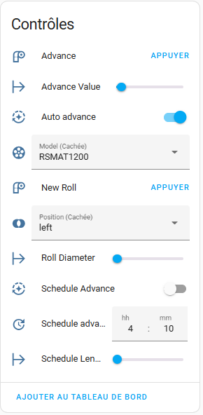
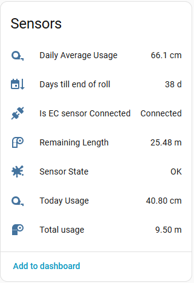
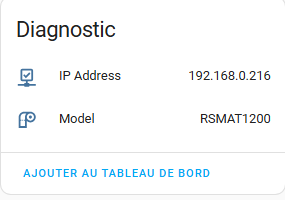

[← Torna alla pagina principale](README.it.md)

# ReefMat:
- Interruttore di avanzamento automatico (abilita/disabilita)
- Avanzamento programmato
- Valore di avanzamento personalizzato: permette di scegliere l'entità dell'avanzamento del rotolo
- Avanzamento manuale
- Cambiare il rotolo.
>[!TIP]
> Per un rotolo nuovo completo, imposta il "diametro del rotolo" al minimo (4,0 cm). La dimensione verrà adattata in base alla tua versione di RSMAT. Per un rotolo parzialmente usato, inserisci il valore in cm.
- Due parametri nascosti: modello e posizione, se hai bisogno di riconfigurare il tuo RSMAT

### Attività di manutenzione
| Attività | Predefinito | Intervallo |
| -------- | ----------- | ---------- |
| Sostituire il carbone attivo | 25 giorni | 2 – 5 settimane |

Vedi la sezione [Manutenzione](maintenance.it.md#manutenzione).

---

[← Torna alla pagina principale](README.it.md)
