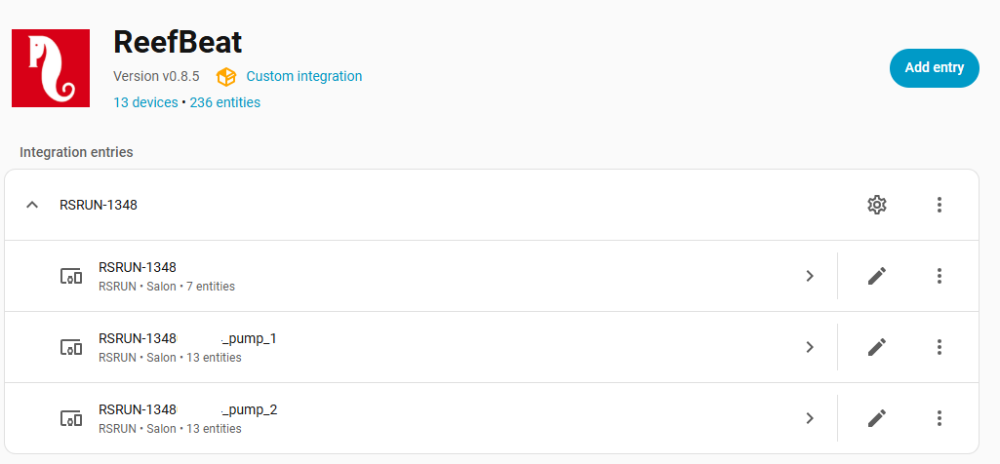
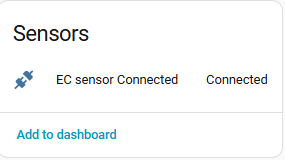
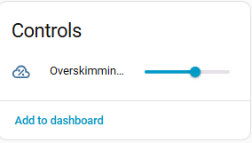
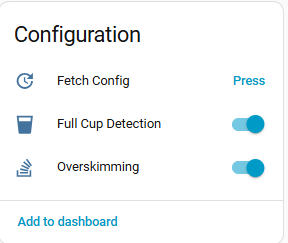
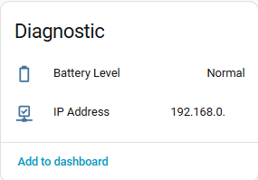
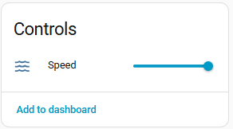
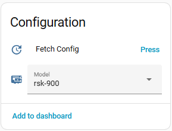
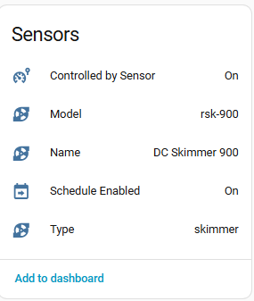
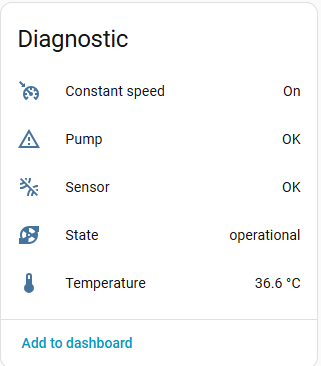

[← Torna alla pagina principale](README.it.md)

# ReefRun:
- Impostare la velocità delle pompe
- Gestire la sovra-schiumazione
- Gestire il rilevamento di bicchiere pieno
- Possibilità di cambiare il modello di schiumatoio

### Principale

### Pompe

### Attività di manutenzione
Le attività sono associate al sottodispositivo pompa e dipendono dal suo tipo.

| Attività | Pompa | Predefinito | Intervallo |
| -------- | ----- | ----------- | ---------- |
| Pulire motore e rotore | Risalita | 4,5 mesi | 2 – 7 mesi |
| Pulire il filtro di aspirazione | Risalita | 6 settimane | 3 – 9 settimane |
| Pulire venturi e tubo dell'aria | Schiumatoio | 5 settimane | 3 – 7 settimane |
| Pulire il rotore dello schiumatoio | Schiumatoio | 4,5 mesi | 2 – 7 mesi |
| Calibrare la sonda di bicchiere pieno | Schiumatoio | 4 settimane | 2 – 6 settimane |
| Calibrare la sonda di sovra-schiumazione | Schiumatoio | 4 settimane | 2 – 6 settimane |

Le due attività di calibrazione sono sorvegliate anche dal blueprint degli
avvisi, che confronta la data dell'ultima calibrazione comunicata
dall'apparecchio con l'intervallo impostato qui. Vedi la sezione
[Manutenzione](maintenance.it.md#manutenzione).

### Chiave per smontare il rotore

L'attività *Pulire il rotore dello schiumatoio* qui sopra impone di svitare il
corpo pompa, che bagnato non offre quasi alcuna presa. Una chiave stampabile in
3D per questa operazione, con un video che ne mostra l'uso, è disponibile qui:
[Chiave per rotore di DC Skimmer Red Sea](https://elwinmage.github.io/reeftank/#-red-sea-dc-skimmer-impeller-tool).

---

[← Torna alla pagina principale](README.it.md)
