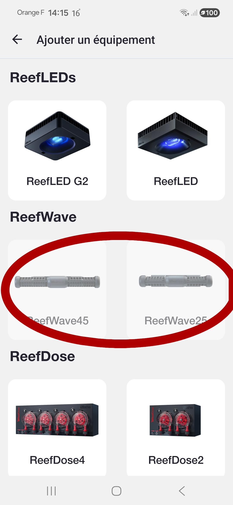
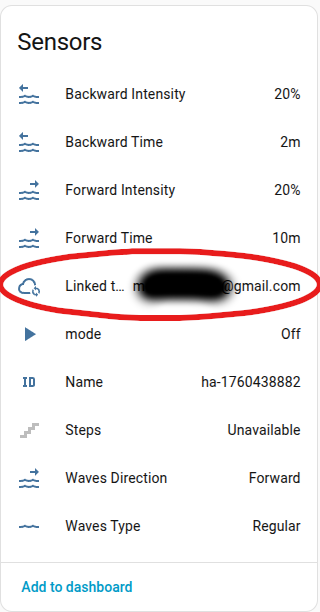
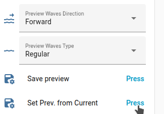
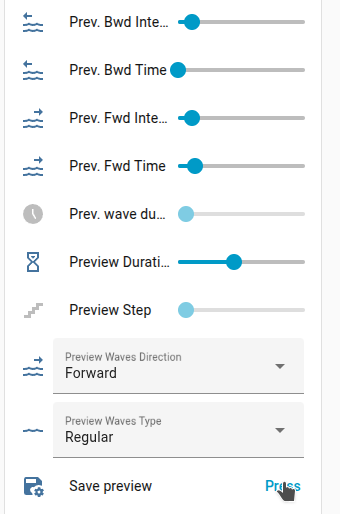
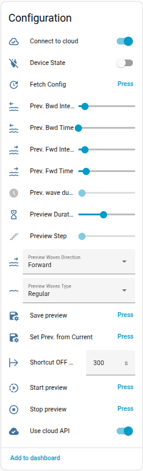
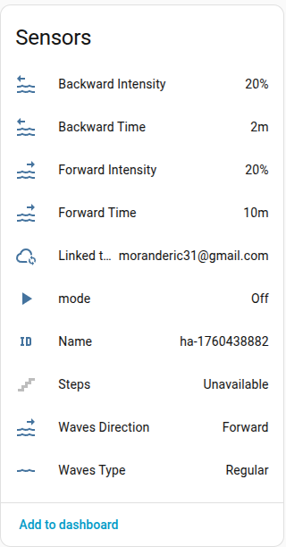
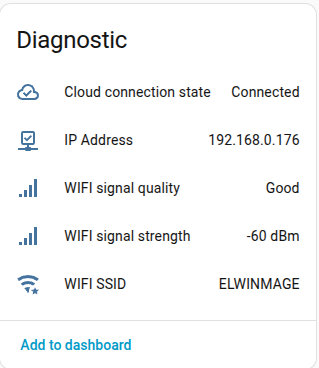

[← Torna alla pagina principale](README.it.md)

# ReefWave

> [!IMPORTANT]
> I dispositivi ReefWave sono diversi dagli altri dispositivi ReefBeat. Sono gli unici dispositivi che sono slave del cloud ReefBeat. 
> Quando avvii l'app mobile ReefBeat, lo stato di tutti i dispositivi viene interrogato e i dati dall'app ReefBeat vengono recuperati dallo stato del dispositivo. 
> Per ReefWave è il contrario: non c'è un punto di controllo locale (come puoi vedere nell'app ReefBeat, non puoi aggiungere un ReefWave a un acquario disconnesso). 
> 

 
> Le onde sono archiviate nella libreria utente del cloud. Quando cambi il valore di un'onda, viene modificato nella libreria cloud e applicato al nuovo orario. 
> Quindi non c'è una modalità locale? Non proprio così semplice. Esiste un'API locale nascosta per controllare ReefWave, ma l'app ReefBeat non rileverà i cambiamenti. Di conseguenza, il dispositivo e Home Assistant da un lato, e l'app mobile ReefBeat dall'altro, saranno fuori sincronia. Il dispositivo e Home Assistant saranno sempre sincronizzati. 
> Ora che lo sai, fai la tua scelta!

> [!NOTE]
> Le onde ReefWave hanno molti parametri collegati e l'intervallo di alcuni parametri dipende da altri parametri. Non sono stato in grado di testare tutte le possibili combinazioni. Se trovi un bug, puoi creare una segnalazione [qui](https://github.com/Elwinmage/ha-reefbeat-component/issues).

## Modalità ReefWave
Come spiegato sopra, i dispositivi ReefWave sono gli unici dispositivi che possono diventare non sincronizzati con l'app ReefBeat se utilizzi l'API locale.
Sono disponibili tre modalità: Cloud, Local e Hybrid.
Puoi cambiare la modalità impostando gli interruttori "Connetti al Cloud" e "Usa API Cloud" come descritto nella tabella sottostante.

<table>
<tr>
<td>Nome Modalità</td>
<td>Interruttore Connetti al Cloud</td>
<td>Interruttore Usa API Cloud</td>
<td>Comportamento</td>
<td>ReefBeat e HA sono sincronizzati</td>
</tr>
<tr>
<td>Cloud (Predefinito)</td>
<td>✅</td>
<td>✅</td>
<td>I dati vengono recuperati tramite l'API locale.  I comandi on/off vengono inviati anche tramite l'API locale.  I comandi delle onde vengono inviati tramite l'API cloud.</td>
<td>✅</td>
</tr>
<tr>
<td>Local</td>
<td>❌</td>
<td>❌</td>
<td>I dati vengono recuperati tramite l'API locale.  I comandi vengono inviati tramite l'API locale.  Il dispositivo viene mostrato come "spento" nell'app ReefBeat.</td>
<td>❌</td>
</tr>
<tr>
<td>Hybrid</td>
<td>✅</td>
<td>❌</td>
<td>I dati vengono recuperati tramite l'API locale.  I comandi vengono inviati tramite l'API locale. L'app mobile ReefBeat non visualizza i valori delle onde corretti se sono stati modificati tramite HA. Home Assistant visualizza sempre i valori corretti. Puoi cambiare i valori sia dall'app ReefBeat che da Home Assistant.</td>
<td>❌</td>
</tr>
</table>

Per le modalità Cloud e Hybrid è necessario collegare il tuo account cloud ReefBeat.
Per prima cosa crea un dispositivo ["Cloud API"](../../README.md#add-cloud-api) con le tue credenziali, e il gioco è fatto!
Il sensore "Collegato all'account" verrà aggiornato con il nome del tuo account ReefBeat una volta stabilita la connessione.

## Modifica dei valori correnti
Per caricare i valori dell'onda corrente nei campi di anteprima, utilizza il pulsante "Imposta Anteprima dall'Onda Corrente".

Per modificare i valori dell'onda corrente, imposta i valori di anteprima e utilizza il pulsante "Salva Anteprima".

Il comportamento è lo stesso dell'app mobile ReefBeat. Tutte le onde con lo stesso ID nell'orario corrente verranno aggiornate.

## Gruppi
Come nell'app ReefBeat, tutte le ReefWave raggruppate di un acquario formano
un solo gruppo (solo con un account cloud).

| Entità | Ruolo |
| ------ | ----- |
| `switch` Raggruppata con l'acquario | Raggruppa la pompa con le altre ReefWave del suo acquario, oppure la separa; una pompa che si aggiunge va in ultima posizione. Non disponibile senza account cloud |
| `sensor` ReefWave collegate | Numero di pompe del gruppo, il loro elenco nell'attributo `waves` (`hwid`, `name`, `model`, `entry_id`, `available`) |

Un programma viene scritto su tutte le pompe del gruppo: stesse fasce, ogni
pompa con le proprie intensità. Come nell'app, una scrittura viene rifiutata
quando una pompa del gruppo non è caricata o non risponde: non viene inviato
nulla, così il gruppo resta sincronizzato. Tutte le ReefWave caricate
vengono aggiornate dopo un cambio di gruppo.

## Programma del giorno
Il `sensor` Tipo onda porta l'intero programma del giorno
nell'attributo `schedule`: l'elenco dei suoi intervalli, ciascuno inizia a
`st` (minuto del giorno) e dura fino al successivo, con `wave_uid`, `name`,
`type`, `direction`, `frt`, `rrt`, `fti`, `rti`, `sn`, `pd` e `sync`.
ha-reef-card disegna la giornata a partire da esso.

## Servizi
Questi servizi gestiscono la libreria delle onde e il programma del giorno,
come fa l'app ReefBeat; gli editor di ha-reef-card li usano. `device_id` è
la voce di configurazione della ReefWave.

| Servizio | Ruolo |
| -------- | ----- |
| `redsea.wave_library` | Onde dell'acquario della pompa, con le intensità di questa pompa, le pompe che usano ogni onda e il gruppo della pompa. Senza account cloud: le onde del suo programma |
| `redsea.wave_library_save` | Crea un'onda, oppure ne aggiorna una (`uid`). La forma è condivisa, le intensità sono quelle della pompa; i programmi che usano un'onda aggiornata vengono riscritti. Le onde Red Sea e i nomi già usati vengono rifiutati |
| `redsea.wave_library_delete` | Elimina una delle tue onde; rifiutato per un'onda Red Sea, o un'onda usata da un programma |
| `redsea.wave_program_save` | Scrive il programma del giorno (`slots`: `st`, `wave_uid`, `direction`; il primo inizia a 0) su tutte le pompe del gruppo; sulla pompa stessa senza account cloud |
| `redsea.wave_preview` | Esegue un'onda sulla pompa da 1 a 10 min, poi torna al suo programma |
| `redsea.wave_preview_stop` | Ferma l'anteprima |
| `redsea.wave_pump_set` | Direzione e intensità di questa pompa nell'onda in corso (anche una Red Sea); le altre pompe del gruppo non vengono toccate |
| `redsea.wave_group_set` | Raggruppa o separa una pompa (`grouped`), come l'interruttore |
| `redsea.wave_group_order` | Ordine delle pompe del gruppo (`hwids`, ogni pompa indicata una volta) |

La libreria richiede un account cloud ReefBeat: senza, `wave_library_save` e
`wave_library_delete` vengono rifiutati. Tutti i rifiuti sono errori tradotti
di Home Assistant.

## Icone
I pittogrammi dei tipi di onda dell'app sono disponibili come
`redsea:wave-uniform`, `redsea:wave-random`, `redsea:wave-regular`,
`redsea:wave-step`, `redsea:wave-surface` e `redsea:wave-none`.

### Attività di manutenzione
| Attività | Predefinito | Intervallo |
| -------- | ----------- | ---------- |
| Pulire le gabbie del rotore | 2 mesi | 1 – 3 mesi |

Vedi la sezione [Manutenzione](maintenance.it.md#manutenzione).

---

[← Torna alla pagina principale](README.it.md)
