

[![BuyMeCoffee][buymecoffeebadge]][buymecoffee]

<!--  -->
Aby pomóc w tłumaczeniu, postępuj zgodnie z tym [przewodnikiem](https://github.com/Elwinmage/ha-reefbeat-component/blob/main/doc/TRANSLATION.md).

# Przegląd
***Lokalne zarządzanie urządzeniami HomeAssistant RedSea Reefbeat (bez chmury): ReefATO+, ReefDose, ReefLed, ReefMat, ReefRun i ReefWave***

> [!TIP]
> ***Aby edytować zaawansowane harmonogramy dla ReefDose, ReefLed, ReefRun i ReefWave, użyj [ha-reef-card](https://github.com/Elwinmage/ha-reef-card) (currently under development)***

> [!TIP]
> Lista przyszłych implementacji jest dostępna [tutaj](https://github.com/Elwinmage/ha-reefbeat-component/issues?q=is%3Aissue%20state%3Aopen%20label%3Aenhancement) 
> Lista błędów jest dostępna [tutaj](https://github.com/Elwinmage/ha-reefbeat-component/issues?q=is%3Aissue%20state%3Aopen%20label%3Abug) 

***Jeśli potrzebujesz innych czujników lub urządzeń wykonawczych, skontaktuj się ze mną [tutaj](https://github.com/Elwinmage/ha-reefbeat-component/discussions).***

> [!IMPORTANT]
> Jeśli Twoje urządzenia nie są w tej samej podsieci co Home Assistant, [przeczytaj to](https://github.com/Elwinmage/ha-reefbeat-component/#my-device-is-not-detected).

> [!CAUTION]
> ⚠️ To nie jest oficjalne repozytorium RedSea. Używasz na własne ryzyko.⚠️

# Zgodność

✅ Przetestowano ☑️ Powinno działać (Jeśli masz takie urządzenie, czy możesz potwierdzić jego działanie [tutaj](https://github.com/Elwinmage/ha-reefbeat-component/discussions/8)) ❌ Not Supported Yet
<table>
<th>
<td colspan="2"><b>Model</b></td>
<td colspan="2"><b>Status</b></td>
<td><b>Issues</b>  📆(Planned)   🐛(Bugs)</td>
</th>
<tr>
<td><a href="#reefato">ReefATO+</a></td>
<td colspan="2">RSATO+</td><td>✅ </td>
<td width="200px"></td>
<td>
<a href="https://github.com/Elwinmage/ha-reefbeat-component/issues?q=is:issue state:open label:rsato,all label:enhancement" style="text-decoration:none">📆</a>
<a href="https://github.com/Elwinmage/ha-reefbeat-component/issues?q=is:issue state:open label:rsato,all label:bug" style="text-decoration:none">🐛</a>
</td>
</tr>
<tr>
<td><a href="#reefcontrol">ReefControl</a></td>
<td colspan="2">RSSENSE Jeśli je posiadasz, skontaktuj się ze mną <a href="https://github.com/Elwinmage/ha-reefbeat-component/discussions/8">tutaj</a>, a dodam jego obsługę.</td><td>❌</td>
<td width="200px"></td>
<td>
  <a href="https://github.com/Elwinmage/ha-reefbeat-component/issues?q=is:issue state:open label:rscontrol,all label:enhancement" style="text-decoration:none">📆</a>
  <a href="https://github.com/Elwinmage/ha-reefbeat-component/issues?q=is:issue state:open label:rscontrol,all label:bug" style="text-decoration:none">🐛</a>
</td>
</tr>
<tr>
<td rowspan="2"><a href="#reefdose">ReefDose</a></td>
<td colspan="2">RSDOSE2</td>
<td>✅</td>
<td width="200px"></td>
<td rowspan="2">
<a href="https://github.com/Elwinmage/ha-reefbeat-component/issues?q=is:issue state:open label:rsdose,all label:enhancement" style="text-decoration:none">📆</a>
<a href="https://github.com/Elwinmage/ha-reefbeat-component/issues?q=is:issue state:open label:rsdose,all label:bug" style="text-decoration:none">🐛</a>
</td>
</tr>
<tr>
<td colspan="2">RSDOSE4</td><td>✅ </td>
<td width="200px">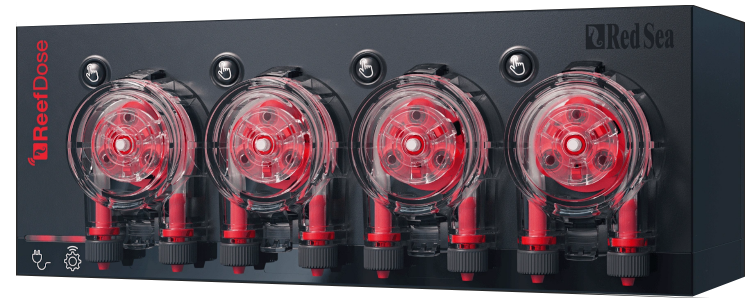</td>
</tr>
<tr>
<td rowspan="6"> <a href="#reefled">ReefLed</a></td>
<td rowspan="3">G1</td>
<td>RSLED50</td>
<td>✅</td>
<td rowspan="3" width="200px">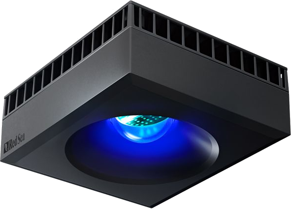</td>
<td rowspan="6">
<a href="https://github.com/Elwinmage/ha-reefbeat-component/issues?q=is:issue state:open label:rsled,all label:enhancement" style="text-decoration:none">📆</a>
<a href="https://github.com/Elwinmage/ha-reefbeat-component/issues?q=is:issue state:open label:rsled,RSLED90,all label:bug" style="text-decoration:none">🐛</a>
</td>
</tr>
<tr>
<td>RSLED90</td>
<td>✅</td>
</tr>
<tr>
<td>RSLED160</td><td>✅ </td>
</tr>
<tr>
<td rowspan="3">G2</td>
<td>RSLED60</td>
<td>✅</td>
<td rowspan="3" width="200px"></td>
</tr>
<tr>
<td>RSLED115</td><td>✅ </td>
</tr>
<tr>
<td>RSLED170</td><td>☑️</td>
</tr>
<tr>
<td rowspan="3"><a href="#reefmat">ReefMat</a></td>
<td colspan="2">RSMAT250</td>
<td>✅</td>
<td rowspan="3" width="200px">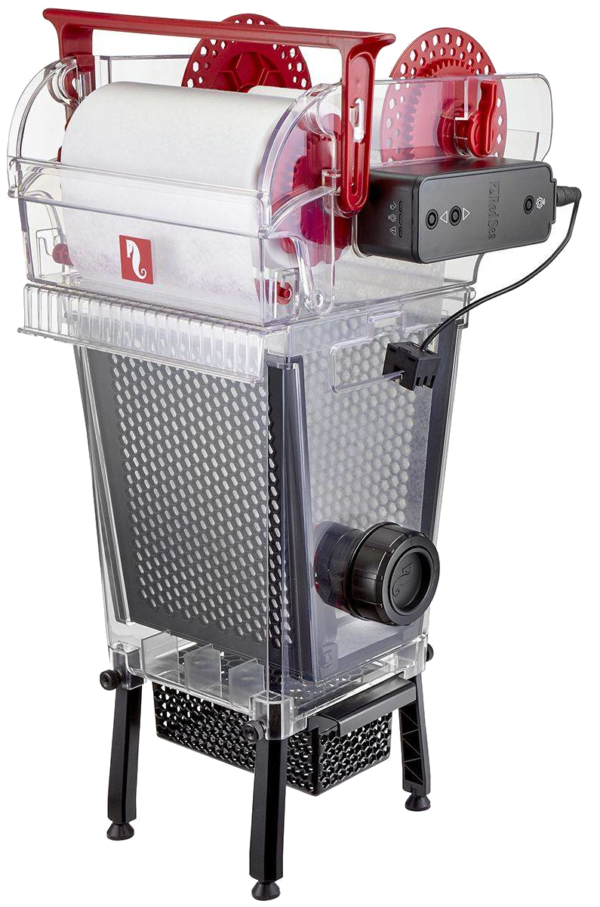</td>
<td rowspan="3">
<a href="https://github.com/Elwinmage/ha-reefbeat-component/issues?q=is:issue state:open label:rsmat,all label:enhancement" style="text-decoration:none">📆</a>
<a href="https://github.com/Elwinmage/ha-reefbeat-component/issues?q=is:issue state:open label:rsmat,all label:bug" style="text-decoration:none">🐛</a>
</td>
</tr>
<tr>
<td colspan="2">RSMAT500</td><td>✅</td>
</tr>
<tr>
<td colspan="2">RSMAT1200</td><td>✅ </td>
</tr>
<tr>
<td><a href="#reefrun">ReefRun & DC Skimmer</a></td>
<td colspan="2">RSRUN</td><td>✅</td>
<td width="200px">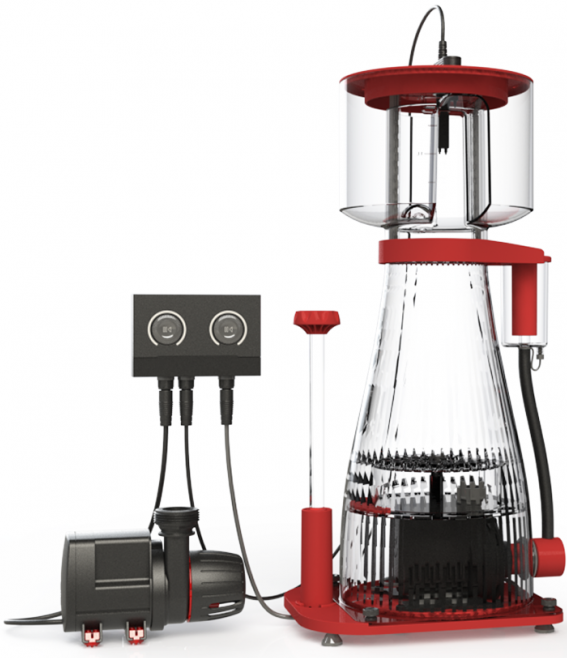</td>
<td>
<a href="https://github.com/Elwinmage/ha-reefbeat-component/issues?q=is:issue state:open label:rsrun,all label:enhancement" style="text-decoration:none">📆</a>
<a href="https://github.com/Elwinmage/ha-reefbeat-component/issues?q=is:issue state:open label:rsrun,all label:bug" style="text-decoration:none">🐛</a>
</td>
</tr>
<tr>
<td rowspan="2"><a href="#reefwave">ReefWave (*)</a></td>
<td colspan="2">RSWAVE25</td>
<td>☑️</td>
<td width="200px" rowspan="2">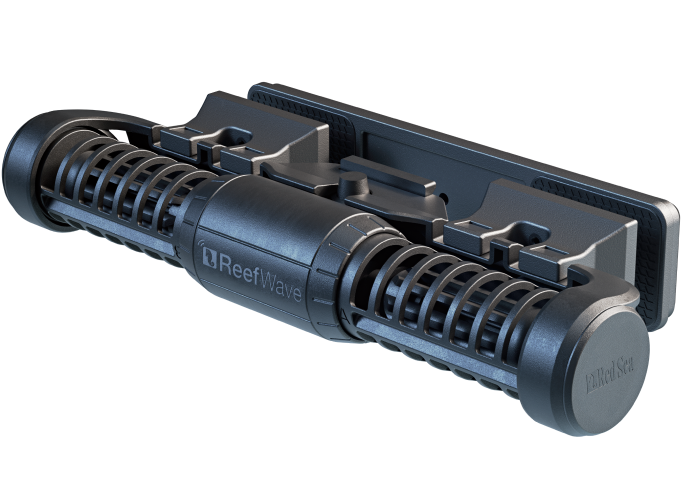</td>
<td rowspan="2">
<a href="https://github.com/Elwinmage/ha-reefbeat-component/issues?q=is:issue state:open label:rswave,all label:enhancement" style="text-decoration:none">📆</a>
<a href="https://github.com/Elwinmage/ha-reefbeat-component/issues?q=is:issue state:open label:rwave,all label:bug" style="text-decoration:none">🐛</a>
</td>
</tr>
<tr>
<td colspan="2">RSWAVE45</td><td>✅</td>
</tr>
</table>

(*) Użytkownicy ReefWave, proszę przeczytajcie [to](https://github.com/Elwinmage/ha-reefbeat-component/#reefwave)

# Spis treści
- [Instalacja przez HACS](https://github.com/Elwinmage/ha-reefbeat-component/#installation-via-hacs)
- [Wspólne funkcje](https://github.com/Elwinmage/ha-reefbeat-component/#common-functions)
- [ReefATO+](https://github.com/Elwinmage/ha-reefbeat-component/#reefato)
- [ReefControl](https://github.com/Elwinmage/ha-reefbeat-component/#reefcontrol)
- [ReefDose](https://github.com/Elwinmage/ha-reefbeat-component/#reefdose)
- [ReefLED](https://github.com/Elwinmage/ha-reefbeat-component/#reefled)
- [Wirtualna LED](https://github.com/Elwinmage/ha-reefbeat-component/#virtual-led)
- [ReefMat](https://github.com/Elwinmage/ha-reefbeat-component/#reefmat)
- [ReefRun](https://github.com/Elwinmage/ha-reefbeat-component/#reefrun)
- [ReefWave](https://github.com/Elwinmage/ha-reefbeat-component/#reefwave)
- [Cloud API](https://github.com/Elwinmage/ha-reefbeat-component/#cloud-api)
- [FAQ](https://github.com/Elwinmage/ha-reefbeat-component/#faq)

# Instalacja przez HACS

## Bezpośrednia instalacja

Kliknij tutaj, aby przejść bezpośrednio do repozytorium w HACS i kliknij „Pobierz": 

Dla karty towarzyszącej ha-reef-card z zaawansowanymi funkcjami, kliknij tutaj, aby przejść do repozytorium w HACS i kliknij „Pobierz": 

## Szukaj w HACS
Lub wyszukaj «redsea» lub «reefbeat» w HACS.

# Wspólne funkcje

# Ikony
Ta integracja udostępnia niestandardowe ikony dostępne przez "redsea:icon-name":

## Dodaj urządzenie
Przy dodawaniu nowego urządzenia masz 4 opcje:

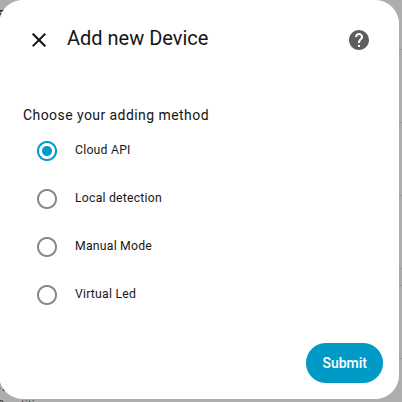

### Dodaj Cloud API
***Wymagane dla ReefWave, jeśli chcesz zachować synchronizację z aplikacją mobilną ReefBeat*** (Read [this](https://github.com/Elwinmage/ha-reefbeat-component/#reefwave)).  
***Wymagane do otrzymywania powiadomień o nowych wersjach firmware*** (Read [this](https://github.com/Elwinmage/ha-reefbeat-component/#firmware-update)).
- Pobierz informacje o użytkowniku
- Pobierz akwaria
- Pobierz bibliotekę Waves
- Pobierz bibliotekę LED

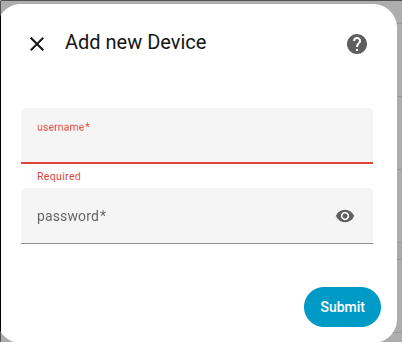

### Automatyczne wykrywanie w sieci prywatnej
Jeśli nie jesteś w tej samej sieci, przeczytaj [to](#my-device-is-not-detected) i użyj [„Trybu ręcznego"](https://github.com/Elwinmage/ha-reefbeat-component/#manual-mode).

### Tryb ręczny
Możesz wpisać adres IP urządzenia lub adres sieci do automatycznego wykrywania.

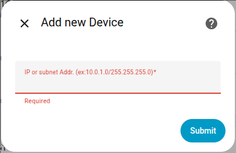

### Ustaw interwał skanowania urządzenia

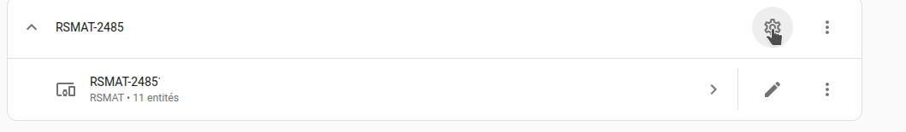

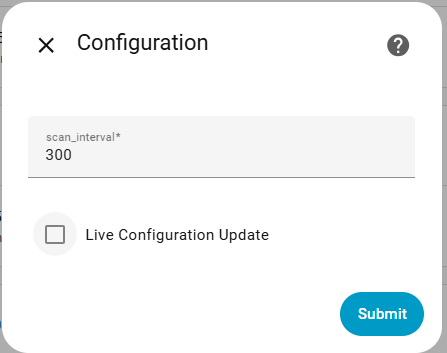

## Aktualizacja na żywo

> [!NOTE]
> It is possible to choose whether to enable live_update_config or not. In this mode (old default), configuration data is continuously retrieved along with normal data. For RSDOSE or RSLED, these large HTTP requests can take a long time (7–9 seconds). Sometimes the device does not respond to the request, so a retry function has been implemented. When live_update_config is disabled, configuration data is only retrieved at startup and when requested via the "Fetch Configuration" button. This new mode is activated by default. You can change it in the device configuration. 

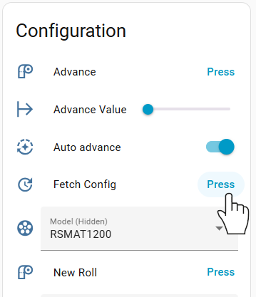

## Aktualizacja Firmware
Możesz otrzymywać powiadomienia i aktualizować urządzenie, gdy dostępna jest nowa wersja oprogramowania. You must have an active ["Cloud API"](https://github.com/Elwinmage/ha-reefbeat-component/#add-cloud-api) device with your credentials and the "Use Cloud API" switch must be enabled.
> [!TIP]
> The "Cloud API" is only needed to get the version number of the new release and compare it to the installed version. To update your firmware, the Cloud API is not strictly required.
> If you do not use the "Cloud API" (switch disabled or no Cloud API device installed), you will not be alerted when a new version is available, but you can still use the hidden "Force Firmware Update" button. If a new version is available, it will be installed.

  
  

# ReefATO:
- Włącz/wyłącz automatyczne napełnianie
- Ręczne napełnianie

# ReefControl:
Jeszcze nieobsługiwane. If you have one, contact me [here](https://github.com/Elwinmage/ha-reefbeat-component/discussions/8) and I will add its support.

# ReefDose:
- Edytuj dzienną dawkę
- Ręczne dozowanie
- Dodawaj i usuwaj suplementy
- Edytuj i kontroluj objętość pojemnika. Container volume settings are automatically enabled or disabled according to the volume control switch.
- Włącz/wyłącz harmonogram dla każdej pompy
- Konfiguracja alertów zapasów
- Opóźnienie dozowania między suplementami
- Napełnianie (Proszę przeczytać [this](https://github.com/Elwinmage/ha-reefbeat-component/#calibration-and-priming))
- Kalibracja (Proszę przeczytać [this](https://github.com/Elwinmage/ha-reefbeat-component/#calibration-and-priming))

### Główny

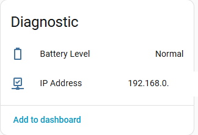

### Głowice

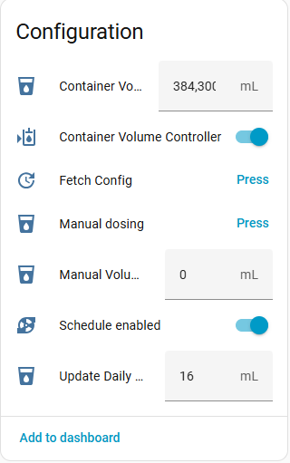
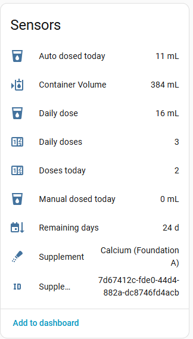

#### Calibration and Priming

> [!CAUTION]
> Musisz ściśle przestrzegać poniższej kolejności (Using the [ha-reef-card](https://github.com/Elwinmage/ha-reef-card) is safer).  
> <ins>Calibration</ins>:
>  1. Place the graduated container and press "Start Calibration"
>  2. Enter the measured value using the "Dose of Calibration" field
>  3. Press "Set Calibration Value"
>  4. Empty the graduated container and press "Test new Calibration". If the value obtained is not 4 mL, go back to step 1.
>  5. Press "Stop and Save Graduation"
>
> <ins>For priming</ins>:
>  1. (a) Press "Start Priming"
>  2. (b) When the liquid flows out, press "Stop Priming"
>  3. (1) Place the graduated container and press "Start Calibration"
>  4. (2) Enter the measured value using the "Dose of Calibration" field
>  5. (3) Press "Set Calibration Value"
>  6. (4) Empty the graduated container and press "Test new Calibration". If the value obtained is not 4 mL, go back to step 1.
>  7. (5) Press "Stop and Save Graduation"
>
> ⚠️ Priming must always be followed by a calibration (steps 1 to 5)!⚠️

  

# ReefLED:

- Odczyt i ustawienie kanałów Białego i Niebieskiego (only for G1: RSLED50, RSLED90, RSLED160)
- Odczyt i ustawienie Temperatury barwowej, Intensywności i Księżyca (all LEDs)
- Zarządzaj aklimatyzacją. Acclimation settings are automatically enabled or disabled according to the acclimation switch.
- Zarządzaj fazami księżyca. Moon phase settings are automatically enabled or disabled according to the moon phase switch.
- Ustaw ręczny tryb koloru z czasem lub bez.
- Odczyt wartości wentylatora i temperatury.
- Odczyt nazwy i wartości programów (with cloud support). Only for G1 LEDs.

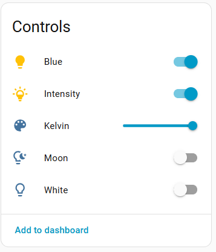

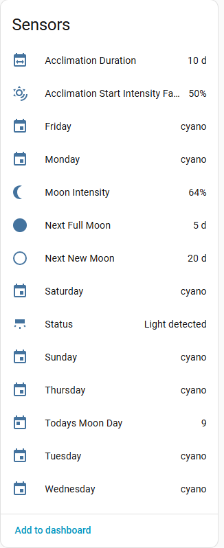

***

Color Temperature support for G1 LEDs takes into account the specificities of each of the three models.

***
## WAŻNE dla lamp G1 i G2

### LAMPY G2

#### Intensywność
Because G2 LEDs ensure constant intensity across the entire color range, your LEDs do not utilize their full capacity in the middle of the spectrum. At 8,000K, the white channel is at 100% and the blue channel at 0% (the opposite at 23,000K). At 14,000K with 100% intensity for G2 lights, the power of the white and blue channels is approximately 85%.
Here is the loss curve for the G2s.

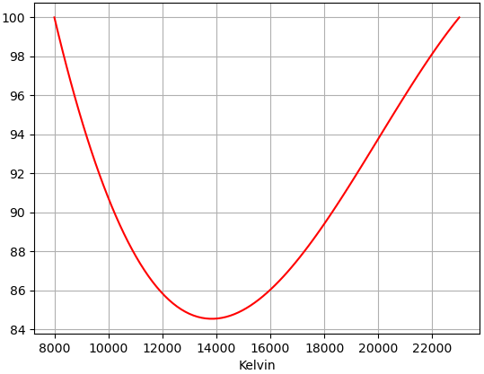

#### Temperatura barwowa
The G2 interface does not support the entire temperature range. From 8,000K to 10,000K, values are incremented in 200K steps, and from 10,000K to 23,000K in 500K steps. This behavior is handled automatically: if you choose an invalid value (e.g. 8,300K), a valid value will be automatically selected (8,200K in this example). This is why you may sometimes observe a slight cursor adjustment when selecting the color on a G2 light — the cursor repositions itself to an allowed value.

### LAMPY G1

G1 LEDs use white and blue channel control, which allows full power across the entire range, but not constant intensity without compensation.
That is why intensity compensation has been implemented.
This compensation ensures you get the same [PAR](https://en.wikipedia.org/wiki/Photosynthetically_active_radiation) (light intensity) regardless of your color temperature choice (in the range 12,000 to 23,000K).
> [!NOTE]
> Because Red Sea does not publish PAR values below 12,000K, compensation is only available in the 12,000 to 23,000K range. If you have a G1 LED and a PAR meter, you can [contact me](https://github.com/Elwinmage/ha-reefbeat-component/discussions/) to add compensation for the full range (9,000 to 23,000K).

In other words, without compensation, an intensity of x% at 9,000K does not provide the same PAR as at 23,000K or 15,000K.

Here are the power curves:

If you want to use the full power of your LED, disable intensity compensation (default).

If you enable intensity compensation, the light intensity will be constant across all color temperature values, but in the middle of the range you will not use the full capacity of your LEDs (as with G2 models).

Also note that if compensation is enabled, the intensity factor can exceed 100% for G1 lights if you manually adjust the White/Blue channels. This allows you to harness the full power of your LEDs!

***

# Wirtualna LED
- Grupuj i zarządzaj LED za pomocą wirtualnego urządzenia (create a virtual device from the integration panel, then use the configure button to link the LEDs).
- Możesz używać Kelvinów i intensywności do sterowania LED tylko jeśli masz G2 lub mieszankę G1 i G2.
- Możesz używać zarówno Kelvin/Intensywność jak i Biały i Niebieski jeśli masz tylko lampy G1.

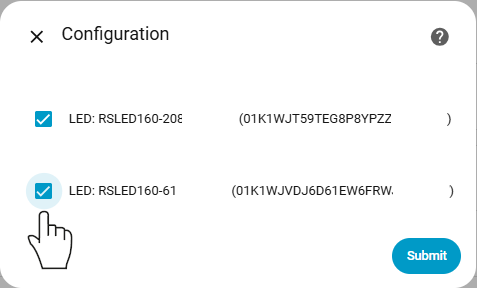

# ReefMat:
- Przełącznik automatycznego posuwu (włącz/wyłącz)
- Zaplanowany posuw
- Niestandardowa wartość posuwu: pozwala wybrać wartość posuwu rolki
- Ręczny posuw
- Zmień rolkę.
>[!TIP]
> For a new full roll, please set "roll diameter" to the minimum (4.0 cm). The size will be adjusted according to your RSMAT version. For a partially used roll, enter the value in cm.
- Dwa ukryte parametry: model i pozycja, jeśli musisz ponownie skonfigurować RSMAT

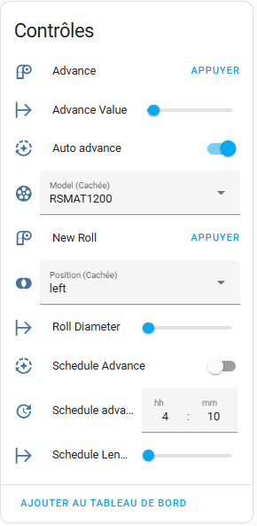

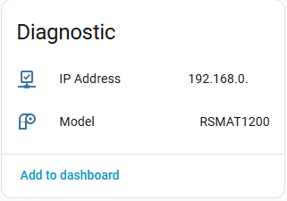

# ReefRun:
- Ustaw prędkość pompy
- Zarządzaj nadmiernym pienowaniem
- Zarządzaj wykrywaniem pełnego kubka
- Możliwość zmiany modelu skimmera

### Główny

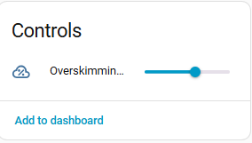

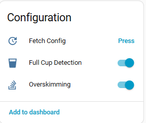

### Pompy

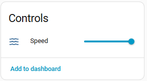

# ReefWave:
> [!IMPORTANT]
> ReefWave devices are different from other ReefBeat devices. They are the only devices that are slaves to the ReefBeat cloud. 
> When you launch the ReefBeat mobile app, the status of all devices is queried and data from the ReefBeat app is retrieved from device state. 
> For ReefWave, it is the opposite: there is no local control point (as you can see in the ReefBeat app, you cannot add a ReefWave to a disconnected aquarium). 
> 
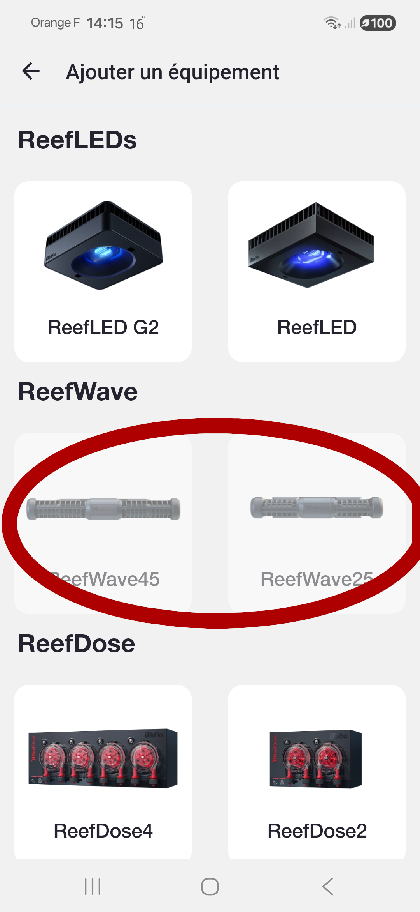
 
> Waves are stored in the cloud user library. When you change a wave's value, it is changed in the cloud library and applied to the new schedule. 
> So there is no local mode? Not so simple. There is a hidden local API to control ReefWave, but the ReefBeat app will not detect the changes. As a result, the device and Home Assistant on one side, and the ReefBeat mobile app on the other, will be out of sync. The device and Home Assistant will always be synchronized. 
> Now that you know, make your choice!

> [!NOTE]
> ReefWave waves have many linked parameters, and the range of some parameters depends on other parameters. I was not able to test all possible combinations. If you find a bug, you can create an issue [here](https://github.com/Elwinmage/ha-reefbeat-component/issues).

## Tryby ReefWave
As explained above, ReefWave devices are the only devices that can become unsynchronized with the ReefBeat app if you use the local API.
Dostępne są trzy tryby: Cloud, Lokalny i Hybrydowy.
Możesz zmienić tryb, ustawiając przełączniki „Połącz z chmurą" i „Używaj API Cloud" zgodnie z opisem w poniższej tabeli.

<table>
<tr>
<td>Nazwa trybu</td>
<td>Przełącznik Połącz z chmurą</td>
<td>Przełącznik Używaj API Cloud</td>
<td>Zachowanie</td>
<td>ReefBeat i HA są zsynchronizowane</td>
</tr>
<tr>
<td>Cloud (domyślnie)</td>
<td>✅</td>
<td>✅</td>
<td>Data is fetched via the local API.  On/off commands are also sent via the local API.  Wave commands are sent via the cloud API.</td>
<td>✅</td>
</tr>
<tr>
<td>Local</td>
<td>❌</td>
<td>❌</td>
<td>Data is fetched via the local API.  Commands are sent via the local API.  Device is shown as "off" in the ReefBeat app.</td>
<td>❌</td>
</tr>
<tr>
<td>Hybrid</td>
<td>✅</td>
<td>❌</td>
<td>Data is fetched via the local API.  Commands are sent via the local API. The ReefBeat mobile app does not display the correct wave values if they have been changed via HA. Home Assistant always displays the correct values. You can change values from both the ReefBeat app and Home Assistant.</td>
<td>❌</td>
</tr>
</table>

For Cloud and Hybrid modes you must link your ReefBeat cloud account.
First create a ["Cloud API"](https://github.com/Elwinmage/ha-reefbeat-component/#add-cloud-api) device with your credentials, and that's it!
The "Linked to account" sensor will be updated with the name of your ReefBeat account once the connection is established.

## Zmiana bieżących wartości
To load current wave values into the preview fields, use the "Set Preview From Current Wave" button.

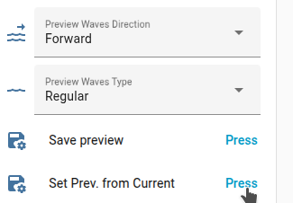

To change the current wave values, set the preview values and use the "Save Preview" button.

The behavior is the same as the ReefBeat mobile app. All waves with the same ID in the current schedule will be updated.

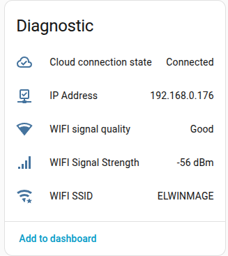

# API Cloud
API Cloud umożliwia:
- Uruchamianie lub zatrzymywanie skrótów: awaryjny, konserwacja i karmienie,
- Pobierz informacje o użytkowniku,
- Pobierz bibliotekę waves,
- Pobierz bibliotekę suplementów,
- Pobierz bibliotekę programów LED,
- Otrzymuj powiadomienia o [nowej wersji firmware](https://github.com/Elwinmage/ha-reefbeat-component/#firmware-update),
- Wysyłaj polecenia do ReefWave gdy tryb „[Cloud lub Hybrydowy](https://github.com/Elwinmage/ha-reefbeat-component/#reefwave)" mode is selected.

Skróty, parametry waves i LED są posortowane według akwarium.

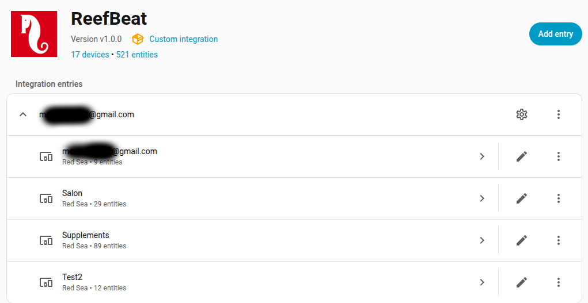

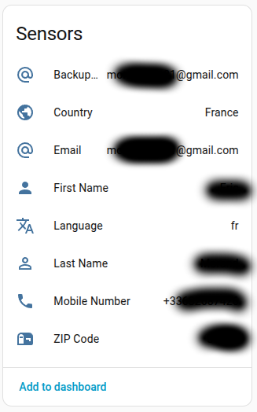

>[!TIP]
> Możesz wyłączyć pobieranie listy suplementów w konfiguracji urządzenia API Cloud.
>    
***
# FAQ

## Moje urządzenie nie jest wykrywane
- Spróbuj ponownie uruchomić automatyczne wykrywanie za pomocą przycisku „Dodaj wpis". Sometimes devices do not respond because they are busy.
- If your Red Sea devices are not on the same subnet as your Home Assistant, auto-detection will first fail and then offer you the option to enter the IP address of your device or the address of the subnet where your devices are located. For subnet detection, please use the format IP/MASK, for example: 192.168.14.0/255.255.255.0.
- You can also use [Manual Mode](https://github.com/Elwinmage/ha-reefbeat-component/#manual-mode).

## Niektóre dane są aktualizowane poprawnie, inne nie.
Dane są podzielone na trzy części: dane, konfiguracja i informacje o urządzeniu.
- Dane są regularnie aktualizowane.
- Dane konfiguracyjne są aktualizowane tylko przy uruchomieniu i po naciśnięciu przycisku „Pobierz konfigurację".
- Dane informacyjne urządzenia są aktualizowane tylko przy uruchomieniu.

Aby zapewnić regularne aktualizowanie danych konfiguracyjnych, włącz [Aktualizację konfiguracji na żywo](#live-update).

***

[buymecoffee]: https://paypal.me/Elwinmage
[buymecoffeebadge]: https://img.shields.io/badge/buy%20me%20a%20coffee-donate-yellow.svg?style=flat-square
