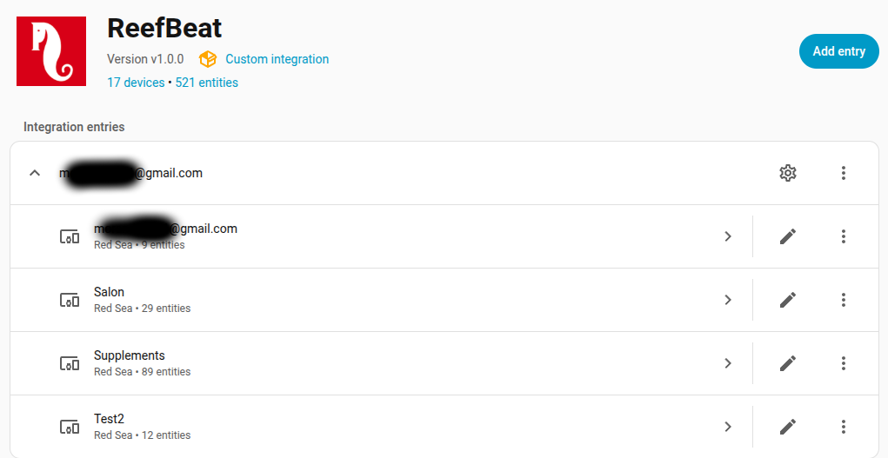
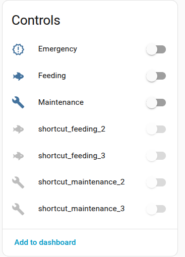
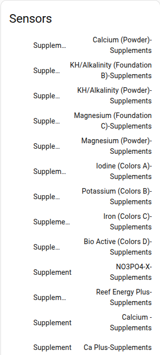
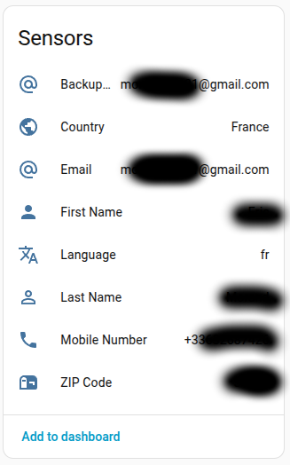
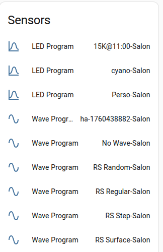
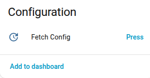
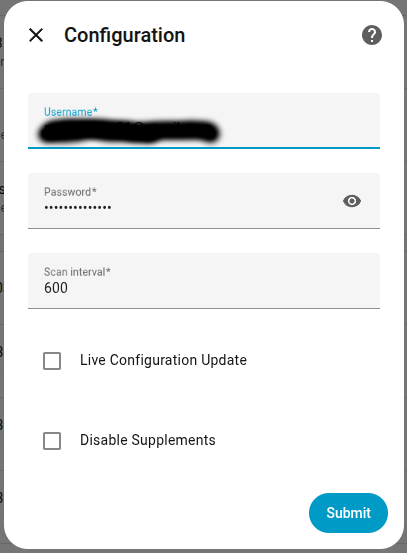

[← Powrót do strony głównej](README.pl.md)

# API Cloud
API Cloud umożliwia:
- Uruchamianie lub zatrzymywanie skrótów: awaryjny, konserwacja i karmienie,
- Pobierz informacje o użytkowniku,
- Pobierz bibliotekę waves,
- Pobierz bibliotekę suplementów,
- Pobierz bibliotekę programów LED,
- Otrzymuj powiadomienia o [nowej wersji firmware](../../README.md#firmware-update),
- Wysyłaj polecenia do ReefWave gdy tryb „[Cloud lub Hybrydowy](reefwave.pl.md#reefwave)" mode is selected.

Skróty, parametry waves i LED są posortowane według akwarium.

>[!TIP]
> Możesz wyłączyć pobieranie listy suplementów w konfiguracji urządzenia API Cloud.
>    
***

---

[← Powrót do strony głównej](README.pl.md)
