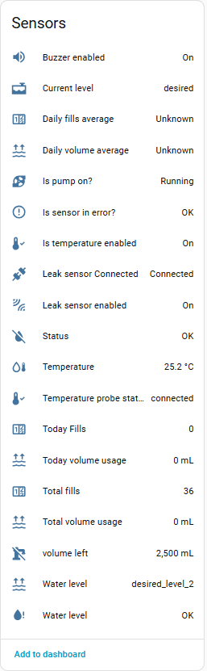
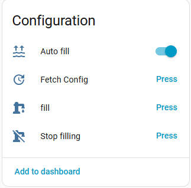
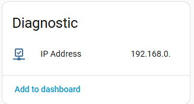

[← Powrót do strony głównej](README.pl.md)

# ReefATO:
- Włącz/wyłącz automatyczne napełnianie
- Ręczne napełnianie
- Włącz/wyłącz buzzer alarmu wycieku

### Zadania konserwacyjne
| Zadanie | Domyślnie | Zakres |
| ------- | --------- | ------ |
| Czyszczenie sondy EC | 6 tygodni | 3 – 9 tygodni |
| Czyszczenie pompy powrotnej | 4,5 miesiąca | 2 – 7 miesięcy |

Zobacz sekcję [Konserwacja](maintenance.pl.md#konserwacja).

---

[← Powrót do strony głównej](README.pl.md)
