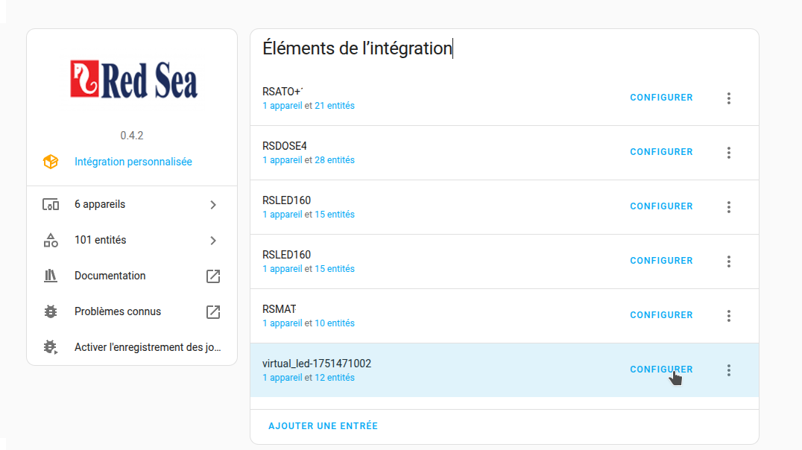
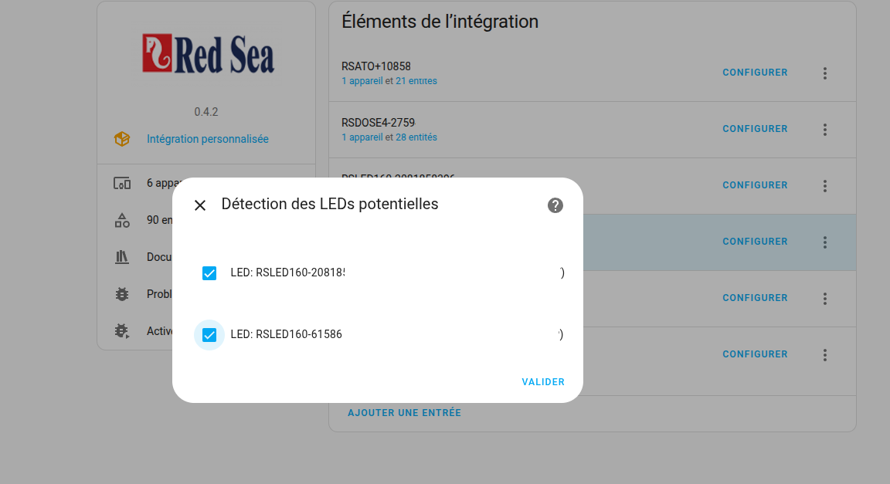

[← Voltar à página principal](README.pt.md)

# LED virtual
Um LED virtual é um **grupo** de ReefLED, como os LED «agrupados» da
aplicação ReefBeat: as suas lâmpadas são controladas como uma só.

- Crie um dispositivo virtual no painel da integração e use depois o botão
  de configuração: escolha os LED (pelo menos dois, um LED pertence a um só
  grupo) e depois a sua ordem. Um novo LED virtual começa com as lâmpadas
  que a aplicação ReefBeat já agrupa, pela ordem da aplicação.
- Só pode usar Kelvin e intensidade para controlar os seus LEDs se tiver G2 ou uma mistura de G1 e G2.
- Pode usar tanto Kelvin/Intensidade como Branco e Azul se tiver apenas lâmpadas G1.

## O que o grupo partilha
Um valor partilhado definido no LED virtual, ou numa das suas lâmpadas, é
aplicado a todas as lâmpadas do grupo: canais manuais, kelvin / intensidade,
modo, temporizador, programas, aclimatação, fase lunar e o
[programa meteorológico](reefled.pt.md#programa-meteorológico). O que pertence a uma lâmpada fica na
lâmpada: nome, Wi-Fi, nuvem, firmware, identificação, reposição…

Como na aplicação, uma escrita de grupo é recusada quando uma das lâmpadas
não está carregada, não responde, ou está num modo que o grupo não pode
controlar (desligada, ou retida por um atalho): nada é enviado, pelo que as
lâmpadas se mantêm sincronizadas, e o erro indica as lâmpadas em causa. Uma
lâmpada posta fora de serviço na aplicação fica de fora das escritas, das
verificações e do nascer do sol escalonado. O branco / azul não pode ser
definido num grupo que contenha uma G2: use kelvin / intensidade.

## Nascer do sol escalonado
Como na aplicação, as lâmpadas de um grupo podem começar o dia uma após a
outra:

| Entidade | Função |
| -------- | ------ |
| `switch` Nascer do sol escalonado | Escalona o nascer do sol das lâmpadas do grupo |
| `number` Atraso do nascer do sol escalonado | Minutos entre duas lâmpadas, de 1 a 15 (10 por omissão) |

Cada lâmpada começa o dia `atraso × posição` minutos mais tarde (a primeira
lâmpada do grupo não é atrasada). O valor é escrito no
Desfasamento do nascer do sol de cada lâmpada, de novo sempre que as lâmpadas
do grupo ou a sua ordem mudam; uma lâmpada que sai do grupo volta a 0.

## As lâmpadas do grupo
O `sensor` LEDs ligados, no LED virtual e em cada lâmpada de um
grupo, dá o número de lâmpadas e, no atributo `leds`, a sua lista pela ordem
do grupo: `hwid`, `name`, `model`, `g2`, `offset` (desfasamento do nascer do
sol em minutos, vazio para uma lâmpada sem `/offset`) e `entry_id`. O
ha-reef-card usa-o para listar as lâmpadas.

## Sincronização com a aplicação ReefBeat
Com uma conta na nuvem ReefBeat ([API Cloud](README.pt.md#adicionar-api-cloud)), um grupo cujas
lâmpadas são de um só modelo, de um só aquário e de uma só conta é o mesmo
grupo na aplicação: o grupo, a sua ordem e o seu nascer do sol escalonado
são escritos na nuvem, ou obtidos da aplicação, consoante o lado que mudou
desde a última sincronização.

Um grupo da aplicação que nenhum LED virtual controla (pelo menos duas
lâmpadas carregadas no Home Assistant) é proposto como novo LED virtual nos
dispositivos «Descobertos», com as suas lâmpadas pela ordem da aplicação;
«Ignorar» mantém-no ignorado.

Quando a decisão lhe cabe, é assinalada uma reparação
(Definições > Sistema > Reparações):

| Reparação | O que fazer |
| --------- | ----------- |
| Sem conta cloud ReefBeat | A aplicação poderia conter o grupo, mas nenhuma conta na nuvem lista as suas lâmpadas: adicione a conta (a reparação desaparece sozinha), ou mantenha o grupo apenas no Home Assistant |
| LEDs agrupados na aplicação ReefBeat | O grupo contém vários modelos, que a aplicação não consegue agrupar, e algumas lâmpadas continuam agrupadas na aplicação: desagrupe-as aí; o grupo passa a existir apenas no Home Assistant |
| Alterado no Home Assistant e na aplicação ReefBeat | Ambos os lados mudaram desde a última sincronização: escolha o grupo a manter |

---

[← Voltar à página principal](README.pt.md)
